# MongoDB CDC Pipeline Demo

End-to-end streaming pipeline: MongoDB CDC to Kafka to PostgreSQL, with Grafana dashboards and dbt-managed models.

## Architecture

```mermaid
graph LR
    subgraph "Data Generation"
        DG["datagen connector"]
        GEN["gen_* models"]
        MONGO["MongoDB"]
        DG --> GEN --> MONGO
    end

    subgraph "CDC Pipeline"
        CDC["mongodb-cdc connector"]
        STG["stg_* models"]
        KAFKA["Kafka"]
        MONGO --> CDC --> STG --> KAFKA
    end

    subgraph "Data Warehouse"
        KSrc["Kafka source"]
        PG_M["pg_* models"]
        PG["PostgreSQL"]
        GRAFANA["Grafana"]
        KAFKA --> KSrc --> PG_M --> PG --> GRAFANA
    end

    style MONGO fill:#4db33d,color:#fff
    style KAFKA fill:#231f20,color:#fff
    style PG fill:#336791,color:#fff
    style GRAFANA fill:#f46800,color:#fff
```



**Three layers, nine dbt models:**

| Layer | Models | Connector In | Connector Out | Purpose |
|---|---|---|---|---|
| Gen | `gen_customers`, `gen_products`, `gen_orders` | `datagen` | `mongodb` | Generate synthetic e-commerce data into MongoDB |
| Staging | `stg_customers`, `stg_products`, `stg_orders` | `mongodb-cdc` | `upsert-kafka` | Capture CDC changes, publish to Kafka topics |
| Marts | `pg_customers`, `pg_products`, `pg_orders` | `upsert-kafka` (via `ref()`) | `jdbc` | Materialize into PostgreSQL for analytics |

## Services

| Service | Container | Host Port | Internal Port | Purpose |
|---|---|---|---|---|
| MongoDB | `demo-mongodb` | 27117 | 27017 | Source database (replica set for CDC) |
| Flink JobManager | `demo-jobmanager` | 28081 | 8081 | Flink cluster coordinator |
| Flink TaskManager | `taskmanager` (x2) | -- | -- | Flink task execution (4 slots each) |
| SQL Gateway | `demo-sql-gateway` | 28083 | 8083 | REST API for dbt-flink-adapter |
| Kafka | `demo-kafka` | 29092 | 9092 | Intermediate changelog store (KRaft mode) |
| PostgreSQL | `demo-postgres` | 25432 | 5432 | Target analytics database |
| Grafana | `demo-grafana` | 23000 | 3000 | Dashboard visualization |

## Quick Start

```bash
# 1. Start all services (waits for health checks)
bash setup.sh

# 2. Download JARs, init MongoDB RS, create PG schema, create Kafka topics
bash initialize.sh

# 3. Run the dbt pipeline (creates 9 streaming jobs)
bash run_dbt.sh

# 4. Open dashboards
open http://localhost:23000   # Grafana (anonymous admin)
open http://localhost:28081   # Flink Web UI
```

**Selective execution:**

```bash
bash run_dbt.sh --select gen       # Only data generators
bash run_dbt.sh --select staging   # Only CDC → Kafka
bash run_dbt.sh --select marts     # Only Kafka → PostgreSQL
```

## Alternative: Raw SQL Pipeline

Skip dbt and submit Flink SQL directly:

```bash
# 1. Submit pipeline (MongoDB CDC → Kafka → PostgreSQL)
bash submit_pipeline.sh

# 2. Start external data generator
bash generate.sh                     # 5 ops/sec, runs forever
bash generate.sh --rate 10           # 10 ops/sec
bash generate.sh --duration 120      # Run for 2 minutes
bash generate.sh --seed-only         # Seed initial data only
```

## Deploying to Ververica Cloud

The included `dbt_project/dbt-flink-ververica.toml` configures VVC deployment with all required connector JARs. Update the S3 paths to match your JAR storage location.

```bash
# Dry run — preview compiled SQL
dbt-flink-ververica workflow \
  --name-prefix mongo-cdc \
  --config dbt_project/dbt-flink-ververica.toml \
  --dry-run

# Deploy and start
dbt-flink-ververica workflow \
  --name-prefix mongo-cdc \
  --config dbt_project/dbt-flink-ververica.toml \
  --workspace-id "$VERVERICA_WORKSPACE_ID" \
  --email "$VERVERICA_EMAIL" \
  --password "$VERVERICA_PASSWORD" \
  --start
```

## Project Structure

```
demos/mongo-flink-kafka-pg/
├── docker-compose.yml              # All 7 services
├── setup.sh                        # Start services + health checks
├── initialize.sh                   # JARs, MongoDB RS, PG schema, Kafka topics
├── teardown.sh                     # Stop services + clean volumes
├── run_dbt.sh                      # Run dbt pipeline
├── submit_pipeline.sh              # Submit raw SQL pipeline to Flink
├── generate.sh                     # External Python data generator
├── dbt_project/
│   ├── dbt_project.yml             # dbt project config
│   ├── profiles.yml                # Flink SQL Gateway connection
│   ├── dbt-flink-ververica.toml    # Ververica Cloud deployment config
│   └── models/
│       ├── sources.yml             # Source definitions (datagen + mongodb-cdc)
│       ├── gen/
│       │   ├── gen_customers.sql   # datagen → MongoDB customers
│       │   ├── gen_products.sql    # datagen → MongoDB products
│       │   └── gen_orders.sql      # datagen → MongoDB orders
│       ├── staging/
│       │   ├── stg_customers.sql   # MongoDB CDC → Kafka customers
│       │   ├── stg_products.sql    # MongoDB CDC → Kafka products
│       │   └── stg_orders.sql      # MongoDB CDC → Kafka orders
│       └── marts/
│           ├── pg_customers.sql    # Kafka → PostgreSQL customers
│           ├── pg_products.sql     # Kafka → PostgreSQL products
│           └── pg_orders.sql       # Kafka → PostgreSQL orders
├── datagen/
│   ├── generate.py                 # Python CDC event generator
│   └── requirements.txt            # pymongo, faker
├── sql/
│   ├── init-postgres.sql           # PostgreSQL schema DDL
│   ├── 01_mongo_sources.sql        # MongoDB CDC source tables
│   ├── 02_kafka_sinks.sql          # Kafka upsert sinks + INSERT
│   ├── 03_pg_sinks.sql             # PostgreSQL JDBC sinks + INSERT
│   ├── pipeline.sql                # Complete pipeline in one session
│   ├── pipeline_mongo_to_kafka.sql # Job 1: MongoDB → Kafka
│   └── pipeline_kafka_to_pg.sql    # Job 2: Kafka → PostgreSQL
└── grafana/
    ├── dashboards/
    │   └── mongo-pipeline.json     # 9-panel dashboard
    └── provisioning/
        ├── dashboards/dashboard.yml
        └── datasources/postgres.yml
```

## Files

| File | Purpose |
|------|---------|
| `docker-compose.yml` | Service definitions: MongoDB, Flink (JM + 2 TMs + SQL GW), Kafka, PostgreSQL, Grafana |
| `setup.sh` | Start all containers and wait for health checks (180s timeout) |
| `initialize.sh` | Download connector JARs, init MongoDB replica set, create PG schema and Kafka topics |
| `teardown.sh` | Stop containers, remove volumes and venv |
| `run_dbt.sh` | Install dbt-flink-adapter and run `dbt run` with project/profile directories |
| `submit_pipeline.sh` | Submit raw Flink SQL jobs via `sql-client.sh` in the JobManager container |
| `generate.sh` | Run Python data generator against MongoDB (configurable rate and duration) |
| `dbt_project/dbt-flink-ververica.toml` | Ververica Cloud deployment config with CDC JAR dependencies |
| `models/sources.yml` | Datagen sources (3) and MongoDB CDC sources (3) with column definitions |
| `models/gen/*.sql` | Data generation layer: datagen → CASE transforms → MongoDB sink |
| `models/staging/*.sql` | CDC staging layer: MongoDB CDC → upsert-kafka with business key |
| `models/marts/*.sql` | Analytics layer: Kafka source (via `ref()`) → JDBC PostgreSQL sink |
| `sql/pipeline.sql` | Complete end-to-end pipeline in a single Flink SQL session |
| `grafana/dashboards/mongo-pipeline.json` | 9-panel Grafana dashboard (stats, pie, line, bar, table) |

## Grafana Dashboard

URL: [http://localhost:23000](http://localhost:23000) (anonymous admin, no login required)

**Panels:**

| Panel | Type | Description |
|---|---|---|
| Total Orders | Stat | Count of all orders |
| Total Revenue | Stat | Sum of order totals (USD) |
| Total Customers | Stat | Count of all customers |
| Total Products | Stat | Count of all products |
| Orders by Status | Pie | Breakdown: pending, processing, shipped, delivered |
| Revenue per Minute | Line | Time-series revenue over last hour |
| Orders per Minute | Bar | Time-series order count over last hour |
| Orders by Category | Bar | Order count and revenue by product category |
| Recent Orders | Table | Last 25 orders with customer/product joins |

## Troubleshooting

### SQL Gateway not reachable

```
Error: SQL Gateway not reachable at localhost:28083
```

Run `bash setup.sh` first and verify with `curl -s http://localhost:28083/info`. If services started but SQL Gateway is unhealthy, check logs:

```bash
podman compose logs sql-gateway
```

### "Table not found" or connector errors

Missing connector JARs. Run `bash initialize.sh` which downloads and installs JARs into all Flink containers. Verify JARs are loaded:

```bash
podman exec demo-jobmanager ls /opt/flink/lib/ | grep -E "(mongodb|kafka|jdbc|postgresql)"
```

### MongoDB not PRIMARY

CDC requires MongoDB to be a replica set PRIMARY. Check status:

```bash
podman exec demo-mongodb mongosh --eval "rs.status()" | grep stateStr
```

If stuck in SECONDARY or no replica set, `initialize.sh` handles this. Re-run it or manually initiate:

```bash
podman exec demo-mongodb mongosh --eval "rs.initiate({_id: 'rs0', members: [{_id: 0, host: 'mongodb:27017'}]})"
```

### No data in PostgreSQL

Data flows gen → staging → marts sequentially. Check each layer:

1. **MongoDB** — `podman exec demo-mongodb mongosh ecommerce --eval "db.customers.countDocuments()"`
2. **Kafka** — `podman exec demo-kafka kafka-console-consumer --bootstrap-server localhost:9092 --topic demo-customers --from-beginning --max-messages 5`
3. **PostgreSQL** — `podman exec demo-postgres psql -U postgres -d demodb -c "SELECT COUNT(*) FROM demo.customers"`
4. **Flink jobs** — Check [http://localhost:28081](http://localhost:28081) for failed or restarting jobs

### Kafka topic errors

If topics already exist with different configurations:

```bash
# Delete and recreate
podman exec demo-kafka kafka-topics --bootstrap-server localhost:9092 --delete --topic demo-customers
podman exec demo-kafka kafka-topics --bootstrap-server localhost:9092 --create --topic demo-customers --partitions 3 --replication-factor 1
```

## Teardown

```bash
bash teardown.sh
```

Stops all containers, removes volumes (MongoDB data, Kafka logs, PostgreSQL data), and deletes the Python virtual environment.
