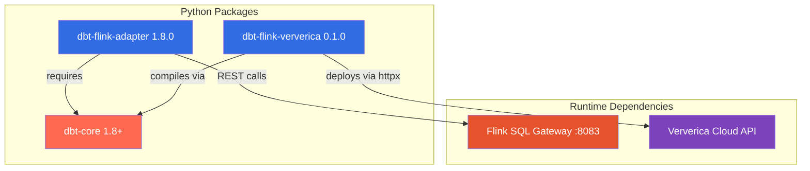

# Installation

[Home](../index.md) > Getting Started > Installation

---

Install the dbt-flink-adapter for local development and, optionally, the dbt-flink-ververica CLI for deploying to Ververica Cloud.

## Prerequisites

| Requirement | Minimum | Recommended | Notes |
|---|---|---|---|
| Python | 3.9 | 3.12+ | 3.13 is supported but experimental |
| pip | 21.0+ | Latest | Needed for package installation |
| venv or virtualenv | -- | venv (stdlib) | Isolate adapter dependencies from system Python |
| Docker + Docker Compose | -- | Latest | Only needed for running a local Flink cluster |
| Git | 2.0+ | Latest | Only needed if installing from source |

Verify your Python version before proceeding:

```bash
python3 --version
# Python 3.12.x or higher recommended
```

## Component Overview



The adapter and the CLI are independent packages. Install whichever you need:

- **dbt-flink-adapter** -- required for running dbt models against any Flink SQL Gateway (local or remote).
- **dbt-flink-ververica** -- optional CLI for compiling dbt models and deploying them to Ververica Cloud as managed SQLSCRIPT jobs.

## Step 1: Create a Virtual Environment

Always install into an isolated virtual environment to avoid dependency conflicts with other Python projects.

```bash
# Create the virtual environment
python3 -m venv ~/.virtualenvs/dbt-flink

# Activate it
source ~/.virtualenvs/dbt-flink/bin/activate

# Upgrade pip inside the venv
pip install --upgrade pip
```

## Step 2: Install dbt-flink-adapter

Install from PyPI. This pulls in dbt-core, dbt-adapters, dbt-common, and requests as transitive dependencies.

```bash
pip install dbt-flink-adapter
```

Verify the installation:

```bash
dbt --version
```

Expected output (version numbers may vary):

```
Core:
  - installed: 1.8.x
  ...

Plugins:
  - flink: 1.8.0
```

Confirm the adapter loads without errors:

```bash
python -c "from dbt.adapters.flink import FlinkAdapter; print('adapter OK')"
```

## Step 3: Install dbt-flink-ververica CLI (Optional)

The Ververica CLI lives in the `dbt-flink-ververica/` directory of the repository. Install it in editable mode so you can pull updates with `git pull` without reinstalling.

```bash
# Clone the repository if you have not already
git clone https://github.com/getindata/dbt-flink-adapter.git
cd dbt-flink-adapter

# Install the CLI in editable mode
cd dbt-flink-ververica
pip install -e .
```

Verify the CLI is available:

```bash
dbt-flink-ververica --version
```

Expected output:

```
dbt-flink-ververica version: 0.1.0
```

The CLI depends on Typer, Pydantic, httpx, keyring, and Rich. These are installed automatically.

## Step 4: Set Up a Local Flink Cluster (Optional)

For local development you need a running Flink cluster with the SQL Gateway enabled. The repository provides two Docker Compose configurations:

### Option A: Full test-kit (Flink + Kafka + PostgreSQL + MySQL)

The test-kit starts Flink 1.20 with two TaskManagers, the SQL Gateway, Kafka (KRaft mode), PostgreSQL, and MySQL. Use this if you need Kafka connectors or CDC sources.

```bash
cd test-kit
docker compose up -d
```

Services started:

| Service | Port | Purpose |
|---|---|---|
| Flink Web UI | `localhost:8081` | Job monitoring |
| SQL Gateway | `localhost:8083` | dbt adapter endpoint |
| Kafka | `localhost:9092` | Streaming source/sink |
| PostgreSQL | `localhost:5432` | JDBC/CDC source |
| MySQL | `localhost:3306` | CDC source |

### Option B: Minimal Flink cluster

A lighter setup with just Flink and the SQL Gateway (no Kafka, no databases). Good for testing view and datagen-based models.

```bash
cd envs/flink-1.20
docker compose up -d
```

Services started:

| Service | Port | Purpose |
|---|---|---|
| Flink Web UI | `localhost:8081` | Job monitoring |
| SQL Gateway | `localhost:8083` | dbt adapter endpoint |

### Verify the SQL Gateway is running

The SQL Gateway exposes a REST endpoint at `/v1/info`. Check it with curl:

```bash
curl -s http://localhost:8083/v1/info | python3 -m json.tool
```

You should see a JSON response containing the Flink version and product name. If you get a connection refused error, wait 15-30 seconds for the gateway to finish starting and try again.

## Step 5: Verify Everything Works Together

With the virtual environment active and a local Flink cluster running, run a quick smoke test:

```bash
# Initialize a throwaway dbt project
mkdir /tmp/dbt-flink-test && cd /tmp/dbt-flink-test
dbt init smoke_test --skip-profile-setup
```

This confirms that dbt recognizes the `flink` adapter type and can scaffold a new project.

## Troubleshooting

### `dbt --version` does not show the flink plugin

The adapter is not installed in the active Python environment. Ensure your virtual environment is activated (`which python3` should point inside the venv) and reinstall:

```bash
pip install --force-reinstall dbt-flink-adapter
```

### `dbt-flink-ververica: command not found`

The CLI entry point was not added to your PATH. This usually means the virtual environment is not activated, or the package was installed with `--user` outside the venv. Activate the venv and reinstall:

```bash
source ~/.virtualenvs/dbt-flink/bin/activate
cd dbt-flink-ververica && pip install -e .
```

### SQL Gateway returns connection refused

The SQL Gateway needs the Flink JobManager to be fully started before it can accept connections. Wait 30 seconds after `docker compose up -d` and retry. Check container health:

```bash
docker compose ps
```

Look for `healthy` status on the `sql-gateway` container.

### Python version conflict

If you see errors about unsupported Python syntax or missing `tomllib`, ensure you are running Python 3.9 or newer. The adapter supports 3.9 through 3.13.

```bash
python3 --version
```

## Next Steps

- [Local Quickstart](quickstart-local.md) -- Build your first streaming pipeline on a local Flink cluster
- [Ververica Quickstart](quickstart-ververica.md) -- Deploy to Ververica Cloud
- [Home](../index.md) -- Back to documentation index
