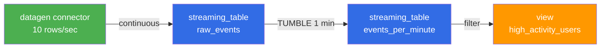
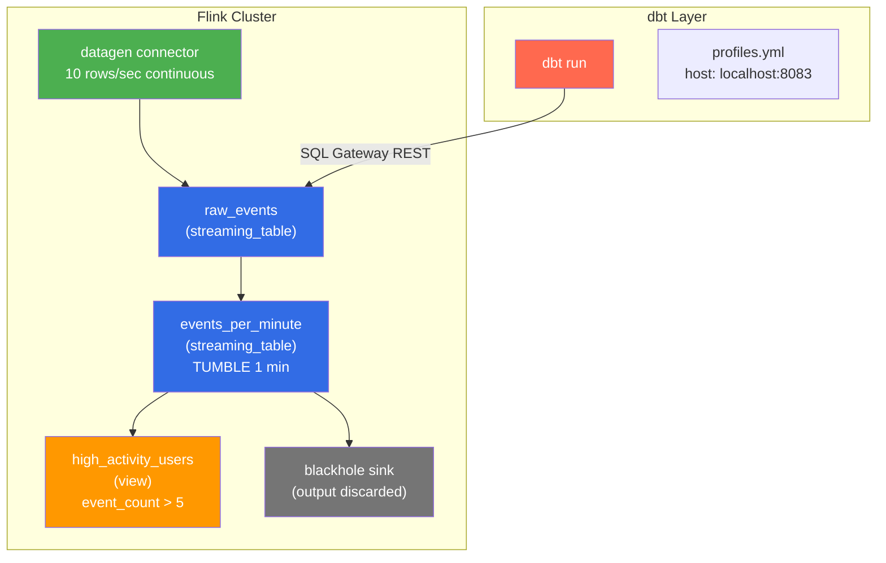

# Local Quickstart

[Home](../index.md) > Getting Started > Local Quickstart

---

Build a three-model streaming pipeline on your laptop in 15 minutes. You will create a datagen source that produces continuous events, a tumbling window aggregation that counts events per user per minute, and a view that filters high-activity users.

## What You Will Build



**Data flow:** The datagen connector produces synthetic events at 10 rows per second. The `raw_events` streaming table persists them. The `events_per_minute` model applies a 1-minute tumbling window to count events and sum amounts per user. The `high_activity_users` view filters for users with more than 5 events in a window.

## Prerequisites

- dbt-flink-adapter installed ([Installation Guide](installation.md))
- Docker and Docker Compose installed
- Ports 8081 and 8083 available on localhost

## Step 1: Start a Local Flink Cluster

Use the minimal Flink 1.20 environment from the repository. This starts a JobManager, two TaskManagers, and the SQL Gateway.

```bash
cd envs/flink-1.20
docker compose up -d
```

Wait for the SQL Gateway to become healthy (about 20 seconds):

```bash
# Poll until the gateway responds
until curl -sf http://localhost:8083/v1/info > /dev/null 2>&1; do
    echo "Waiting for SQL Gateway..."
    sleep 5
done
echo "SQL Gateway is ready."
```

Alternatively, use the full test-kit if you want Kafka and CDC sources available:

```bash
cd test-kit
docker compose up -d
```

Verify the Flink Web UI is accessible at [http://localhost:8081](http://localhost:8081). You should see the dashboard with available task slots.

## Step 2: Create a dbt Project

Create a new directory for your project and initialize it:

```bash
mkdir ~/dbt-flink-quickstart && cd ~/dbt-flink-quickstart
```

### Configure profiles.yml

Create the dbt connection profile. This tells dbt how to reach the SQL Gateway.

```bash
mkdir -p ~/.dbt
```

Add a `flink` profile to `~/.dbt/profiles.yml` (create the file if it does not exist):

```yaml
flink_quickstart:
  outputs:
    dev:
      type: flink
      host: localhost
      port: 8083
      session_name: quickstart_session
      database: default_catalog
      schema: default_database
      session_idle_timeout: 600
  target: dev
```

| Key | Value | Description |
|---|---|---|
| `type` | `flink` | Tells dbt to use the Flink adapter |
| `host` | `localhost` | SQL Gateway hostname |
| `port` | `8083` | SQL Gateway REST API port |
| `session_name` | `quickstart_session` | Name for the SQL Gateway session |
| `database` | `default_catalog` | Flink catalog (maps to dbt's `database`) |
| `schema` | `default_database` | Flink database (maps to dbt's `schema`) |
| `session_idle_timeout` | `600` | Session timeout in seconds (10 minutes) |

### Create dbt_project.yml

```bash
cat > dbt_project.yml << 'EOF'
name: flink_quickstart
version: 1.0.0
config-version: 2

profile: flink_quickstart

model-paths: ["models"]
target-path: "target"
clean-targets: ["target", "dbt_packages"]
EOF
```

### Create the models directory

```bash
mkdir -p models/streaming
```

## Step 3: Create the Source Model

This streaming table uses the Flink datagen connector to produce continuous synthetic events. It defines a watermark on `event_time` with a 5-second tolerance for late data.

Create `models/streaming/raw_events.sql`:

```sql
{{
    config(
        materialized='streaming_table',
        execution_mode='streaming',
        schema='''
            event_id BIGINT,
            user_id STRING,
            event_type STRING,
            event_time TIMESTAMP(3),
            amount DECIMAL(10, 2)
        ''',
        watermark={
            'column': 'event_time',
            'strategy': "event_time - INTERVAL '5' SECOND"
        },
        properties={
            'connector': 'datagen',
            'rows-per-second': '10',
            'fields.event_id.kind': 'sequence',
            'fields.event_id.start': '1',
            'fields.event_id.end': '1000000',
            'fields.user_id.length': '6',
            'fields.event_type.length': '8',
            'fields.amount.min': '1.00',
            'fields.amount.max': '999.99'
        }
    )
}}

SELECT
    event_id,
    user_id,
    event_type,
    event_time,
    amount
FROM TABLE(
    VALUES (
        CAST(NULL AS BIGINT),
        CAST(NULL AS STRING),
        CAST(NULL AS STRING),
        CAST(NULL AS TIMESTAMP(3)),
        CAST(NULL AS DECIMAL(10, 2))
    )
) AS t(event_id, user_id, event_type, event_time, amount)
WHERE FALSE
```

**What this does:** The `streaming_table` materialization creates a Flink table with the datagen connector properties. The connector generates rows continuously. The `SELECT ... WHERE FALSE` body is a placeholder -- the table's data comes from the connector, not from the SELECT.

## Step 4: Create the Window Aggregation Model

This model reads from `raw_events` and applies a 1-minute tumbling window to compute per-user metrics. Results are written to a blackhole sink (discards output, useful for testing).

Create `models/streaming/events_per_minute.sql`:

```sql
{{
    config(
        materialized='streaming_table',
        execution_mode='streaming',
        schema='''
            window_start TIMESTAMP(3),
            window_end TIMESTAMP(3),
            user_id STRING,
            event_count BIGINT,
            total_amount DECIMAL(10, 2)
        ''',
        properties={
            'connector': 'blackhole'
        }
    )
}}

SELECT
    window_start,
    window_end,
    user_id,
    COUNT(*) AS event_count,
    SUM(amount) AS total_amount
FROM TABLE(
    TUMBLE(
        TABLE {{ ref('raw_events') }},
        DESCRIPTOR(event_time),
        INTERVAL '1' MINUTE
    )
)
GROUP BY window_start, window_end, user_id
```

**What this does:** The `TUMBLE` table-valued function creates non-overlapping 1-minute windows based on `event_time`. For each window, it counts events and sums amounts per `user_id`. The blackhole connector discards the output rows -- replace it with a Kafka or filesystem connector in a real pipeline.

## Step 5: Create a View for Filtering

Views do not require a connector because they do not persist data. This view filters the aggregation for high-activity users.

Create `models/streaming/high_activity_users.sql`:

```sql
{{
    config(
        materialized='view'
    )
}}

SELECT
    window_start,
    window_end,
    user_id,
    event_count,
    total_amount
FROM {{ ref('events_per_minute') }}
WHERE event_count > 5
```

**What this does:** A standard SQL view. When queried, Flink evaluates it against the upstream `events_per_minute` table. No connector configuration is needed.

## Step 6: Run the Pipeline

Execute all models with dbt:

```bash
dbt run
```

Expected output:

```
Running with dbt=1.8.x
Found 3 models, 0 sources, 0 tests

Concurrency: 1 threads (target='dev')

1 of 3 START streaming_table model default_database.raw_events ........... [RUN]
1 of 3 OK created streaming_table model default_database.raw_events ...... [OK]
2 of 3 START streaming_table model default_database.events_per_minute .... [RUN]
2 of 3 OK created streaming_table model default_database.events_per_minute [OK]
3 of 3 START view model default_database.high_activity_users ............. [RUN]
3 of 3 OK created view model default_database.high_activity_users ........ [OK]

Finished running 2 streaming_table models, 1 view model in X.XXs.

Completed successfully.
Done. PASS=3 WARN=0 ERROR=0 SKIP=0 TOTAL=3
```

## Step 7: Verify in the Flink Web UI

Open [http://localhost:8081](http://localhost:8081) in your browser.

1. Navigate to **Running Jobs** in the left sidebar. You should see streaming jobs for the source and window aggregation tables.
2. Click on a job to see its execution graph, task metrics, and checkpoint history.
3. The datagen source should show rows being produced at approximately 10 per second.

## Data Flow Summary



## Cleanup

Stop and remove the Flink cluster when you are done:

```bash
# If using envs/flink-1.20:
cd envs/flink-1.20
docker compose down -v

# If using test-kit:
cd test-kit
docker compose down -v
```

Delete the session file to force a fresh session next time:

```bash
rm -f ~/.dbt/flink-session.yml
```

## Common Issues

### Session expired during dbt run

Flink sessions expire after the idle timeout (default 10 minutes). If your dbt run takes longer than this, or if you wait too long between runs, the session will expire. Delete the session file and re-run:

```bash
rm ~/.dbt/flink-session.yml
dbt run
```

Increase the timeout in `profiles.yml` if needed:

```yaml
session_idle_timeout: 1800  # 30 minutes
```

### Model fails with "Table not found"

Tables created in one session are not visible in another. If you run `dbt test` more than 10 minutes after `dbt run`, the session may have expired. Re-run `dbt run` to recreate the session and tables before testing.

### No task slots available

The default Docker Compose configuration provides limited task slots. If you see errors about insufficient resources, scale down parallelism or increase task slots in the Docker Compose environment variables.

## Next Steps

- [Ververica Quickstart](quickstart-ververica.md) -- Deploy your pipeline to Ververica Cloud
- [Installation](installation.md) -- Detailed installation options
- [Home](../index.md) -- Back to documentation index
