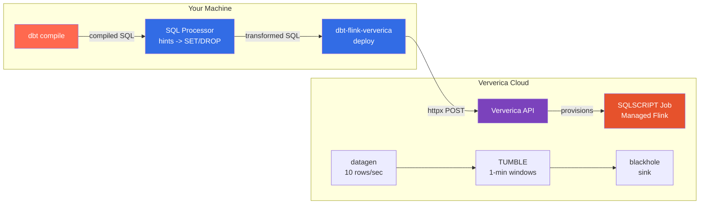
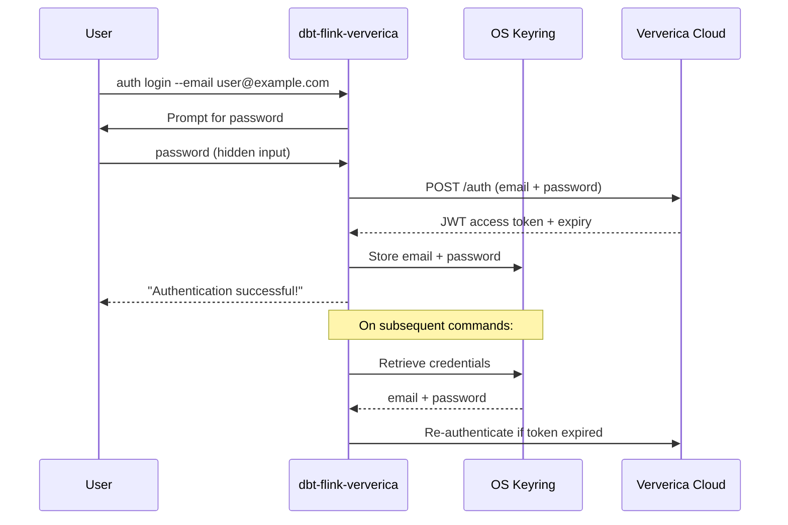
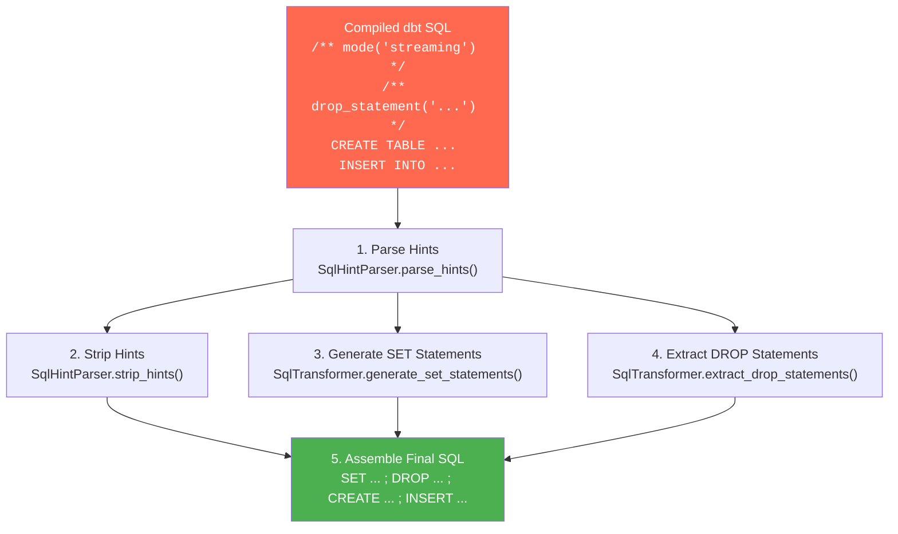
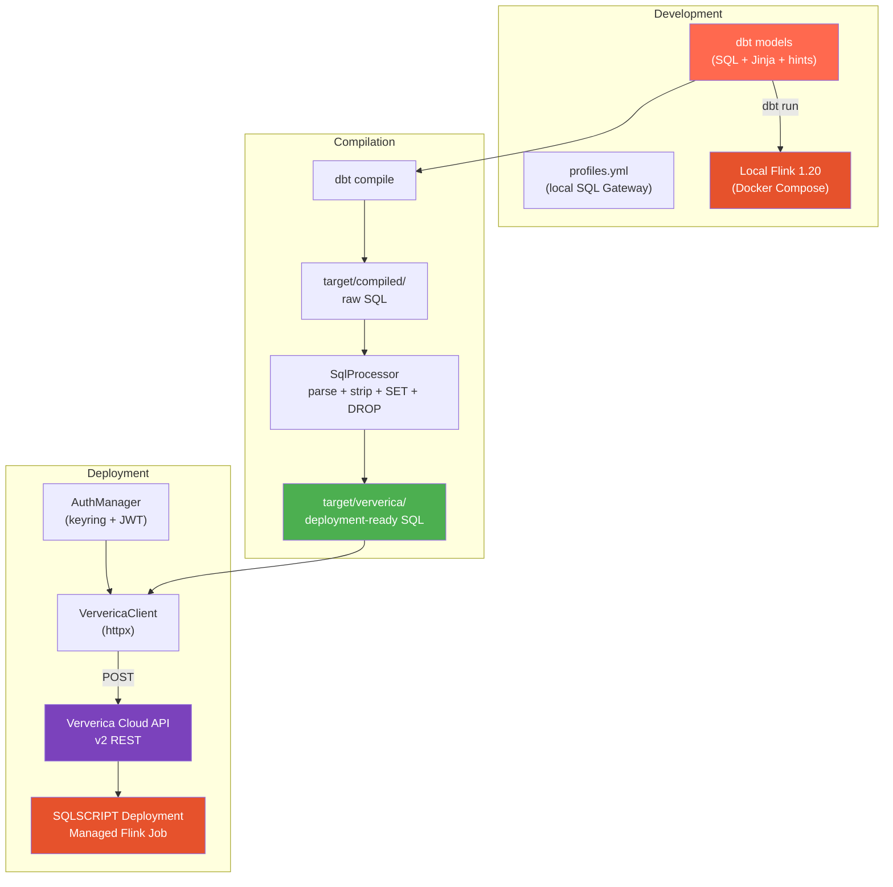

# Ververica Cloud Quickstart

[Home](../index.md) > Getting Started > Ververica Cloud Quickstart

---

Deploy a dbt-flink streaming pipeline to Ververica Cloud as a managed SQLSCRIPT job. This tutorial walks through every step from authentication to a running deployment, including the SQL transformation pipeline that converts dbt query hints into Ververica-compatible SET and DROP statements.

## What You Will Build

A three-stage streaming pipeline running on Ververica Cloud:

1. **DataGen source** -- produces 10 synthetic events per second with event IDs, user IDs, timestamps, and amounts.
2. **Tumbling window aggregation** -- counts events and sums amounts per user in 1-minute non-overlapping windows.
3. **Blackhole sink** -- discards output (replace with a real connector for production workloads).



## Prerequisites

| Requirement | Details |
|---|---|
| dbt-flink-adapter | Installed ([Installation Guide](installation.md)) |
| dbt-flink-ververica CLI | Installed from `dbt-flink-ververica/` directory |
| Ververica Cloud account | Sign up at [https://www.ververica.com](https://www.ververica.com) |
| Workspace ID | Found in the Ververica Cloud UI under workspace settings |
| Email and password | Your Ververica Cloud login credentials |

Optional but recommended:
- Local Flink cluster for testing before deploying (see [Local Quickstart](quickstart-local.md))
- The repository cloned locally for access to example TOML and deployment scripts

## Step 1: Authenticate with Ververica Cloud

The CLI stores credentials securely in your operating system's keyring (macOS Keychain, Windows Credential Manager, or Linux Secret Service). You authenticate once and the CLI retrieves stored credentials for subsequent operations.

```bash
dbt-flink-ververica auth login --email your@email.com
```

You will be prompted for your password. It is never stored in plaintext files or logged.

```
Password: ********
Authentication successful!
Token expires at: 2026-02-23T14:30:00+00:00
Credentials saved to system keyring
```

Verify your credentials are stored:

```bash
dbt-flink-ververica auth status --email your@email.com
```

Expected output:

```
Credentials found for: your@email.com
```

### How authentication works



## Step 2: Create a dbt Project

Create a fresh dbt project for this tutorial. If you already have a project from the [Local Quickstart](quickstart-local.md), you can reuse it and skip to Step 3.

```bash
mkdir ~/dbt-flink-vvc-tutorial && cd ~/dbt-flink-vvc-tutorial
```

### dbt_project.yml

```bash
cat > dbt_project.yml << 'EOF'
name: vvc_tutorial
version: 1.0.0
config-version: 2

profile: vvc_tutorial

model-paths: ["models"]
target-path: "target"
clean-targets: ["target", "dbt_packages"]
EOF
```

### profiles.yml

For compilation purposes, you need a local Flink connection profile. The CLI compiles models locally via `dbt compile` and then transforms the output for Ververica. If you do not have a local Flink cluster, you can still compile -- dbt will succeed for compilation without connecting.

Add to `~/.dbt/profiles.yml`:

```yaml
vvc_tutorial:
  outputs:
    dev:
      type: flink
      host: localhost
      port: 8083
      session_name: vvc_tutorial_session
      database: default_catalog
      schema: default_database
      session_idle_timeout: 600
  target: dev
```

### Create Models

Create the models directory and two SQL files:

```bash
mkdir -p models/streaming
```

**models/streaming/datagen_source.sql** -- the source table:

```sql
{{
    config(
        materialized='streaming_table',
        execution_mode='streaming',
        schema='''
            event_id BIGINT,
            user_id STRING,
            event_type STRING,
            event_time TIMESTAMP(3),
            amount DECIMAL(10, 2)
        ''',
        watermark={
            'column': 'event_time',
            'strategy': "event_time - INTERVAL '5' SECOND"
        },
        properties={
            'connector': 'datagen',
            'rows-per-second': '10',
            'fields.event_id.kind': 'sequence',
            'fields.event_id.start': '1',
            'fields.event_id.end': '1000000',
            'fields.user_id.length': '6',
            'fields.event_type.length': '8',
            'fields.amount.min': '1.00',
            'fields.amount.max': '999.99'
        }
    )
}}

SELECT
    event_id,
    user_id,
    event_type,
    event_time,
    amount
FROM TABLE(
    VALUES (
        CAST(NULL AS BIGINT),
        CAST(NULL AS STRING),
        CAST(NULL AS STRING),
        CAST(NULL AS TIMESTAMP(3)),
        CAST(NULL AS DECIMAL(10, 2))
    )
) AS t(event_id, user_id, event_type, event_time, amount)
WHERE FALSE
```

**models/streaming/tumbling_window_agg.sql** -- the window aggregation:

```sql
/** mode('streaming') */
/** drop_statement('DROP TABLE IF EXISTS tumbling_window_agg') */
{{
    config(
        materialized='streaming_table',
        execution_mode='streaming',
        schema='''
            window_start TIMESTAMP(3),
            window_end TIMESTAMP(3),
            user_id STRING,
            event_count BIGINT,
            total_amount DECIMAL(10, 2)
        ''',
        properties={
            'connector': 'blackhole'
        }
    )
}}

SELECT
    window_start,
    window_end,
    user_id,
    COUNT(*) AS event_count,
    SUM(amount) AS total_amount
FROM TABLE(
    TUMBLE(
        TABLE {{ ref('datagen_source') }},
        DESCRIPTOR(event_time),
        INTERVAL '1' MINUTE
    )
)
GROUP BY window_start, window_end, user_id
```

Note the **query hints** at the top of `tumbling_window_agg.sql`:

- `/** mode('streaming') */` -- tells the SQL processor to generate `SET 'execution.runtime-mode' = 'streaming';`
- `/** drop_statement('DROP TABLE IF EXISTS tumbling_window_agg') */` -- tells the processor to prepend a DROP statement before the CREATE

These hints are stripped from the SQL before deployment and converted into proper Flink SET/DROP statements.

## Step 3: Initialize Configuration

Generate a `dbt-flink-ververica.toml` configuration file:

```bash
dbt-flink-ververica config init
```

This creates `dbt-flink-ververica.toml` in the current directory with sensible defaults. Edit it to match your Ververica workspace.

### TOML Configuration Reference

The configuration file has five sections. Here is a complete annotated example:

```toml
[ververica]
# Ververica Cloud API base URL
gateway_url = "https://app.ververica.cloud"

# Your workspace ID (find in Ververica Cloud UI > Workspace Settings)
workspace_id = "your-workspace-id-here"

# Namespace within the workspace (often "default")
namespace = "default"

# Default Flink engine version for deployments
# Options: "vera-4.0.0-flink-1.20", "vera-3.0.0-flink-1.19", etc.
default_engine_version = "vera-4.0.0-flink-1.20"


[dbt]
# Path to your dbt project (relative or absolute)
project_dir = "."

# dbt target to use for compilation
target = "dev"

# Specific models to compile (empty list = all models)
models = []


[deployment]
# Default deployment name (overridden by --name flag)
deployment_name = "vvc-tutorial-pipeline"

# Job parallelism (number of parallel task instances)
parallelism = 2

# How to restore state on upgrade
# Options: LATEST_STATE, LATEST_SAVEPOINT, NONE
restore_strategy = "LATEST_STATE"

# How to handle deployment upgrades
# Options: STATEFUL, STATELESS
upgrade_strategy = "STATEFUL"

# Additional Flink runtime configuration
[deployment.flink_config]
"execution.checkpointing.interval" = "60s"
"execution.checkpointing.mode" = "EXACTLY_ONCE"
"execution.checkpointing.timeout" = "10min"
"state.backend" = "rocksdb"
"state.backend.incremental" = "true"
"restart-strategy" = "fixed-delay"
"restart-strategy.fixed-delay.attempts" = "3"
"restart-strategy.fixed-delay.delay" = "10s"
"taskmanager.memory.process.size" = "4gb"
"taskmanager.memory.managed.fraction" = "0.4"

# Metadata tags for the deployment
[deployment.tags]
environment = "development"
team = "data-platform"
owner = "your-team@example.com"


[sql_processing]
# Strip dbt-flink query hints (/** hint_name('value') */)
strip_hints = true

# Convert hints to Flink SET statements
generate_set_statements = true

# Wrap multiple statements in BEGIN STATEMENT SET / END
# Usually false for Ververica Cloud
wrap_in_statement_set = false

# Include DROP statements extracted from drop_statement hints
include_drop_statements = true
```

### Key configuration choices

| Section | Key | When to Change |
|---|---|---|
| `[ververica]` | `workspace_id` | Always -- this is your Ververica workspace UUID |
| `[ververica]` | `default_engine_version` | When targeting a different Flink version |
| `[deployment]` | `parallelism` | Increase for higher throughput; 1 is fine for testing |
| `[deployment]` | `restore_strategy` | Set to `NONE` for stateless jobs, `LATEST_STATE` for stateful |
| `[deployment.flink_config]` | checkpointing | Decrease interval for lower latency; increase for less overhead |
| `[sql_processing]` | `strip_hints` | Set to `false` if you want to preserve hints in deployed SQL |

Validate the configuration:

```bash
dbt-flink-ververica config validate dbt-flink-ververica.toml
```

Expected output:

```
Config file is valid: dbt-flink-ververica.toml

Configuration summary:
  Ververica gateway: https://app.ververica.cloud
  Workspace ID: your-workspace-id-here
  Namespace: default
  dbt project: /Users/you/dbt-flink-vvc-tutorial
  dbt target: dev
```

## Step 4: Test Locally First (Recommended)

Before deploying to Ververica Cloud, validate your models against a local Flink cluster. This catches SQL errors, missing references, and schema mismatches before they cost cloud compute time.

```bash
# Start a local Flink cluster (if not already running)
cd /path/to/dbt-flink-adapter/envs/flink-1.20
docker compose up -d

# Return to your project
cd ~/dbt-flink-vvc-tutorial

# Run models locally
dbt run
```

Verify all models succeed. Check the Flink Web UI at [http://localhost:8081](http://localhost:8081) to confirm jobs are running.

## Step 5: Compile for Ververica

The compile command runs `dbt compile` to generate SQL, then applies the SQL processor to transform query hints into SET/DROP statements compatible with Ververica Cloud.

```bash
dbt-flink-ververica compile --project-dir .
```

Output:

```
Compiling dbt project...
Project: /Users/you/dbt-flink-vvc-tutorial
Target: dev
Models: all
Output: /Users/you/dbt-flink-vvc-tutorial/target/ververica

Running dbt compile... done
Found 2 compiled models

Processing SQL...
  datagen_source.sql
  tumbling_window_agg.sql
    - Parsed 2 hints
    - Generated 1 SET statement
    - Extracted 1 DROP statement

Compilation complete!

Next steps:
  - Review SQL in: /Users/you/dbt-flink-vvc-tutorial/target/ververica
  - Deploy with: dbt-flink-ververica deploy --name <deployment-name>
```

### Inspect the Transformed SQL

Examine the output in `target/ververica/` to understand what the SQL processor did.

**Before (compiled dbt SQL with hints):**

```sql
/** mode('streaming') */
/** drop_statement('DROP TABLE IF EXISTS tumbling_window_agg') */
CREATE TABLE tumbling_window_agg (
    window_start TIMESTAMP(3),
    window_end   TIMESTAMP(3),
    user_id      STRING,
    event_count  BIGINT,
    total_amount DECIMAL(10, 2)
) WITH (
    'connector' = 'blackhole'
);

INSERT INTO tumbling_window_agg
SELECT
    window_start,
    window_end,
    user_id,
    COUNT(*) AS event_count,
    SUM(amount) AS total_amount
FROM TABLE(
    TUMBLE(
        TABLE datagen_source,
        DESCRIPTOR(event_time),
        INTERVAL '1' MINUTE
    )
)
GROUP BY window_start, window_end, user_id;
```

**After (Ververica-ready SQL):**

```sql
-- SQL generated by dbt-flink-ververica

-- Configuration
SET 'execution.runtime-mode' = 'streaming';

-- Drop existing objects
DROP TABLE IF EXISTS tumbling_window_agg;

-- Main SQL
CREATE TABLE tumbling_window_agg (
    window_start TIMESTAMP(3),
    window_end   TIMESTAMP(3),
    user_id      STRING,
    event_count  BIGINT,
    total_amount DECIMAL(10, 2)
) WITH (
    'connector' = 'blackhole'
);

INSERT INTO tumbling_window_agg
SELECT
    window_start,
    window_end,
    user_id,
    COUNT(*) AS event_count,
    SUM(amount) AS total_amount
FROM TABLE(
    TUMBLE(
        TABLE datagen_source,
        DESCRIPTOR(event_time),
        INTERVAL '1' MINUTE
    )
)
GROUP BY window_start, window_end, user_id;
```

### SQL Transformation Pipeline



The transformations:

1. **Parse hints** -- regex matches `/** hint_name('value') */` patterns and extracts name-value pairs.
2. **Strip hints** -- removes hint comments from the SQL body so Flink does not see them.
3. **Generate SET statements** -- maps hint names to Flink configuration keys (e.g., `mode` becomes `execution.runtime-mode`).
4. **Extract DROP statements** -- pulls out `drop_statement` hint values and validates them against an allowlist pattern to prevent SQL injection.
5. **Assemble** -- concatenates SET statements, DROP statements, and clean SQL in the correct order.

## Step 6: Deploy to Ververica Cloud

Deploy the compiled SQL as a SQLSCRIPT job:

```bash
dbt-flink-ververica deploy \
    --name vvc-tutorial-pipeline \
    --sql-file target/ververica/tumbling_window_agg.sql \
    --workspace-id YOUR_WORKSPACE_ID \
    --namespace default \
    --email your@email.com
```

Output:

```
Deploying to Ververica Cloud...
Deployment name: vvc-tutorial-pipeline
Workspace: YOUR_WORKSPACE_ID
Namespace: default

Reading SQL from: target/ververica/tumbling_window_agg.sql
Read 847 characters

Authenticating... done
Authenticated as your@email.com

Creating deployment... done
Deployment created successfully!

Deployment details:
  - ID: dep-abc123-def456-789
  - Name: vvc-tutorial-pipeline
  - State: CREATED
  - Namespace: default

View in Ververica Cloud:
  https://app.ververica.cloud/workspaces/YOUR_WORKSPACE_ID/deployments/dep-abc123-def456-789
```

## Step 7: One-Step Workflow (Alternative)

Instead of running compile and deploy separately, use the `workflow` command to do both in a single operation:

```bash
dbt-flink-ververica workflow \
    --name vvc-tutorial-pipeline \
    --project-dir . \
    --workspace-id YOUR_WORKSPACE_ID \
    --namespace default \
    --email your@email.com \
    --target dev
```

This executes five steps in sequence:

1. **Compile** -- runs `dbt compile` to generate SQL artifacts
2. **Process** -- reads compiled models and transforms hints
3. **Combine** -- merges all model SQL into a single script
4. **Authenticate** -- retrieves or refreshes the JWT token
5. **Deploy** -- creates the SQLSCRIPT deployment on Ververica Cloud

```
Running full workflow (compile + deploy)...

Step 1: Compile dbt models
Running dbt compile... done
dbt compile successful

Step 2: Process SQL
Found 2 models
Processed 2 models

Step 3: Combine SQL
Combined SQL: 1847 characters

Step 4: Authenticate
Authenticated as your@email.com

Step 5: Deploy to Ververica Cloud
Creating deployment... done
Deployment created successfully!

Deployment Summary
  - ID: dep-abc123-def456-789
  - Name: vvc-tutorial-pipeline
  - State: CREATED
  - Namespace: default
  - Models: 2

View in Ververica Cloud:
  https://app.ververica.cloud/workspaces/YOUR_WORKSPACE_ID/deployments/dep-abc123-def456-789
```

## Step 8: Verify in Ververica Cloud UI

Open the Ververica Cloud console at the URL printed by the deploy command.

1. Navigate to **Deployments** in the left sidebar.
2. Find your deployment (`vvc-tutorial-pipeline`).
3. Check the **Status** -- it should show `CREATED` or `RUNNING` depending on whether auto-start is enabled.
4. Click into the deployment to view the Flink job graph, task metrics, and checkpoint history.
5. The datagen source should show rows being produced at approximately 10 per second.

If the deployment is in `CREATED` state and you want to start it, use the Ververica Cloud UI's Start button or deploy using the `scripts/deploy_dbt_models.py` script with the `--start` flag (see Step 11).

## Step 9: Query Hints Reference

Query hints are the bridge between dbt-flink's SQL models and Ververica Cloud's runtime configuration. They are embedded as SQL comments in your model files and processed during compilation.

### Hint Format

```sql
/** hint_name('value') */
```

### Supported Hints

| Hint | Maps To | Example | Purpose |
|---|---|---|---|
| `mode` | `SET 'execution.runtime-mode'` | `/** mode('streaming') */` | Set streaming or batch mode |
| `execution_mode` | `SET 'execution.runtime-mode'` | `/** execution_mode('batch') */` | Alias for `mode` |
| `fetch_timeout_ms` | Used by adapter | `/** fetch_timeout_ms(5000) */` | Polling timeout for test queries |
| `drop_statement` | Prepended DROP | `/** drop_statement('DROP TABLE IF EXISTS t') */` | Clean up before creating objects |
| `job_state` | Metadata only | `/** job_state('running') */` | Not converted to SET; adapter metadata |

### Hint Processing Rules

- Multiple hints can appear on the same model. Each is processed independently.
- Hints must use single or double quotes around the value: `/** mode('streaming') */` or `/** mode("streaming") */`.
- Unknown hints are logged as warnings and skipped (no SET statement generated).
- `drop_statement` values are validated against a strict regex pattern to prevent SQL injection. Only `DROP TABLE`, `DROP VIEW`, `DROP DATABASE`, and `DROP CATALOG` statements with optional `IF EXISTS`, `CASCADE`, and `RESTRICT` clauses are accepted.

## Step 10: Multi-Environment Configuration

For real projects, maintain separate TOML files per environment. The CLI reads the configuration from `dbt-flink-ververica.toml` in the current directory by default.

### Directory structure

```
my-project/
  dbt_project.yml
  models/
  config/
    dev.toml
    staging.toml
    production.toml
```

### Environment-specific TOML files

**config/dev.toml:**

```toml
[ververica]
workspace_id = "dev-workspace-id"
namespace = "dev"

[dbt]
target = "dev"

[deployment]
deployment_name = "my-pipeline-dev"
parallelism = 1

[deployment.flink_config]
"execution.checkpointing.interval" = "60s"
"taskmanager.memory.process.size" = "2gb"

[deployment.tags]
environment = "development"
```

**config/staging.toml:**

```toml
[ververica]
workspace_id = "staging-workspace-id"
namespace = "staging"

[dbt]
target = "staging"

[deployment]
deployment_name = "my-pipeline-staging"
parallelism = 2
restore_strategy = "LATEST_SAVEPOINT"

[deployment.flink_config]
"execution.checkpointing.interval" = "30s"
"taskmanager.memory.process.size" = "4gb"

[deployment.tags]
environment = "staging"
```

**config/production.toml:**

```toml
[ververica]
workspace_id = "prod-workspace-id"
namespace = "production"

[dbt]
target = "prod"

[deployment]
deployment_name = "my-pipeline-prod"
parallelism = 4
restore_strategy = "LATEST_STATE"
upgrade_strategy = "STATEFUL"

[deployment.flink_config]
"execution.checkpointing.interval" = "30s"
"execution.checkpointing.mode" = "EXACTLY_ONCE"
"state.backend" = "rocksdb"
"state.backend.incremental" = "true"
"taskmanager.memory.process.size" = "8gb"

[deployment.tags]
environment = "production"
sla = "critical"
```

### Deploying per environment

Copy the desired config file before running the workflow:

```bash
# Deploy to staging
cp config/staging.toml dbt-flink-ververica.toml
dbt-flink-ververica workflow \
    --name my-pipeline-staging \
    --workspace-id staging-workspace-id \
    --email your@email.com \
    --target staging

# Deploy to production
cp config/production.toml dbt-flink-ververica.toml
dbt-flink-ververica workflow \
    --name my-pipeline-prod \
    --workspace-id prod-workspace-id \
    --email your@email.com \
    --target prod
```

## Step 11: Cleanup

### Stop and delete a deployment

Use the Ververica Cloud UI to stop a running job and delete the deployment:

1. Navigate to **Deployments** in the sidebar.
2. Click on your deployment.
3. Click **Stop** to cancel the running Flink job.
4. After the job stops, click **Delete** to remove the deployment.

### Remove local credentials

```bash
dbt-flink-ververica auth logout --email your@email.com
```

This removes the stored credentials from your system keyring.

### Clean up local artifacts

```bash
rm -rf target/
rm -f dbt-flink-ververica.toml
rm -f ~/.dbt/flink-session.yml
```

## Step 12: Programmatic Deployment with Scripts

For CI/CD pipelines or batch deployment of multiple models, use the `scripts/deploy_dbt_models.py` script. This script deploys multiple pre-defined Flink SQL models to Ververica Cloud without requiring the full dbt compile workflow.

### Environment setup

Create a `.env` file in the repository root:

```bash
VERVERICA_EMAIL=your@email.com
VERVERICA_PASSWORD=your-password
VERVERICA_GATEWAY_URL=https://app.ververica.cloud
VERVERICA_WORKSPACE_ID=your-workspace-id
VERVERICA_NAMESPACE=default
VERVERICA_ENGINE_VERSION=vera-4.0.0-flink-1.20
```

### Run the script

```bash
# Deploy all models
python scripts/deploy_dbt_models.py --prefix tutorial

# Deploy specific models
python scripts/deploy_dbt_models.py --prefix tutorial --models tumbling-window-agg

# Preview SQL without deploying
python scripts/deploy_dbt_models.py --dry-run

# Deploy and start immediately
python scripts/deploy_dbt_models.py --prefix tutorial --start
```

The script:

1. Authenticates with Ververica Cloud using the `VervericaAuthClient`.
2. For each model, creates a `DeploymentSpec` with the SQL script, engine version, and labels.
3. Calls `VervericaClient.create_sqlscript_deployment()` to create each deployment.
4. Optionally starts all deployments with `client.start_deployment()`.

### Available models in the script

| Model Name | Description |
|---|---|
| `tumbling-window-agg` | 1-min tumbling windows: event count and total amount per user |
| `hopping-window-agg` | 5-min hopping windows (1-min slide): moving average amount |
| `session-window-agg` | Session windows (30s gap): user activity session tracking |

Each model includes an inline datagen source table definition, so deployments are self-contained and do not depend on external catalog entries.

### Temporary vs persistent tables

By default, the script rewrites `CREATE TABLE` to `CREATE TEMPORARY TABLE` so tables are session-scoped and do not pollute the catalog. Use `--persistent` to keep them as permanent catalog entries:

```bash
# Temporary tables (default, recommended for testing)
python scripts/deploy_dbt_models.py --prefix tutorial

# Persistent tables (catalog entries survive job restarts)
python scripts/deploy_dbt_models.py --prefix tutorial --persistent
```

## Architecture Summary



## Next Steps

- [Local Quickstart](quickstart-local.md) -- Set up local development and testing
- [Installation](installation.md) -- Detailed installation instructions
- [Home](../index.md) -- Back to documentation index
