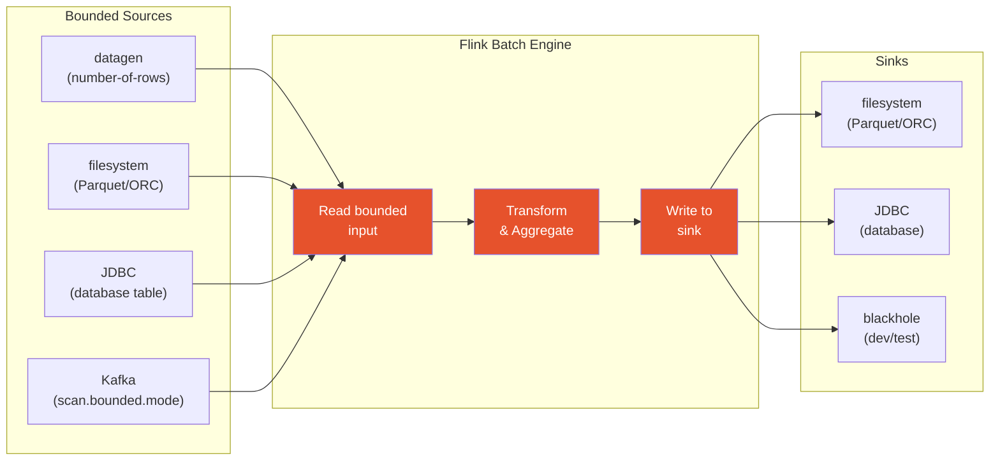

# Batch Processing

[Home](../index.md) > [Guides](./) > Batch Processing

---

While Apache Flink is best known for stream processing, it also provides a mature batch execution engine. dbt-flink-adapter supports batch mode through bounded sources, batch-optimized execution configuration, and the `table` and `incremental` materializations running in `execution_mode='batch'`.

## When to Use Batch vs. Streaming

| Characteristic | Batch Mode | Streaming Mode |
|---|---|---|
| Data source | Bounded (finite rows) | Unbounded (continuous) |
| Execution | Runs to completion, then exits | Runs indefinitely |
| Latency | Minutes to hours | Seconds to minutes |
| Use case | Daily ETL, backfills, reports | Real-time dashboards, alerting |
| Cost model | Pay for compute during job run | Pay for always-on compute |
| State management | No checkpointing needed | Checkpoints required |
| Typical scheduler | Cron, Airflow, dbt Cloud | Always running |

### Decision Table

| Scenario | Recommended Mode |
|---|---|
| Daily aggregation of yesterday's data | Batch |
| Real-time fraud detection | Streaming |
| Backfill historical data into a new table | Batch |
| Continuously enrich events from Kafka | Streaming |
| One-time data migration | Batch |
| Live dashboard with 5-minute freshness | Streaming (or materialized_table) |
| Nightly report generation | Batch |
| CDC pipeline from PostgreSQL | Streaming |

## Batch Execution Flow



## Bounded Sources

For batch mode to work correctly, every source must be **bounded** -- it must have a finite number of rows. Some connectors are naturally bounded (filesystem, JDBC). Others (Kafka, datagen) require explicit configuration.

### datagen (Testing)

The `datagen` connector generates synthetic data. To make it bounded, set `number-of-rows`:

```yaml
{{
  config(
    materialized='table',
    execution_mode='batch',
    properties={
      'connector': 'datagen',
      'number-of-rows': '1000000',
      'fields.event_id.kind': 'sequence',
      'fields.event_id.start': '1',
      'fields.event_id.end': '1000000',
      'fields.user_id.length': '8',
      'fields.amount.min': '1.00',
      'fields.amount.max': '999.99'
    }
  )
}}

SELECT event_id, user_id, amount
FROM source_table
```

Without `number-of-rows`, the datagen connector produces events indefinitely and the batch job never completes.

### Kafka (Bounded Read)

Kafka is naturally unbounded, but you can make it bounded by specifying where to stop reading:

```yaml
properties={
  'connector': 'kafka',
  'topic': 'events',
  'properties.bootstrap.servers': 'kafka:9092',
  'scan.startup.mode': 'earliest-offset',
  'scan.bounded.mode': 'latest-offset',
  'format': 'json'
}
```

| `scan.bounded.mode` | Behavior |
|---|---|
| `latest-offset` | Reads from startup position to the latest offset at job start |
| `group-offsets` | Reads to the committed consumer group offset |
| `timestamp` | Reads to a specific timestamp (requires `scan.bounded.timestamp-millis`) |
| `specific-offsets` | Reads to explicit per-partition offsets |

The `validate_batch_mode` macro raises a compiler error if you use Kafka in batch mode without `scan.bounded.mode`.

### Filesystem (Naturally Bounded)

File-based sources (Parquet, ORC, CSV, Avro) are naturally bounded:

```yaml
properties={
  'connector': 'filesystem',
  'path': 's3://data-lake/events/dt=2025-01-15/',
  'format': 'parquet'
}
```

For best batch performance, use columnar formats (Parquet or ORC) instead of row-oriented formats (CSV, JSON).

### JDBC (Naturally Bounded)

JDBC reads from a database table, which is inherently bounded:

```yaml
properties={
  'connector': 'jdbc',
  'url': 'jdbc:postgresql://db:5432/analytics',
  'table-name': 'public.events',
  'username': '{{ env_var("DB_USER") }}',
  'password': '{{ env_var("DB_PASSWORD") }}',
  'scan.fetch-size': '1000'
}
```

For large tables, configure parallel scanning:

```yaml
properties={
  'connector': 'jdbc',
  'url': 'jdbc:postgresql://db:5432/analytics',
  'table-name': 'public.events',
  'scan.partition.column': 'id',
  'scan.partition.num': '4',
  'scan.partition.lower-bound': '1',
  'scan.partition.upper-bound': '10000000',
  'scan.fetch-size': '5000'
}
```

## The `configure_batch_source` Macro

The `configure_batch_source` macro adds appropriate bounded-mode configuration based on connector type. It accepts a connector type string and an existing properties dictionary, and returns a new dictionary with batch-specific defaults added.

### Kafka

```sql

{# Result adds: scan.bounded.mode=latest-offset, scan.startup.mode=earliest-offset #}
```

### datagen

```sql

{# Logs warning if number-of-rows is missing #}
```

### JDBC

```sql

{# Result adds: scan.fetch-size=1000 (if not already set) #}
```

### Filesystem

```sql

{# Logs suggestion to use parquet or orc for better performance #}
```

## The `get_batch_execution_config` Macro

This macro returns a dictionary of Flink configuration properties optimized for batch execution:

```sql

```

Default values returned:

| Key | Default Value | Purpose |
|---|---|---|
| `execution.runtime-mode` | `batch` | Run Flink in batch mode |
| `execution.batch-shuffle-mode` | `ALL_EXCHANGES_BLOCKING` | Use blocking shuffle for batch |
| `table.exec.spill-compression.enabled` | `true` | Compress spilled data |
| `table.exec.spill-compression.block-size` | `64kb` | Spill compression block size |

You can override any of these:

```sql

```

Use the result in your model's `execution_config`:

```yaml
{{
  config(
    materialized='table',
    execution_mode='batch',
    execution_config=get_batch_execution_config({
      'table.exec.resource.default-parallelism': '8'
    })
  )
}}
```

## The `validate_batch_mode` Macro

This macro checks for common misconfigurations when running in batch mode. It is called automatically by the `table` materialization when `execution_mode='batch'`.

Checks performed:

| Condition | Behavior |
|---|---|
| Kafka connector without `scan.bounded.mode` | **Raises compiler error** |
| datagen connector without `number-of-rows` | Logs warning |
| Kafka with `scan.startup.mode=latest-offset` but no `scan.bounded.mode` | Logs warning (job would process zero rows) |

## Example: Daily Batch ETL

This example demonstrates a daily batch pipeline that reads events from a bounded Kafka source, aggregates them by date and user, and writes to a partitioned filesystem table using the `insert_overwrite` incremental strategy.

### Source Configuration

```yaml
# models/schema.yml
sources:
  - name: raw
    tables:
      - name: events
        config:
          connector_properties:
            connector: kafka
            topic: events
            properties.bootstrap.servers: "kafka:9092"
            scan.startup.mode: earliest-offset
            scan.bounded.mode: latest-offset
            format: json
        columns:
          - name: event_id
            data_type: BIGINT
          - name: user_id
            data_type: STRING
          - name: event_type
            data_type: STRING
          - name: event_time
            data_type: TIMESTAMP(3)
          - name: amount
            data_type: "DECIMAL(10, 2)"
```

### Incremental Batch Model

```yaml
-- models/batch/daily_user_summary.sql
{{
  config(
    materialized='incremental',
    incremental_strategy='insert_overwrite',
    execution_mode='batch',
    partition_by=['dt'],
    execution_config=get_batch_execution_config(),
    properties={
      'connector': 'filesystem',
      'path': 's3://data-lake/daily_user_summary/',
      'format': 'parquet',
      'partition.default-name': 'unpartitioned',
      'sink.rolling-policy.file-size': '128MB'
    }
  )
}}

SELECT
    CAST(event_time AS DATE) AS dt,
    user_id,
    event_type,
    COUNT(*) AS event_count,
    SUM(amount) AS total_amount,
    MIN(event_time) AS first_event,
    MAX(event_time) AS last_event
FROM {{ source('raw', 'events') }}


WHERE CAST(event_time AS DATE) = CURRENT_DATE - INTERVAL '1' DAY


GROUP BY
    CAST(event_time AS DATE),
    user_id,
    event_type
```

### Running the Batch Job

```bash
# First run: creates the table and loads all historical data
dbt run --select daily_user_summary

# Incremental run: overwrites only yesterday's partition
dbt run --select daily_user_summary

# Force full refresh (drop and recreate)
dbt run --select daily_user_summary --full-refresh
```

## Batch Performance Tips

1. **Use columnar formats**: Parquet and ORC provide predicate pushdown and column pruning, reducing I/O significantly.

2. **Tune parallelism**: Set `table.exec.resource.default-parallelism` in `execution_config` to match your cluster's TaskManager slots.

3. **JDBC fetch size**: Increase `scan.fetch-size` from the default (which varies by driver) to 1000 or higher for large table scans. The `configure_batch_source` macro sets this to 1000 by default.

4. **JDBC parallel scan**: For large database tables, configure `scan.partition.column`, `scan.partition.num`, `scan.partition.lower-bound`, and `scan.partition.upper-bound` to read partitions in parallel.

5. **Spill compression**: The `get_batch_execution_config` macro enables spill compression by default, which reduces disk I/O when intermediate results spill to disk.

6. **Bounded Kafka reads**: Always pair `scan.startup.mode` with `scan.bounded.mode`. Using `scan.startup.mode=latest-offset` without a bounded mode means the job starts at the latest offset and immediately finishes with zero rows.

---

## Next Steps

- [Streaming Pipelines](./streaming-pipelines.md) -- Real-time streaming with watermarks and windows
- [Incremental Models](./incremental-models.md) -- Append, overwrite, and merge strategies
- [Sources and Connectors](./sources-and-connectors.md) -- Defining sources and configuring connectors
- [Materializations](./materializations.md) -- Full reference for all six materializations
