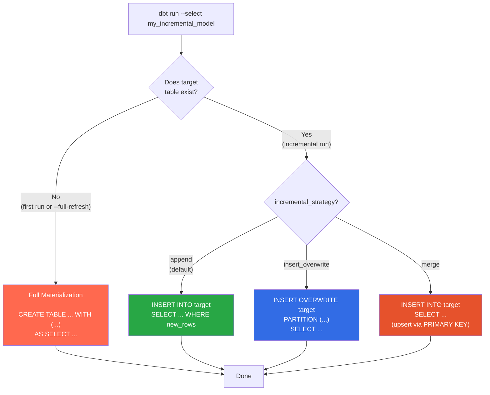

# Incremental Models

[Home](../index.md) > [Guides](./) > Incremental Models

---

Incremental models avoid rebuilding an entire table on every run. Instead, they add only new or changed data, which is critical for large datasets and streaming workloads where full refresh is impractical or impossible. dbt-flink-adapter supports three incremental strategies, each targeting different data patterns and connector capabilities.

## How Incremental Models Work



On the **first run**, the model behaves identically to the `table` materialization: it creates the target table with connector properties and populates it with all data from the query.

On **subsequent runs**, the model checks for the existing target table and applies the configured incremental strategy to add only new data.

The `--full-refresh` flag forces a complete rebuild regardless of whether the table exists.

---

## Strategy 1: Append

The `append` strategy is the default. It issues a plain `INSERT INTO` to add new rows to the existing table. This is the simplest strategy and works with any Flink connector.

### Use Cases

- Event logs and audit trails
- Time-series data (metrics, sensor readings)
- Immutable fact tables
- Streaming pipelines that continuously append

### Configuration

```yaml
-- models/incremental/event_log.sql
{{
  config(
    materialized='incremental',
    incremental_strategy='append',
    execution_mode='streaming',
    properties={
      'connector': 'kafka',
      'topic': 'event-log-output',
      'properties.bootstrap.servers': 'kafka:9092',
      'format': 'json'
    }
  )
}}

SELECT
    event_id,
    user_id,
    event_type,
    event_time,
    amount
FROM {{ source('raw', 'events') }}


WHERE event_time > (SELECT MAX(event_time) FROM {{ this }})

```

### Generated SQL

**First run:**

```sql
/** mode('streaming') */ /** upgrade_mode('stateless') */ /** job_state('running') */
/** drop_statement('drop table if exists `default_catalog.default_database.event_log`') */
CREATE TABLE default_catalog.default_database.event_log
WITH (
    'connector' = 'kafka',
    'topic' = 'event-log-output',
    'properties.bootstrap.servers' = 'kafka:9092',
    'format' = 'json'
)
AS
    SELECT event_id, user_id, event_type, event_time, amount
    FROM raw.events
```

**Incremental run:**

```sql
/** mode('streaming') */
/** upgrade_mode('stateless') */
/** job_state('running') */
INSERT INTO default_catalog.default_database.event_log
    SELECT event_id, user_id, event_type, event_time, amount
    FROM raw.events
    WHERE event_time > (SELECT MAX(event_time) FROM default_catalog.default_database.event_log)
```

### The `is_incremental()` Macro

The `is_incremental()` macro returns `true` when:

1. The target table already exists in the catalog
2. The `--full-refresh` flag is **not** set
3. The model is configured with `materialized='incremental'`

Use it to filter for only new data on incremental runs:

```sql

-- Only process rows newer than what we already have
WHERE event_time > (SELECT MAX(event_time) FROM {{ this }})

```

The `{{ this }}` variable refers to the target relation of the current model.

---

## Strategy 2: Insert Overwrite

The `insert_overwrite` strategy replaces data in the target table using `INSERT OVERWRITE`. When combined with `partition_by`, it replaces only the specified partitions, leaving other partitions untouched. This is the standard pattern for daily batch ETL.

### Use Cases

- Daily or hourly batch aggregations
- Partitioned dimension tables
- Any workload where a time-bounded slice is recomputed each run

### Configuration

```yaml
-- models/incremental/daily_revenue.sql
{{
  config(
    materialized='incremental',
    incremental_strategy='insert_overwrite',
    execution_mode='batch',
    partition_by=['dt'],
    properties={
      'connector': 'filesystem',
      'path': 's3://data-lake/daily_revenue/',
      'format': 'parquet',
      'partition.default-name': 'unpartitioned',
      'sink.rolling-policy.file-size': '128MB'
    }
  )
}}

SELECT
    CAST(event_time AS DATE) AS dt,
    user_id,
    SUM(amount) AS daily_revenue,
    COUNT(*) AS transaction_count
FROM {{ source('raw', 'events') }}


WHERE CAST(event_time AS DATE) = CURRENT_DATE - INTERVAL '1' DAY


GROUP BY CAST(event_time AS DATE), user_id
```

### Generated SQL (Incremental Run)

```sql
/** mode('batch') */
/** upgrade_mode('stateless') */
/** job_state('running') */
INSERT OVERWRITE default_catalog.default_database.daily_revenue
PARTITION (dt)
    SELECT
        CAST(event_time AS DATE) AS dt,
        user_id,
        SUM(amount) AS daily_revenue,
        COUNT(*) AS transaction_count
    FROM raw.events
    WHERE CAST(event_time AS DATE) = CURRENT_DATE - INTERVAL '1' DAY
    GROUP BY CAST(event_time AS DATE), user_id
```

### Partition-Aware Overwrite

When `partition_by` is configured, `INSERT OVERWRITE` replaces only the partitions that appear in the query result. Other partitions remain unchanged. This is essential for incremental batch processing:

```
Before run:
  daily_revenue/
    dt=2025-01-13/  (untouched)
    dt=2025-01-14/  (untouched)
    dt=2025-01-15/  (overwritten with new data)

After run:
  daily_revenue/
    dt=2025-01-13/  (unchanged)
    dt=2025-01-14/  (unchanged)
    dt=2025-01-15/  (fresh data from this run)
```

### Constraints

- Only works in **batch mode** (`execution_mode='batch'`)
- Not all connectors support `INSERT OVERWRITE` (filesystem and Hive do; Kafka does not)
- Without `partition_by`, the entire table is overwritten (equivalent to a full refresh)

---

## Strategy 3: Merge

The `merge` strategy handles upsert (insert-or-update) semantics. Flink does not have a native `MERGE` statement; instead, this strategy relies on **upsert-capable connectors** that use a primary key to automatically deduplicate writes.

When you `INSERT INTO` a table with a primary key backed by an upsert connector, the connector handles the merge logic: new rows are inserted, and existing rows (matching the primary key) are updated.

### Use Cases

- Slowly changing dimensions (SCD Type 1)
- User profile tables
- State tables updated from a CDC stream
- Any table where the latest value per key matters

### Configuration

```yaml
-- models/incremental/user_profile.sql
{{
  config(
    materialized='incremental',
    incremental_strategy='merge',
    unique_key='user_id',
    execution_mode='streaming',
    connector_properties={
      'connector': 'upsert-kafka',
      'topic': 'user-profiles',
      'properties.bootstrap.servers': 'kafka:9092',
      'key.format': 'json',
      'value.format': 'json'
    }
  )
}}

SELECT
    user_id,
    LAST_VALUE(email) AS email,
    LAST_VALUE(full_name) AS full_name,
    LAST_VALUE(country) AS country,
    MAX(event_time) AS last_active_at,
    COUNT(*) AS total_events
FROM {{ source('raw', 'user_events') }}
GROUP BY user_id
```

### With JDBC Connector

```yaml
-- models/incremental/product_inventory.sql
{{
  config(
    materialized='incremental',
    incremental_strategy='merge',
    unique_key='product_id',
    execution_mode='streaming',
    connector_properties={
      'connector': 'jdbc',
      'url': 'jdbc:postgresql://db:5432/warehouse',
      'table-name': 'product_inventory',
      'username': '{{ env_var("DB_USER") }}',
      'password': '{{ env_var("DB_PASSWORD") }}'
    }
  )
}}

SELECT
    product_id,
    SUM(quantity_change) AS current_stock,
    MAX(event_time) AS last_updated
FROM {{ source('inventory', 'stock_events') }}
GROUP BY product_id
```

### Validation

The adapter performs two validations for the merge strategy:

1. **`unique_key` is required**: If missing, a compiler error is raised:
   ```
   incremental_strategy="merge" requires unique_key to be configured
   ```

2. **Connector compatibility warning**: If the connector is not in the known upsert-capable list (`upsert-kafka`, `jdbc`, `upsert-jdbc`), a warning is logged but compilation continues. This allows custom connectors that support upsert to work without modification.

---

## Strategy Compatibility Matrix

| Strategy | `kafka` | `upsert-kafka` | `jdbc` | `filesystem` | `blackhole` | `datagen` |
|---|---|---|---|---|---|---|
| `append` | Yes | Yes | Yes | Yes | Yes | N/A (source only) |
| `insert_overwrite` | No | No | No | Yes | No | N/A (source only) |
| `merge` | No | Yes | Yes | No | No | N/A (source only) |

---

## Configuration Reference

| Option | Type | Default | Description |
|---|---|---|---|
| `incremental_strategy` | `string` | `'append'` | One of: `append`, `insert_overwrite`, `merge` |
| `unique_key` | `string` or `list[string]` | `None` | Column(s) that uniquely identify a row. Required for `merge`. |
| `partition_by` | `list[string]` | `None` | Partition columns for `insert_overwrite`. Determines which partitions are replaced. |
| `execution_mode` | `string` | `'batch'` | `batch` or `streaming` |
| `properties` | `dict` | `{}` | Connector properties (merged with defaults) |
| `connector_properties` | `dict` | `{}` | Connector properties (merged with defaults) |
| `contract.enforced` | `bool` | `false` | Validate column types against schema definition |
| `execution_config` | `dict` | `{}` | Additional Flink configuration (SET statements) |
| `upgrade_mode` | `string` | `'stateless'` | Ververica deployment upgrade mode |
| `job_state` | `string` | `'running'` | Ververica deployment desired job state |

---

## Full Refresh

The `--full-refresh` flag forces the model to drop the existing table and rebuild from scratch, regardless of the incremental strategy:

```bash
# Normal incremental run
dbt run --select my_incremental_model

# Force full rebuild
dbt run --select my_incremental_model --full-refresh
```

Use full refresh when:

- The schema has changed in a way the incremental strategy cannot handle
- Data quality issues require a clean rebuild
- You are deploying to a new environment for the first time
- The incremental filter logic has changed

---

## Patterns and Recipes

### Time-Based Filtering with Lookback

Add a lookback period to handle late-arriving data:

```sql

WHERE event_time > (
    SELECT MAX(event_time) - INTERVAL '1' HOUR
    FROM {{ this }}
)

```

### Multi-Column Unique Key

For composite keys, pass a list:

```yaml
{{
  config(
    materialized='incremental',
    incremental_strategy='merge',
    unique_key=['user_id', 'product_id']
  )
}}
```

### Streaming Append with Kafka

For continuous append to a Kafka topic:

```yaml
{{
  config(
    materialized='incremental',
    incremental_strategy='append',
    execution_mode='streaming',
    properties={
      'connector': 'kafka',
      'topic': 'enriched-events',
      'properties.bootstrap.servers': 'kafka:9092',
      'format': 'json'
    }
  )
}}

-- No is_incremental() filter needed for streaming --
-- the source itself is unbounded and continuously produces new data
SELECT
    event_id,
    user_id,
    enrich_event_type(event_type) AS enriched_type,
    event_time
FROM {{ source('raw', 'events') }}
```

### Batch Daily Partition with Bounded Kafka

Read all events from Kafka up to the latest offset, then aggregate by date:

```yaml
{{
  config(
    materialized='incremental',
    incremental_strategy='insert_overwrite',
    execution_mode='batch',
    partition_by=['dt'],
    execution_config=get_batch_execution_config(),
    properties={
      'connector': 'filesystem',
      'path': 's3://data-lake/daily_events/',
      'format': 'parquet'
    }
  )
}}

SELECT
    CAST(event_time AS DATE) AS dt,
    event_type,
    COUNT(*) AS event_count
FROM {{ source('raw', 'events') }}


WHERE CAST(event_time AS DATE) >= CURRENT_DATE - INTERVAL '2' DAY


GROUP BY CAST(event_time AS DATE), event_type
```

---

## Troubleshooting

### "Table does not exist" on incremental run

The adapter checks whether the target table exists in the Flink catalog. If the Flink cluster was restarted and the session-scoped table was lost, the next run will treat it as a first run and create the table. Use persistent catalogs (Hive Metastore, Paimon) to survive restarts.

### "Invalid incremental_strategy"

The adapter validates the strategy name. Valid values are `append`, `insert_overwrite`, and `merge`. The error message includes the list of valid strategies:

```
Invalid incremental_strategy: "upsert". Valid strategies for Flink adapter: append, insert_overwrite, merge
```

### Merge strategy with non-upsert connector

If you configure `incremental_strategy='merge'` with a connector that does not support upsert (such as plain `kafka`), the adapter logs a warning but proceeds. The job may fail at runtime if the connector cannot handle duplicate keys.

---

## Next Steps

- [Materializations](./materializations.md) -- Overview of all six materializations
- [Streaming Pipelines](./streaming-pipelines.md) -- Watermarks and windows for streaming
- [Batch Processing](./batch-processing.md) -- Bounded sources and batch execution
- [Sources and Connectors](./sources-and-connectors.md) -- Source definitions and connector configuration
