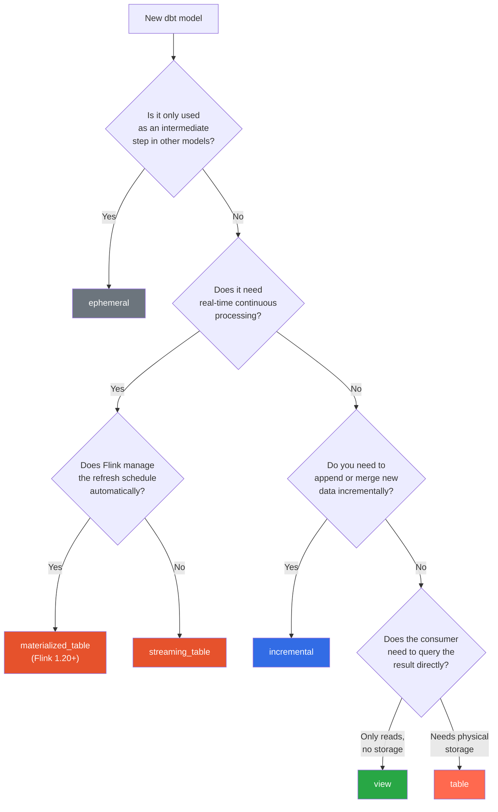
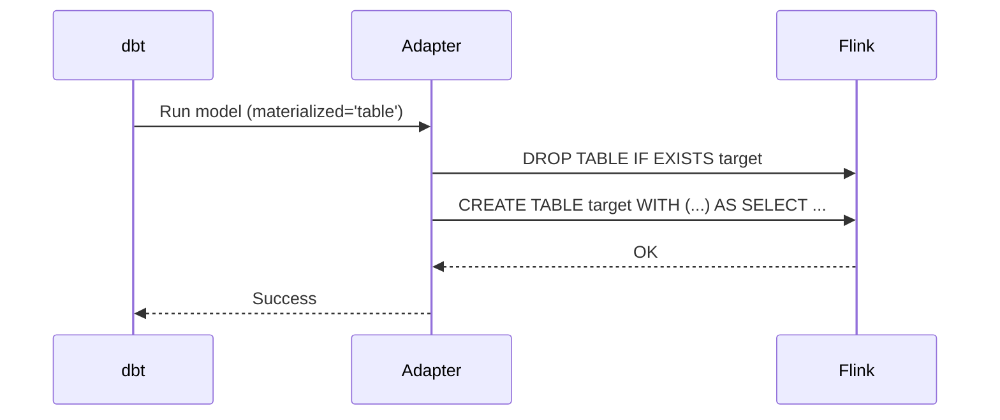
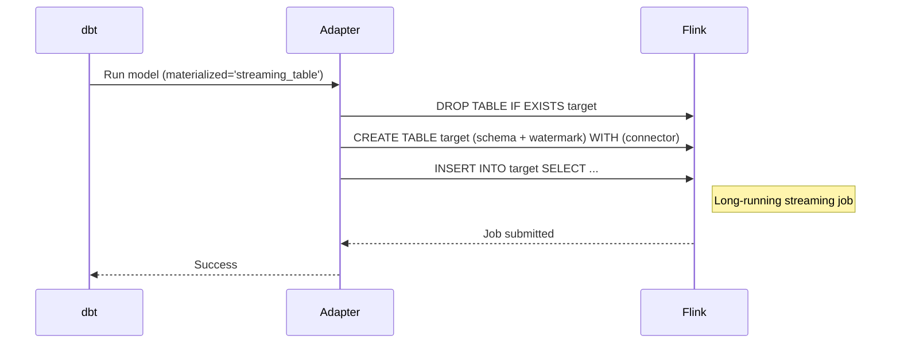
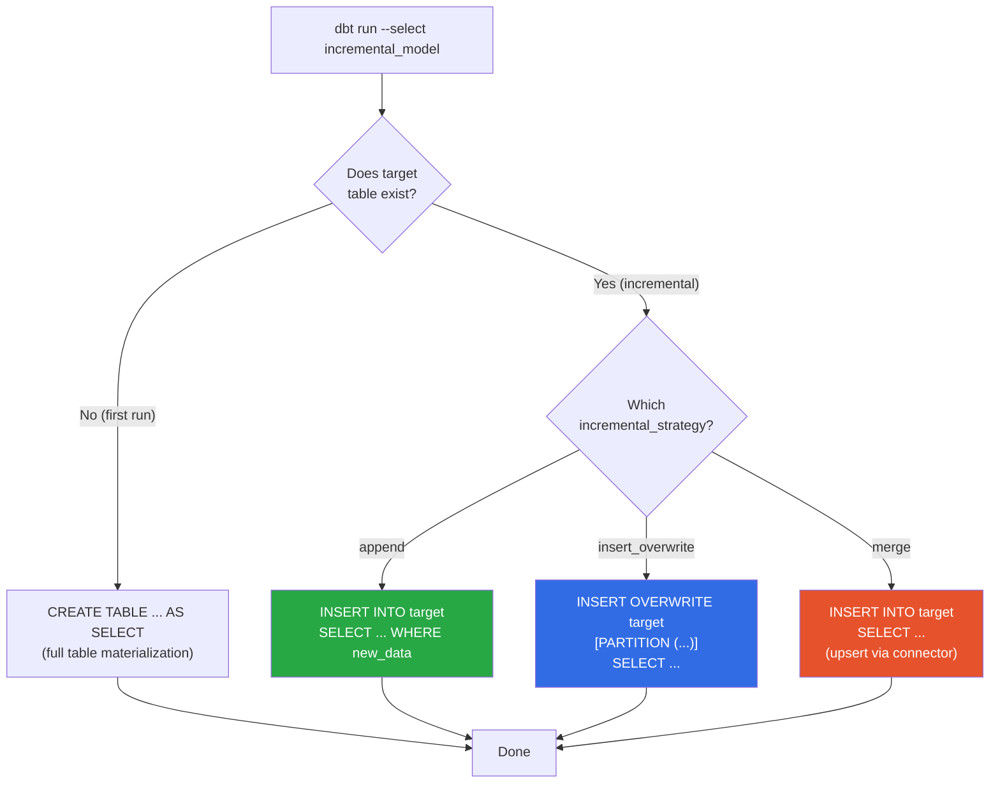

# Materializations

[Home](../index.md) > [Guides](./) > Materializations

---

dbt-flink-adapter provides six materializations that map dbt's model abstraction onto Apache Flink's table and view primitives. Each materialization targets a different execution pattern -- from ephemeral CTEs that exist only at compile time, to continuously refreshing materialized tables managed entirely by Flink.

## Overview

| Materialization | Use Case | Execution Mode | Connector Required | Physical Object Created |
|---|---|---|---|---|
| `table` | One-time or periodic batch loads | batch (default) | Yes (defaults to `blackhole`) | Flink table with connector |
| `view` | Lightweight logical layer | streaming or batch | No | Flink SQL view |
| `streaming_table` | Continuous streaming pipelines | streaming (default) | Yes (defaults to `kafka`) | Flink table + INSERT INTO job |
| `incremental` | Append, overwrite, or merge into existing table | batch or streaming | Yes | Flink table + INSERT statement |
| `materialized_table` | Auto-refreshing managed table (Flink 1.20+) | streaming or batch | Optional | Flink MATERIALIZED TABLE |
| `ephemeral` | Staging transformations, shared logic | N/A (compile-time only) | No | None (CTE interpolation) |

## Choosing a Materialization

Use this decision flowchart to select the right materialization for your model.



---

## 1. Table

The `table` materialization creates a physical Flink table using `CREATE TABLE ... AS SELECT`. On every `dbt run`, the adapter drops the existing table and recreates it from scratch. This makes it appropriate for one-time loads, development snapshots, or batch-mode backfills where full refresh is acceptable.

### How It Works



### Configuration

```yaml
-- models/staging/stg_events.sql
{{
  config(
    materialized='table',
    execution_mode='batch',
    properties={
      'connector': 'filesystem',
      'path': 's3://data-lake/events/',
      'format': 'parquet'
    }
  )
}}

SELECT
    event_id,
    user_id,
    event_type,
    event_time
FROM {{ source('raw', 'events') }}
WHERE event_time >= CURRENT_DATE - INTERVAL '7' DAY
```

### Default Behavior

- **Execution mode**: `batch`
- **Default connector**: `blackhole` (if none specified)
- **Full refresh**: The table is dropped and recreated on every run
- **Contract support**: Yes -- column types and constraints are enforced when `contract.enforced = true`

### Connector Properties Merge Order

Properties are merged from three sources in order, with later values overriding earlier ones:

1. `default_connector_properties` (from `dbt_project.yml`)
2. `connector_properties` (from model config)
3. `properties` (from model config)

```yaml
# dbt_project.yml -- shared defaults
models:
  my_project:
    +default_connector_properties:
      connector: kafka
      properties.bootstrap.servers: "kafka:9092"

# Model-level override
{{
  config(
    properties={
      'topic': 'my-specific-topic'
    }
  )
}}
```

### When to Use

- Development and testing with `blackhole` sink
- One-time data loads or backfills
- Batch ETL jobs that fully replace target data
- Landing zone tables backed by filesystem or JDBC connectors

---

## 2. View

The `view` materialization creates a Flink SQL view using `CREATE VIEW ... AS`. Views are the simplest materialization: they store no data and require no connector. Every query against a view re-executes the underlying SQL.

### Configuration

```yaml
-- models/staging/stg_users_clean.sql
{{
  config(
    materialized='view',
    type='streaming'
  )
}}

SELECT
    user_id,
    LOWER(TRIM(email)) AS email_clean,
    UPPER(country_code) AS country,
    created_at
FROM {{ source('app', 'users') }}
WHERE user_id IS NOT NULL
```

### Generated SQL

```sql
/** drop_statement('drop view if exists `default_catalog.default_database.stg_users_clean`') */
CREATE VIEW default_catalog.default_database.stg_users_clean AS (
    SELECT
        user_id,
        LOWER(TRIM(email)) AS email_clean,
        UPPER(country_code) AS country,
        created_at
    FROM app.users
    WHERE user_id IS NOT NULL
);
```

### Default Behavior

- **No connector required**: Views are purely logical
- **No storage cost**: Data is computed on the fly
- **Contract support**: Yes -- column contracts are validated at compile time
- **Execution mode**: Inherits the caller's execution mode, or can be set explicitly with `type`

### When to Use

- Lightweight transformations and renaming
- Reusable business logic consumed by multiple downstream models
- When storage cost or connector setup is unnecessary
- Streaming pipelines where each stage is a logical layer

---

## 3. Streaming Table

The `streaming_table` materialization is purpose-built for continuous streaming pipelines. It creates a physical Flink table with explicit schema, optional watermark definitions, and an `INSERT INTO` job that runs indefinitely.

### Two Modes of Operation

**Mode 1: With Explicit Schema (supports watermarks)**

When you provide a `schema` config, the adapter issues three separate statements:

1. `DROP TABLE IF EXISTS target`
2. `CREATE TABLE target (columns, WATERMARK FOR ...) WITH (...)`
3. `INSERT INTO target SELECT ...`



**Mode 2: Without Explicit Schema (CTAS fallback)**

Without a `columns` config, the adapter uses `CREATE TABLE ... AS SELECT`, which does not support watermarks.

> **Note:** Use `columns=` (not `schema=`) for inline column definitions. dbt-core reserves `schema=` for the model's custom schema name.

### Configuration with Watermarks

```yaml
-- models/streaming/enriched_events.sql
{{
  config(
    materialized='streaming_table',
    execution_mode='streaming',
    columns="
      event_id BIGINT,
      user_id STRING,
      event_type STRING,
      event_time TIMESTAMP(3),
      amount DECIMAL(10, 2)
    ",
    watermark={
      'column': 'event_time',
      'strategy': "event_time - INTERVAL '5' SECOND"
    },
    properties={
      'connector': 'kafka',
      'topic': 'enriched-events',
      'properties.bootstrap.servers': 'kafka:9092',
      'format': 'json'
    }
  )
}}

SELECT
    e.event_id,
    e.user_id,
    e.event_type,
    e.event_time,
    e.amount
FROM {{ source('raw', 'events') }} e
WHERE e.event_type IS NOT NULL
```

### Configuration without Schema (CTAS)

```yaml
-- models/streaming/simple_passthrough.sql
{{
  config(
    materialized='streaming_table',
    properties={
      'connector': 'blackhole'
    }
  )
}}

SELECT * FROM {{ source('raw', 'events') }}
```

### Default Behavior

- **Execution mode**: `streaming`
- **Default connector**: `kafka` (if none specified)
- **Watermarks**: Require explicit `schema` config; raise compiler error if watermark is configured without schema
- **Job lifecycle**: The INSERT INTO creates a long-running Flink job
- **Contract support**: Yes

### Query Hints

Streaming tables emit query hints that control Flink behavior and Ververica deployment:

| Hint | Purpose | Default |
|---|---|---|
| `mode('streaming')` | Sets `execution.runtime-mode` | `streaming` |
| `upgrade_mode('stateless')` | Controls how Ververica upgrades the job | `stateless` |
| `job_state('running')` | Desired job state in Ververica | `running` |
| `execution_config('key=value;...')` | Additional Flink SET statements | Empty |

### When to Use

- Real-time event processing pipelines
- Kafka-to-Kafka transformations
- Windowed aggregations with watermarks
- Any continuous streaming workload

---

## 4. Incremental

The `incremental` materialization appends new data to an existing table instead of rebuilding it from scratch. On the first run (or with `--full-refresh`), it creates the table using the `table` materialization logic. On subsequent runs, it uses one of three strategies to add new data.

### First Run vs. Incremental Run



### Strategy 1: Append

The default strategy. Issues a plain `INSERT INTO` to add new rows.

```yaml
-- models/incremental/event_log.sql
{{
  config(
    materialized='incremental',
    incremental_strategy='append',
    execution_mode='streaming',
    properties={
      'connector': 'kafka',
      'topic': 'event-log-sink',
      'properties.bootstrap.servers': 'kafka:9092',
      'format': 'json'
    }
  )
}}

SELECT
    event_id,
    user_id,
    event_type,
    event_time,
    amount
FROM {{ source('raw', 'events') }}


WHERE event_time > (SELECT MAX(event_time) FROM {{ this }})

```

### Strategy 2: Insert Overwrite

Replaces data in the target table, optionally scoped to specific partitions. Best for daily batch pipelines with date-partitioned tables.

```yaml
-- models/incremental/daily_summary.sql
{{
  config(
    materialized='incremental',
    incremental_strategy='insert_overwrite',
    execution_mode='batch',
    partition_by=['dt'],
    properties={
      'connector': 'filesystem',
      'path': 's3://data-lake/daily_summary/',
      'format': 'parquet',
      'partition.default-name': 'unpartitioned'
    }
  )
}}

SELECT
    CAST(event_time AS DATE) AS dt,
    user_id,
    COUNT(*) AS event_count,
    SUM(amount) AS total_amount
FROM {{ source('raw', 'events') }}


WHERE CAST(event_time AS DATE) = CURRENT_DATE


GROUP BY CAST(event_time AS DATE), user_id
```

### Strategy 3: Merge

Uses upsert-capable connectors (such as `upsert-kafka` or `jdbc`) to handle deduplication by primary key. The connector itself manages the merge logic.

```yaml
-- models/incremental/user_profile.sql
{{
  config(
    materialized='incremental',
    incremental_strategy='merge',
    unique_key='user_id',
    execution_mode='streaming',
    connector_properties={
      'connector': 'upsert-kafka',
      'topic': 'user-profiles',
      'properties.bootstrap.servers': 'kafka:9092',
      'key.format': 'json',
      'value.format': 'json'
    }
  )
}}

SELECT
    user_id,
    LAST_VALUE(email) AS email,
    LAST_VALUE(country) AS country,
    MAX(event_time) AS last_seen_at
FROM {{ source('raw', 'user_events') }}
GROUP BY user_id
```

### Strategy Compatibility

| Strategy | Streaming Mode | Batch Mode | Requires `unique_key` | Connector Requirement |
|---|---|---|---|---|
| `append` | Yes | Yes | No | Any connector |
| `insert_overwrite` | No | Yes | No | Connectors that support overwrite (filesystem, Hive) |
| `merge` | Yes | Yes | Yes | Upsert-capable: `upsert-kafka`, `jdbc`, `upsert-jdbc` |

### Configuration Options

| Option | Type | Default | Description |
|---|---|---|---|
| `incremental_strategy` | string | `append` | Strategy: `append`, `insert_overwrite`, `merge` |
| `unique_key` | string or list | None | Required for `merge` strategy |
| `partition_by` | list | None | Partition columns for `insert_overwrite` |
| `execution_mode` | string | `batch` | `batch` or `streaming` |
| `--full-refresh` | CLI flag | -- | Force full rebuild on next run |

### When to Use

- **append**: Event logs, time-series data, audit trails
- **insert_overwrite**: Daily batch partitions, dimension snapshots
- **merge**: Slowly changing dimensions, user profiles, state tables

See [Incremental Models](./incremental-models.md) for an in-depth guide with advanced patterns.

---

## 5. Materialized Table

The `materialized_table` materialization uses Flink 1.20's `CREATE MATERIALIZED TABLE` statement. Unlike other materializations, Flink itself manages the background refresh job that keeps the table up to date. You define a freshness requirement and Flink ensures the data is never staler than that interval.

### Configuration

```yaml
-- models/marts/realtime_user_stats.sql
{{
  config(
    materialized='materialized_table',
    freshness="INTERVAL '5' MINUTE",
    refresh_mode='continuous',
    partition_by=['region'],
    execution_mode='streaming'
  )
}}

SELECT
    user_id,
    region,
    COUNT(*) AS total_events,
    SUM(amount) AS total_amount,
    MAX(event_time) AS last_activity
FROM {{ source('raw', 'events') }}
GROUP BY user_id, region
```

### Generated SQL

```sql
CREATE MATERIALIZED TABLE realtime_user_stats
PARTITIONED BY (region)
FRESHNESS = INTERVAL '5' MINUTE
REFRESH_MODE = CONTINUOUS
AS
SELECT
    user_id,
    region,
    COUNT(*) AS total_events,
    SUM(amount) AS total_amount,
    MAX(event_time) AS last_activity
FROM raw.events
GROUP BY user_id, region
```

### Refresh Modes

| Mode | Behavior | Best For |
|---|---|---|
| `continuous` | Streaming job runs constantly, updating incrementally | Low-latency dashboards, real-time metrics |
| `full` | Periodic batch job rebuilds the entire table | Hourly/daily aggregations, cost-sensitive workloads |
| *(not set)* | Flink auto-selects based on freshness interval | General use (Flink optimizes the choice) |

### Operational Commands

Materialized tables support lifecycle management through dbt run-operations:

```bash
# Pause the background refresh job
dbt run-operation suspend_materialized_table --args '{model_name: realtime_user_stats}'

# Resume with optional config overrides
dbt run-operation resume_materialized_table --args '{model_name: realtime_user_stats}'

# Force an immediate refresh
dbt run-operation refresh_materialized_table --args '{model_name: realtime_user_stats}'

# Get table metadata
dbt run-operation get_materialized_table_info --args '{model_name: realtime_user_stats}'
```

### Requirements and Constraints

- **Flink version**: 1.20 or later
- **Catalog**: Paimon Catalog is required
- **Freshness**: Must be an `INTERVAL` expression (e.g., `"INTERVAL '5' MINUTE"`)
- **Subsequent runs**: If the table already exists, dbt verifies it and lets the background job continue. Use `--full-refresh` to drop and recreate.

### When to Use

- Near-real-time dashboards backed by a managed refresh pipeline
- Aggregation tables with SLA-based freshness guarantees
- Workloads where you want Flink to own the scheduling and lifecycle

---

## 6. Ephemeral

The `ephemeral` materialization creates no physical database object. Instead, the model's SQL is interpolated as a Common Table Expression (CTE) into every downstream model that references it via `{{ ref() }}`.

### Configuration

```yaml
-- models/staging/stg_events_filtered.sql
{{
  config(
    materialized='ephemeral'
  )
}}

SELECT
    event_id,
    user_id,
    event_type,
    event_time,
    amount
FROM {{ source('raw', 'events') }}
WHERE event_type IN ('purchase', 'refund', 'subscription')
  AND amount > 0
```

### How CTE Interpolation Works

When a downstream model references the ephemeral model:

```yaml
-- models/marts/purchase_summary.sql
{{
  config(
    materialized='table',
    properties={'connector': 'blackhole'}
  )
}}

SELECT
    user_id,
    COUNT(*) AS purchase_count,
    SUM(amount) AS total_spent
FROM {{ ref('stg_events_filtered') }}
GROUP BY user_id
```

The compiled SQL becomes:

```sql
WITH stg_events_filtered AS (
    SELECT
        event_id,
        user_id,
        event_type,
        event_time,
        amount
    FROM raw.events
    WHERE event_type IN ('purchase', 'refund', 'subscription')
      AND amount > 0
)
SELECT
    user_id,
    COUNT(*) AS purchase_count,
    SUM(amount) AS total_spent
FROM stg_events_filtered
GROUP BY user_id
```

### Constraints

- No physical table or view created in Flink
- Cannot be queried directly or used in dbt tests
- SQL is duplicated in every downstream consumer
- Deeply nested ephemeral chains produce complex CTEs

### When to Use

- Simple staging transformations (cleaning, filtering, renaming)
- Shared logic consumed by multiple models where duplication cost is low
- Reducing the number of physical objects in the catalog

### When NOT to Use

- Expensive computations (they execute once per consumer, not once globally)
- Models that need to be tested independently
- Deeply nested chains (three or more ephemeral models referencing each other)

---

## Model Contracts

All materializations except `ephemeral` support dbt model contracts (dbt-core 1.5+). When `contract.enforced` is `true`, the adapter validates that the actual columns produced by the model's SQL match the declared columns and types in the YAML schema.

### Enabling Contracts

```yaml
# models/schema.yml
models:
  - name: enriched_events
    config:
      contract:
        enforced: true
    columns:
      - name: event_id
        data_type: BIGINT
        constraints:
          - type: not_null
      - name: user_id
        data_type: STRING
      - name: event_time
        data_type: TIMESTAMP(3)
      - name: amount
        data_type: DECIMAL(10, 2)
```

### Contract Behavior by Materialization

| Materialization | Contract Enforced | Behavior |
|---|---|---|
| `table` | Yes | Uses `get_table_columns_and_constraints()` in CREATE TABLE |
| `view` | Yes | Validates column equivalence at compile time |
| `streaming_table` | Yes | Validates column equivalence at compile time |
| `incremental` | Yes | Validates column equivalence on incremental runs |
| `materialized_table` | Yes | Validates column equivalence on subsequent runs |
| `ephemeral` | Yes | Validates column equivalence at compile time |

---

## Connector Properties Reference

All materializations that create physical tables accept connector properties through the three-layer merge system:

```yaml
# Layer 1: Project-wide defaults (dbt_project.yml)
models:
  my_project:
    +default_connector_properties:
      connector: kafka
      properties.bootstrap.servers: "kafka:9092"
      format: json

    # Layer 2: Directory-level overrides
    staging:
      +connector_properties:
        scan.startup.mode: earliest-offset

    # Layer 3: Model-level overrides (in model SQL config block)
    # properties: {topic: 'my-topic'}
```

Merge order: `default_connector_properties` < `connector_properties` < `properties`

Later values override earlier ones for the same key. This allows you to define organization-wide defaults once and override only what changes per model.

---

## Next Steps

- [Streaming Pipelines](./streaming-pipelines.md) -- Watermarks, window functions, and Kafka integration
- [Batch Processing](./batch-processing.md) -- Bounded sources and batch execution
- [Incremental Models](./incremental-models.md) -- Deep dive into incremental strategies
- [Sources and Connectors](./sources-and-connectors.md) -- Source definitions and connector configuration
- [Ververica Deployment](./ververica-deployment.md) -- Deploy models to Ververica Cloud
