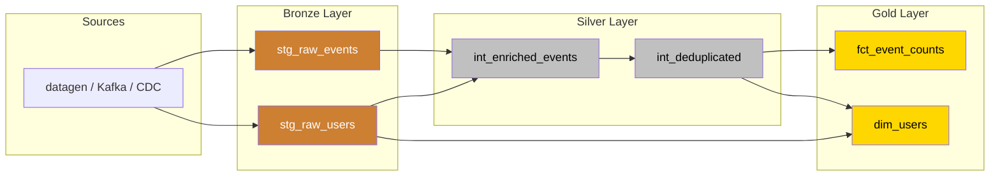
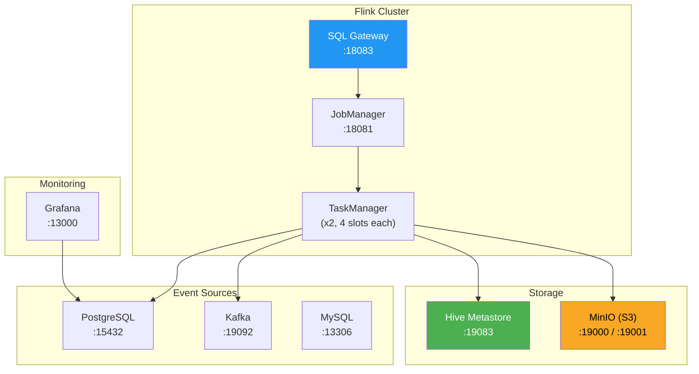
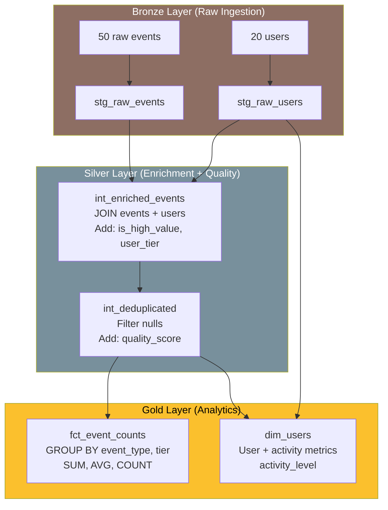

# Medallion Architecture on Open Lakehouse with dbt-flink

Build a production-grade Bronze → Silver → Gold data pipeline on Apache Flink using dbt, with your choice of open lakehouse format: **Apache Paimon**, **Apache Iceberg**, or **Apache Fluss**.

## Architecture Overview



## Infrastructure



## Backend Comparison

| Feature | Apache Paimon | Apache Iceberg | Apache Fluss |
|---------|:------------:|:--------------:|:------------:|
| **Primary use case** | Streaming lakehouse | Open table format | Real-time streaming |
| **Upsert support** | `merge-engine=deduplicate` | `write.upsert.enabled=true` | Primary key tables |
| **Storage format** | ORC (default) | Parquet/ORC/Avro | Internal format |
| **Time travel** | Snapshot ID | Snapshot/Branch/Tag | N/A |
| **Compaction** | Automatic | Manual + scheduled | Automatic |
| **Catalog backend** | Filesystem / Hive | Hive / REST / Glue / Nessie | Fluss coordinator |
| **Streaming writes** | Native changelog | Commit interval based | Native |
| **Schema evolution** | Full support | Full support | Limited |
| **Best for** | Streaming-first pipelines | Multi-engine interop | Ultra-low latency |

## Data Flow



## Quick Start

### Prerequisites

- **podman** (or docker) with compose plugin
- **uv** (Python package manager)
- ~8GB RAM for containers

### 1. Install the adapter

```bash
cd dbt-flink-adapter
uv pip install -e .
```

### 2. Run the demo

```bash
cd demos/medallion-lakehouse

# Option A: Apache Paimon (default)
./run_demo.sh

# Option B: Apache Iceberg
./run_demo.sh --backend iceberg

# Option C: Apache Fluss (requires Fluss containers)
./run_demo.sh --backend fluss
```

### 3. Explore the results

| Dashboard | URL |
|-----------|-----|
| Flink Web UI | http://localhost:18081 |
| MinIO Console | http://localhost:19001 (minioadmin/minioadmin) |
| Grafana | http://localhost:13000 |

### 4. Switch backends

The same logical pipeline runs on any backend. Just change the flag:

```bash
./run_demo.sh --backend iceberg   # Switch to Iceberg
./run_demo.sh --backend paimon    # Switch back to Paimon
```

### 5. Clean up

```bash
./run_demo.sh --stop
```

## How Backend Swapping Works

The `lakehouse_backend` dbt variable controls which storage engine is used:

```yaml
# dbt_project.yml
vars:
  lakehouse_backend: paimon  # or iceberg, fluss
```

### Catalog Setup (`macros/setup_catalogs.sql`)

On each `dbt run`, the `on-run-start` hook creates the appropriate catalog:

```
┌─────────────────────────────────────────────────┐
│  var('lakehouse_backend')                       │
│                                                 │
│  'paimon'  → CREATE CATALOG lakehouse WITH (    │
│               'type' = 'paimon',                │
│               'warehouse' = 's3://...'          │
│              )                                  │
│                                                 │
│  'iceberg' → CREATE CATALOG lakehouse WITH (    │
│               'type' = 'iceberg',               │
│               'catalog-type' = 'hive',          │
│               'uri' = 'thrift://hms:9083',      │
│               'warehouse' = 's3://...'          │
│              )                                  │
│                                                 │
│  'fluss'   → CREATE CATALOG lakehouse WITH (    │
│               'type' = 'fluss',                 │
│               'bootstrap.servers' = '...'       │
│              )                                  │
└─────────────────────────────────────────────────┘
```

### Table Properties (`macros/lakehouse_config.sql`)

Each model calls `lakehouse_table_properties(primary_key=true/false)` to get backend-appropriate WITH clause properties:

- **Paimon PK table**: `merge-engine=deduplicate`, `changelog-producer=input`
- **Iceberg PK table**: `format-version=2`, `write.upsert.enabled=true`, `write.distribution-mode=hash`
- **Fluss**: Properties managed at catalog level

## Extending the Demo

### Add a new data source

1. Create a new Bronze model in `models/staging/`
2. Define the source in `_staging.yml`
3. Wire it into Silver layer transformations

### Add a real Kafka source

Replace the VALUES clause in `stg_raw_events.sql` with a Kafka source:

```sql
-- In default_catalog (not the lakehouse catalog)
CREATE TEMPORARY TABLE kafka_events (
    event_id BIGINT,
    user_id BIGINT,
    event_type STRING,
    amount DOUBLE,
    event_time TIMESTAMP(3)
) WITH (
    'connector' = 'kafka',
    'topic' = 'raw-events',
    'properties.bootstrap.servers' = 'kafka:29092',
    'format' = 'json',
    'scan.startup.mode' = 'earliest-offset'
);

-- Then in your model:
SELECT * FROM kafka_events
```

### Add CDC from PostgreSQL

Use the Flink CDC connector for real-time change capture:

```sql
CREATE TEMPORARY TABLE pg_users (
    user_id BIGINT,
    username STRING,
    email STRING,
    PRIMARY KEY (user_id) NOT ENFORCED
) WITH (
    'connector' = 'postgres-cdc',
    'hostname' = 'postgres',
    'port' = '5432',
    'username' = 'postgres',
    'password' = 'postgres',
    'database-name' = 'testdb',
    'schema-name' = 'public',
    'table-name' = 'users'
);
```

## Production Considerations

### Storage

Replace MinIO with production S3, Azure Blob Storage, or GCS. Update the `s3.endpoint` variable:

```bash
dbt run --vars '{
  lakehouse_backend: iceberg,
  s3_endpoint: "https://s3.amazonaws.com",
  s3_bucket: "my-production-lake"
}'
```

### Catalog

For production Iceberg deployments, consider:
- **AWS Glue** — `create_glue_catalog()` macro
- **Nessie** — `create_nessie_catalog()` for git-like branching
- **Polaris / REST** — `create_iceberg_catalog('rest', ...)` for Snowflake interop

### Monitoring

Add Flink metrics to Grafana via the Prometheus reporter:
```yaml
# flink-conf.yaml
metrics.reporter.prom.factory.class: org.apache.flink.metrics.prometheus.PrometheusReporterFactory
metrics.reporter.prom.port: 9249
```

### Maintenance

Schedule Iceberg maintenance via `dbt run-operation`:

```bash
# Expire old snapshots
dbt run-operation iceberg_expire_snapshots --args '{
  catalog_name: lakehouse,
  table_identifier: "medallion.fct_event_counts",
  retain_last: 5
}'

# Compact small files
dbt run-operation iceberg_rewrite_data_files --args '{
  catalog_name: lakehouse,
  table_identifier: "medallion.fct_event_counts",
  strategy: binpack
}'
```
