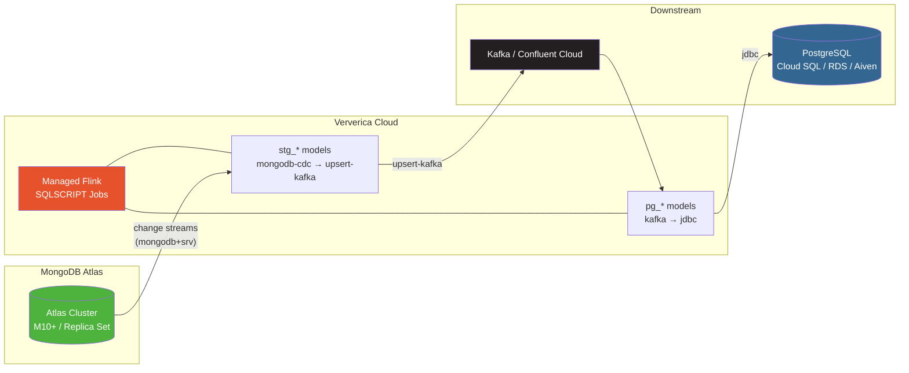

# MongoDB Atlas + Ververica Cloud Tutorial

[Home](../index.md) > [Guides](./) > MongoDB Atlas + Ververica Cloud

---

Deploy a production CDC pipeline from MongoDB Atlas to a managed Flink cluster on Ververica Cloud. This tutorial builds on the [MongoDB CDC Tutorial](./mongodb-cdc-tutorial.md) (local demo) and shows how to adapt it for cloud-managed infrastructure: Atlas for the source database, Ververica Cloud for Flink execution, and your own Kafka and PostgreSQL endpoints.

## What You Will Build

A three-layer streaming pipeline running entirely on managed cloud services:



Unlike the local demo which uses Flink datagen to populate MongoDB, this tutorial assumes your Atlas cluster already has data (or you populate it via your application). The pipeline captures changes via CDC and flows them through Kafka to PostgreSQL.

**Estimated time:** 45 minutes (assumes Atlas cluster and Kafka/PostgreSQL endpoints already exist).

## Prerequisites

| Requirement | Version | Notes |
|---|---|---|
| Python | 3.9+ | For dbt and the CLI |
| dbt-flink-adapter | 1.8+ | `pip install dbt-flink-adapter` |
| dbt-flink-ververica CLI | Latest | `pip install dbt-flink-ververica` |
| MongoDB Atlas cluster | M10+ | Free/Shared (M0/M2/M5) clusters do **not** support change streams |
| Ververica Cloud account | -- | [https://www.ververica.com](https://www.ververica.com) |
| Kafka cluster | Any | Confluent Cloud, Amazon MSK, self-hosted, etc. |
| PostgreSQL instance | 12+ | Cloud SQL, RDS, Aiven, or self-hosted |

> **Important:** MongoDB Atlas free-tier and shared clusters (M0, M2, M5) do not support change streams. You need an M10 or higher dedicated cluster, or a serverless instance.

## Architecture Comparison: Local vs Cloud

The [MongoDB CDC Tutorial](./mongodb-cdc-tutorial.md) runs everything in local containers. This tutorial replaces each component with a managed cloud equivalent:

| Component | Local Demo | Cloud Production |
|---|---|---|
| MongoDB | `demo-mongodb` container (single-node RS) | Atlas M10+ cluster (managed replica set) |
| Flink runtime | Local JobManager + TaskManagers | Ververica Cloud managed Flink |
| Flink interface | SQL Gateway REST API (port 28083) | Ververica Cloud API (SQLSCRIPT jobs) |
| Kafka | `demo-kafka` container (KRaft) | Confluent Cloud / MSK / self-hosted |
| PostgreSQL | `demo-postgres` container | Cloud SQL / RDS / Aiven |
| Connector JARs | Copied into container `lib/` | S3/GCS URIs in `additional_dependencies` |
| Deployment | `dbt run` via SQL Gateway | `dbt-flink-ververica workflow` |

The dbt models themselves are nearly identical -- only the connector hostnames, credentials, and authentication change.

## Step 1: Configure MongoDB Atlas for CDC

### Verify cluster tier

Change streams require a dedicated Atlas cluster (M10+) or serverless instance. Verify your cluster tier in the Atlas UI under **Database > Your Cluster > Configuration**.

### Create a database user for Flink CDC

The Flink CDC connector needs a user with read access to the source database and the `changeStream` privilege.

1. In Atlas, go to **Database Access > Add New Database User**
2. Choose **Password** authentication
3. Set the username (e.g., `flink_cdc`) and a strong password
4. Under **Database User Privileges**, select **Built-in Role: Read Only** on the target database, or create a custom role with these privileges:

   ```
   changeStream   (on the target database)
   find           (on the target database)
   listDatabases  (cluster-level)
   listCollections (on the target database)
   ```

5. Click **Add User**

### Allow network access from Ververica Cloud

The Flink CDC connector connects directly from the Flink TaskManagers to your Atlas cluster. You need to allow Ververica Cloud's IP ranges.

1. In Atlas, go to **Network Access > Add IP Address**
2. Add the Ververica Cloud egress IP ranges for your region (check Ververica Cloud documentation or contact support for the current IP list)
3. Alternatively, for testing, use **Allow Access from Anywhere** (`0.0.0.0/0`) -- but restrict this for production

### Get your connection string

1. In Atlas, go to **Database > Connect > Drivers**
2. Copy the connection string. It looks like:

   ```
   mongodb+srv://flink_cdc:<password>@mycluster.abc123.mongodb.net/?retryWrites=true&w=majority
   ```

3. Note the **hostname** from the SRV address: `mycluster.abc123.mongodb.net`

### Enable pre/post images (recommended, MongoDB 6.0+)

For full changelog support, enable document pre- and post-images on your collections. This is a significant performance optimization: with pre/post images and `scan.full-changelog: 'true'`, Flink eliminates the ChangelogNormalize operator that otherwise adds state overhead for every update.

```javascript
// Run in mongosh connected to your Atlas cluster
use ecommerce;
db.runCommand({
  collMod: "customers",
  changeStreamPreAndPostImages: { enabled: true }
});
db.runCommand({
  collMod: "products",
  changeStreamPreAndPostImages: { enabled: true }
});
db.runCommand({
  collMod: "orders",
  changeStreamPreAndPostImages: { enabled: true }
});
```

Then add `scan.full-changelog: 'true'` to your source connector properties (shown in Step 3). Without pre/post images, the CDC connector still captures inserts, updates, and deletes, but Flink must maintain additional state to reconstruct the changelog, and delete events will only contain the document `_id`.

## Step 2: Set Up the dbt Project

Start from the local demo project structure or create a new one.

### Project structure

```
atlas-cdc-pipeline/
├── dbt_project.yml
├── profiles.yml
├── dbt-flink-ververica.toml
└── models/
    ├── sources.yml
    ├── staging/
    │   ├── stg_customers.sql
    │   ├── stg_products.sql
    │   └── stg_orders.sql
    └── marts/
        ├── pg_customers.sql
        ├── pg_products.sql
        └── pg_orders.sql
```

Note: The gen layer is not needed -- your application writes to Atlas directly. The pipeline starts at the staging layer with MongoDB CDC.

### dbt_project.yml

```yaml
name: 'atlas_cdc_pipeline'
version: '1.0.0'
config-version: 2
profile: 'flink'
model-paths: ["models"]

on-run-start:
  - "{{ create_sources() }}"

models:
  atlas_cdc_pipeline:
    +materialized: streaming_table
    +execution_mode: streaming
```

### profiles.yml

For VVC deployment, the CLI compiles models locally. You need a profiles.yml for `dbt compile` to succeed, but it does not need to connect to a running Flink cluster:

```yaml
flink:
  target: dev
  outputs:
    dev:
      type: flink
      host: localhost
      port: 8083
      database: default_catalog
      schema: default_database
      session_name: atlas_cdc_session
```

## Step 3: Define Sources for Atlas CDC

The key difference from the local demo: the `mongodb-cdc` connector uses `scheme: mongodb+srv` and includes `username`, `password`, and `connection.options` for Atlas authentication. Several production-critical properties are also added for reliability.

### sources.yml

```yaml
version: 2

sources:
  - name: atlas_cdc
    description: "MongoDB Atlas CDC sources via change streams"
    tables:
      - name: customers
        description: "Customer documents from Atlas ecommerce.customers"
        config:
          type: streaming
          primary_key: [_id]
          connector_properties:
            connector: mongodb-cdc
            scheme: mongodb+srv
            hosts: "{{ env_var('ATLAS_HOST') }}"
            username: "{{ env_var('ATLAS_CDC_USER') }}"
            password: "{{ env_var('ATLAS_CDC_PASSWORD') }}"
            database: ecommerce
            collection: customers
            connection.options: "retryWrites=true&w=majority&authSource=admin"
            heartbeat.interval.ms: '60000'
            scan.full-changelog: 'true'
        columns:
          - name: _id
            data_type: STRING
            description: "MongoDB document ID"
          - name: customer_id
            data_type: STRING
            description: "Business customer identifier"
          - name: name
            data_type: STRING
            description: "Customer full name"
          - name: email
            data_type: STRING
            description: "Customer email address"
          - name: city
            data_type: STRING
            description: "Customer city"
          - name: created_at
            data_type: TIMESTAMP(3)
            description: "When the customer was created"

      - name: products
        description: "Product documents from Atlas ecommerce.products"
        config:
          type: streaming
          primary_key: [_id]
          connector_properties:
            connector: mongodb-cdc
            scheme: mongodb+srv
            hosts: "{{ env_var('ATLAS_HOST') }}"
            username: "{{ env_var('ATLAS_CDC_USER') }}"
            password: "{{ env_var('ATLAS_CDC_PASSWORD') }}"
            database: ecommerce
            collection: products
            connection.options: "retryWrites=true&w=majority&authSource=admin"
            heartbeat.interval.ms: '60000'
            scan.full-changelog: 'true'
        columns:
          - name: _id
            data_type: STRING
            description: "MongoDB document ID"
          - name: product_id
            data_type: STRING
            description: "Business product identifier"
          - name: name
            data_type: STRING
            description: "Product name"
          - name: category
            data_type: STRING
            description: "Product category"
          - name: price
            data_type: "DECIMAL(10, 2)"
            description: "Product price"
          - name: stock
            data_type: INT
            description: "Current stock level"

      - name: orders
        description: "Order documents from Atlas ecommerce.orders"
        config:
          type: streaming
          primary_key: [_id]
          connector_properties:
            connector: mongodb-cdc
            scheme: mongodb+srv
            hosts: "{{ env_var('ATLAS_HOST') }}"
            username: "{{ env_var('ATLAS_CDC_USER') }}"
            password: "{{ env_var('ATLAS_CDC_PASSWORD') }}"
            database: ecommerce
            collection: orders
            connection.options: "retryWrites=true&w=majority&authSource=admin"
            heartbeat.interval.ms: '60000'
            scan.full-changelog: 'true'
        columns:
          - name: _id
            data_type: STRING
            description: "MongoDB document ID"
          - name: order_id
            data_type: STRING
            description: "Business order identifier"
          - name: customer_id
            data_type: STRING
            description: "Customer who placed the order"
          - name: product_id
            data_type: STRING
            description: "Product ordered"
          - name: quantity
            data_type: INT
            description: "Quantity ordered"
          - name: total
            data_type: "DECIMAL(10, 2)"
            description: "Order total amount"
          - name: status
            data_type: STRING
            description: "Order status"
          - name: created_at
            data_type: TIMESTAMP(3)
            description: "When the order was created"
          - name: updated_at
            data_type: TIMESTAMP(3)
            description: "Last update timestamp"
```

### Connector Properties Explained

**Key differences from the local demo:**

| Property | Local Demo | Atlas | Why |
|---|---|---|---|
| `scheme` | (not set, defaults to `mongodb`) | `mongodb+srv` | Atlas uses DNS SRV records for replica set discovery |
| `hosts` | `mongodb:27017` | `mycluster.abc123.mongodb.net` (no port) | SRV records resolve the port automatically |
| `username` | (not set, no auth) | `{{ env_var('ATLAS_CDC_USER') }}` | Atlas requires authentication |
| `password` | (not set, no auth) | `{{ env_var('ATLAS_CDC_PASSWORD') }}` | Atlas requires authentication |
| `connection.options` | (not set) | `retryWrites=true&w=majority&authSource=admin` | Atlas connection tuning and auth database |
| `heartbeat.interval.ms` | (not set) | `60000` | Keeps resume tokens fresh for slow-changing collections |
| `scan.full-changelog` | (not set) | `true` | Eliminates ChangelogNormalize operator (requires MongoDB 6.0+ pre/post images) |

**Production-critical properties:**

- **`scheme: mongodb+srv`** -- Tells the connector to use DNS SRV records for service discovery. Atlas exposes its replica set members via SRV, and the connector resolves them automatically. The CDC 3.0.0 JAR bundles MongoDB Java Driver 4.3.0+ which supports the `loadbalanced` mode required by Atlas.

- **`connection.options`** -- Ampersand-separated MongoDB connection options. The `authSource=admin` is critical: if your Atlas user was created in the default `admin` database (which Atlas does by default), you must specify `authSource=admin`. Without it, the connector tries to authenticate against the target database and fails with "User not authorized."

- **`heartbeat.interval.ms: '60000'`** -- Sends heartbeat events every 60 seconds. This is essential for collections that change infrequently (like a product catalog). Without heartbeats, the resume token stored in checkpoints can expire if the oplog rolls over before the next change event. Expired resume tokens cause unrecoverable failures on checkpoint restore. The [XTransfer production case study](https://www.alibabacloud.com/blog/598911) strongly recommends this setting.

- **`scan.full-changelog: 'true'`** -- Requires MongoDB 6.0+ with pre/post images enabled (Step 1). When enabled, the change stream emits full before/after images for update and delete events. This eliminates Flink's ChangelogNormalize operator, which otherwise maintains per-key state to reconstruct the full changelog. Removing ChangelogNormalize significantly reduces state size and improves throughput. If your Atlas cluster runs MongoDB < 6.0, omit this property.

### Generated DDL

When `create_sources()` runs, the Atlas CDC source generates DDL like:

```sql
CREATE TABLE customers (
    `_id` STRING,
    `customer_id` STRING,
    `name` STRING,
    `email` STRING,
    `city` STRING,
    `created_at` TIMESTAMP(3),
    PRIMARY KEY (_id) NOT ENFORCED
)
WITH (
    'connector' = 'mongodb-cdc',
    'scheme' = 'mongodb+srv',
    'hosts' = 'mycluster.abc123.mongodb.net',
    'username' = 'flink_cdc',
    'password' = '***',
    'database' = 'ecommerce',
    'collection' = 'customers',
    'connection.options' = 'retryWrites=true&w=majority&authSource=admin',
    'heartbeat.interval.ms' = '60000',
    'scan.full-changelog' = 'true'
);
```

## Step 4: Write the Staging Models

The staging models are nearly identical to the local demo, except the Kafka bootstrap servers point to your cloud Kafka cluster and credentials use environment variables.

### stg_customers.sql

```sql
{{
    config(
        materialized='streaming_table',
        columns="`customer_id` STRING, `name` STRING, `email` STRING, `city` STRING, `created_at` TIMESTAMP(3)",
        connector_properties={
            'connector': 'upsert-kafka',
            'topic': 'cdc-customers',
            'key.format': 'json',
            'value.format': 'json',
            'properties.bootstrap.servers': env_var('KAFKA_BOOTSTRAP_SERVERS'),
            'properties.security.protocol': 'SASL_SSL',
            'properties.sasl.mechanism': 'PLAIN',
            'properties.sasl.jaas.config': 'org.apache.kafka.common.security.plain.PlainLoginModule required username="' ~ env_var('KAFKA_API_KEY') ~ '" password="' ~ env_var('KAFKA_API_SECRET') ~ '";',
        },
        primary_key='customer_id',
    )
}}

SELECT
    customer_id,
    name,
    email,
    city,
    created_at
FROM {{ source('atlas_cdc', 'customers') }}
```

> **Note:** The Kafka SASL configuration above uses Confluent Cloud's API key authentication. Adjust `security.protocol`, `sasl.mechanism`, and `sasl.jaas.config` for your Kafka provider. For unauthenticated Kafka (e.g., self-hosted in a VPC), remove the `properties.security.*` and `properties.sasl.*` lines and use just `properties.bootstrap.servers`.

### stg_products.sql

```sql
{{
    config(
        materialized='streaming_table',
        columns="`product_id` STRING, `name` STRING, `category` STRING, `price` DECIMAL(10, 2), `stock` INT",
        connector_properties={
            'connector': 'upsert-kafka',
            'topic': 'cdc-products',
            'key.format': 'json',
            'value.format': 'json',
            'properties.bootstrap.servers': env_var('KAFKA_BOOTSTRAP_SERVERS'),
            'properties.security.protocol': 'SASL_SSL',
            'properties.sasl.mechanism': 'PLAIN',
            'properties.sasl.jaas.config': 'org.apache.kafka.common.security.plain.PlainLoginModule required username="' ~ env_var('KAFKA_API_KEY') ~ '" password="' ~ env_var('KAFKA_API_SECRET') ~ '";',
        },
        primary_key='product_id',
    )
}}

SELECT
    product_id,
    name,
    category,
    price,
    stock
FROM {{ source('atlas_cdc', 'products') }}
```

### stg_orders.sql

```sql
{{
    config(
        materialized='streaming_table',
        columns="`order_id` STRING, `customer_id` STRING, `product_id` STRING, `quantity` INT, `total` DECIMAL(10, 2), `status` STRING, `created_at` TIMESTAMP(3), `updated_at` TIMESTAMP(3)",
        connector_properties={
            'connector': 'upsert-kafka',
            'topic': 'cdc-orders',
            'key.format': 'json',
            'value.format': 'json',
            'properties.bootstrap.servers': env_var('KAFKA_BOOTSTRAP_SERVERS'),
            'properties.security.protocol': 'SASL_SSL',
            'properties.sasl.mechanism': 'PLAIN',
            'properties.sasl.jaas.config': 'org.apache.kafka.common.security.plain.PlainLoginModule required username="' ~ env_var('KAFKA_API_KEY') ~ '" password="' ~ env_var('KAFKA_API_SECRET') ~ '";',
        },
        primary_key='order_id',
    )
}}

SELECT
    order_id,
    customer_id,
    product_id,
    quantity,
    total,
    status,
    created_at,
    updated_at
FROM {{ source('atlas_cdc', 'orders') }}
```

## Step 5: Write the Marts Models

The marts models read from the staging Kafka topics via `ref()` and write to your cloud PostgreSQL instance.

### pg_customers.sql

```sql
{{
    config(
        materialized='streaming_table',
        columns="`customer_id` STRING, `name` STRING, `email` STRING, `city` STRING, `created_at` TIMESTAMP(3)",
        connector_properties={
            'connector': 'jdbc',
            'url': env_var('PG_JDBC_URL'),
            'table-name': 'cdc.customers',
            'username': env_var('PG_USER'),
            'password': env_var('PG_PASSWORD'),
            'driver': 'org.postgresql.Driver',
            'sink.buffer-flush.max-rows': '100',
            'sink.buffer-flush.interval': '1s',
        },
        primary_key='customer_id',
    )
}}

SELECT
    customer_id,
    name,
    email,
    city,
    created_at
FROM {{ ref('stg_customers') }}
```

### pg_products.sql

```sql
{{
    config(
        materialized='streaming_table',
        columns="`product_id` STRING, `name` STRING, `category` STRING, `price` DECIMAL(10, 2), `stock` INT",
        connector_properties={
            'connector': 'jdbc',
            'url': env_var('PG_JDBC_URL'),
            'table-name': 'cdc.products',
            'username': env_var('PG_USER'),
            'password': env_var('PG_PASSWORD'),
            'driver': 'org.postgresql.Driver',
            'sink.buffer-flush.max-rows': '100',
            'sink.buffer-flush.interval': '1s',
        },
        primary_key='product_id',
    )
}}

SELECT
    product_id,
    name,
    category,
    price,
    stock
FROM {{ ref('stg_products') }}
```

### pg_orders.sql

```sql
{{
    config(
        materialized='streaming_table',
        columns="`order_id` STRING, `customer_id` STRING, `product_id` STRING, `quantity` INT, `total` DECIMAL(10, 2), `status` STRING, `created_at` TIMESTAMP(3), `updated_at` TIMESTAMP(3)",
        connector_properties={
            'connector': 'jdbc',
            'url': env_var('PG_JDBC_URL'),
            'table-name': 'cdc.orders',
            'username': env_var('PG_USER'),
            'password': env_var('PG_PASSWORD'),
            'driver': 'org.postgresql.Driver',
            'sink.buffer-flush.max-rows': '100',
            'sink.buffer-flush.interval': '1s',
        },
        primary_key='order_id',
    )
}}

SELECT
    order_id,
    customer_id,
    product_id,
    quantity,
    total,
    status,
    created_at,
    updated_at
FROM {{ ref('stg_orders') }}
```

## Step 6: Configure the TOML for Ververica Cloud

### dbt-flink-ververica.toml

```toml
[ververica]
gateway_url = "https://app.ververica.cloud"
workspace_id = "your-workspace-id-here"
namespace = "default"
default_engine_version = "vera-4.0.0-flink-1.20"

[dbt]
project_dir = "."
target = "dev"

[deployment]
deployment_name = "atlas-cdc-pipeline"
parallelism = 2
restore_strategy = "LATEST_STATE"
upgrade_strategy = "STATEFUL"

# All connector JARs required by the pipeline.
# Upload these to your S3/GCS bucket and update the paths.
additional_dependencies = [
    "s3://my-flink-jars/flink-sql-connector-mongodb-cdc-3.0.0.jar",
    "s3://my-flink-jars/flink-sql-connector-kafka-3.3.0-1.20.jar",
    "s3://my-flink-jars/flink-connector-jdbc-3.3.0-1.20.jar",
    "s3://my-flink-jars/postgresql-42.7.4.jar",
]

# Flink runtime configuration
[deployment.flink_config]
"execution.checkpointing.interval" = "30s"
"execution.checkpointing.mode" = "EXACTLY_ONCE"
"state.backend" = "rocksdb"
"state.backend.incremental" = "true"
"restart-strategy" = "fixed-delay"
"restart-strategy.fixed-delay.attempts" = "3"
"restart-strategy.fixed-delay.delay" = "10s"

[deployment.tags]
pipeline = "atlas-cdc"
source = "mongodb-atlas"

[sql_processing]
strip_hints = true
generate_set_statements = true
include_drop_statements = true
```

**JAR dependencies:**

| JAR | Version | Purpose |
|---|---|---|
| `flink-sql-connector-mongodb-cdc` | 3.0.0 | MongoDB CDC source (change streams) |
| `flink-sql-connector-kafka` | 3.3.0-1.20 | Kafka upsert source/sink |
| `flink-connector-jdbc` | 3.3.0-1.20 | JDBC sink for PostgreSQL |
| `postgresql` | 42.7.4 | PostgreSQL JDBC driver |

> **Note:** The `flink-sql-connector-mongodb` JAR (the non-CDC sink connector) is not needed here because we are not writing to MongoDB -- only reading via CDC. The local demo needed it for the gen layer.

### Upload JARs to cloud storage

Download the JARs and upload them to your S3 or GCS bucket:

```bash
# Download JARs
curl -LO https://repo1.maven.org/maven2/com/ververica/flink-sql-connector-mongodb-cdc/3.0.0/flink-sql-connector-mongodb-cdc-3.0.0.jar
curl -LO https://repo1.maven.org/maven2/org/apache/flink/flink-sql-connector-kafka/3.3.0-1.20/flink-sql-connector-kafka-3.3.0-1.20.jar
curl -LO https://repo1.maven.org/maven2/org/apache/flink/flink-connector-jdbc/3.3.0-1.20/flink-connector-jdbc-3.3.0-1.20.jar
curl -LO https://repo1.maven.org/maven2/org/postgresql/postgresql/42.7.4/postgresql-42.7.4.jar

# Upload to S3 (adjust bucket name)
aws s3 cp flink-sql-connector-mongodb-cdc-3.0.0.jar s3://my-flink-jars/
aws s3 cp flink-sql-connector-kafka-3.3.0-1.20.jar s3://my-flink-jars/
aws s3 cp flink-connector-jdbc-3.3.0-1.20.jar s3://my-flink-jars/
aws s3 cp postgresql-42.7.4.jar s3://my-flink-jars/
```

Update the `additional_dependencies` paths in your TOML to match.

## Step 7: Set Environment Variables

All credentials are referenced via `{{ env_var() }}` in the models and sources. Set them before deploying:

```bash
# MongoDB Atlas
export ATLAS_HOST="mycluster.abc123.mongodb.net"
export ATLAS_CDC_USER="flink_cdc"
export ATLAS_CDC_PASSWORD="your-atlas-password"

# Kafka (Confluent Cloud example)
export KAFKA_BOOTSTRAP_SERVERS="pkc-abc123.us-east-1.aws.confluent.cloud:9092"
export KAFKA_API_KEY="your-kafka-api-key"
export KAFKA_API_SECRET="your-kafka-api-secret"

# PostgreSQL
export PG_JDBC_URL="jdbc:postgresql://your-pg-host:5432/analytics"
export PG_USER="flink_writer"
export PG_PASSWORD="your-pg-password"

# Ververica Cloud
export VERVERICA_EMAIL="your@email.com"
export VERVERICA_PASSWORD="your-vvc-password"
export VERVERICA_WORKSPACE_ID="your-workspace-id"
```

## Step 8: Preview with Dry Run

Verify compilation and SQL transformation before deploying:

```bash
dbt-flink-ververica workflow \
    --name-prefix atlas-cdc \
    --config dbt-flink-ververica.toml \
    --dry-run
```

Expected output:

```
Step 1/5: Compile dbt models
  dbt compile successful

Step 2/5: Process SQL
  stg_customers: 0 hints
  stg_products: 0 hints
  stg_orders: 0 hints
  pg_customers: 0 hints
  pg_products: 0 hints
  pg_orders: 0 hints

DRY RUN -- would deploy 6 models:
  atlas-cdc-stg_customers
  atlas-cdc-stg_products
  atlas-cdc-stg_orders
  atlas-cdc-pg_customers
  atlas-cdc-pg_products
  atlas-cdc-pg_orders
```

Review the transformed SQL in `target/ververica/` to verify:
- CDC source tables have `'scheme' = 'mongodb+srv'` and Atlas credentials
- Kafka connectors have your bootstrap servers and SASL config
- JDBC connectors have your PostgreSQL endpoint

## Step 9: Deploy to Ververica Cloud

```bash
dbt-flink-ververica workflow \
    --name-prefix atlas-cdc \
    --config dbt-flink-ververica.toml \
    --start
```

Each model becomes its own SQLSCRIPT deployment in Ververica Cloud:

```
Step 1/5: Compile dbt models
  dbt compile successful

Step 2/5: Process SQL
  6 models processed

Step 3/5: Authenticate
  Authenticated as your@email.com

Step 4/5: Deploy to Ververica Cloud
  atlas-cdc-stg_customers -> dep-abc123 [CREATED]
  atlas-cdc-stg_products -> dep-def456 [CREATED]
  atlas-cdc-stg_orders -> dep-ghi789 [CREATED]
  atlas-cdc-pg_customers -> dep-jkl012 [CREATED]
  atlas-cdc-pg_products -> dep-mno345 [CREATED]
  atlas-cdc-pg_orders -> dep-pqr678 [CREATED]

Step 5/5: Start jobs
  6 jobs starting...

Deployed: 6 models
Started: 6 jobs
```

## Step 10: Verify the Pipeline

### Check Ververica Cloud UI

1. Log in at [https://app.ververica.cloud](https://app.ververica.cloud)
2. Navigate to **Deployments** in your workspace
3. Verify all 6 deployments show **RUNNING** status
4. Click into each deployment to check:
   - **Job graph** -- data flow visualization
   - **Metrics** -- records in/out per second
   - **Checkpoints** -- successful checkpoint history

### Check data in PostgreSQL

```bash
psql -h your-pg-host -U flink_writer -d analytics -c "
  SELECT 'customers' AS entity, COUNT(*) FROM cdc.customers
  UNION ALL
  SELECT 'products', COUNT(*) FROM cdc.products
  UNION ALL
  SELECT 'orders', COUNT(*) FROM cdc.orders;
"
```

### Verify CDC is capturing changes

Insert or update a document in Atlas and verify it flows through:

```javascript
// In mongosh connected to your Atlas cluster
use ecommerce;
db.customers.insertOne({
  customer_id: "test-123",
  name: "Atlas Test User",
  email: "atlas-test@example.com",
  city: "San Francisco",
  created_at: new Date()
});
```

Within seconds, verify the row appears in PostgreSQL:

```bash
psql -h your-pg-host -U flink_writer -d analytics -c \
  "SELECT * FROM cdc.customers WHERE customer_id = 'test-123';"
```

## CI/CD Deployment

For automated deployments, all credentials come from environment variables. No interactive authentication is needed:

### GitHub Actions example

```yaml
name: Deploy Atlas CDC Pipeline

on:
  push:
    branches: [main]
    paths: ['models/**', 'dbt_project.yml', 'dbt-flink-ververica.toml']

jobs:
  deploy:
    runs-on: ubuntu-latest
    steps:
      - uses: actions/checkout@v4

      - uses: actions/setup-python@v5
        with:
          python-version: '3.11'

      - name: Install dependencies
        run: |
          pip install dbt-flink-adapter dbt-flink-ververica

      - name: Deploy to Ververica Cloud
        env:
          ATLAS_HOST: ${{ secrets.ATLAS_HOST }}
          ATLAS_CDC_USER: ${{ secrets.ATLAS_CDC_USER }}
          ATLAS_CDC_PASSWORD: ${{ secrets.ATLAS_CDC_PASSWORD }}
          KAFKA_BOOTSTRAP_SERVERS: ${{ secrets.KAFKA_BOOTSTRAP_SERVERS }}
          KAFKA_API_KEY: ${{ secrets.KAFKA_API_KEY }}
          KAFKA_API_SECRET: ${{ secrets.KAFKA_API_SECRET }}
          PG_JDBC_URL: ${{ secrets.PG_JDBC_URL }}
          PG_USER: ${{ secrets.PG_USER }}
          PG_PASSWORD: ${{ secrets.PG_PASSWORD }}
          VERVERICA_EMAIL: ${{ secrets.VERVERICA_EMAIL }}
          VERVERICA_PASSWORD: ${{ secrets.VERVERICA_PASSWORD }}
          VERVERICA_WORKSPACE_ID: ${{ vars.VERVERICA_WORKSPACE_ID }}
        run: |
          dbt-flink-ververica workflow \
            --name-prefix prod-atlas-cdc \
            --config dbt-flink-ververica.toml \
            --target prod \
            --parallelism 4 \
            --start
```

## Production Considerations

### State Backend: Use RocksDB

The TOML includes `state.backend = "rocksdb"` with incremental checkpoints. This is strongly recommended for MongoDB CDC pipelines because:

- The ChangelogNormalize operator (used when `scan.full-changelog` is not enabled) maintains per-key state for every document. With large collections, this state can exceed heap memory.
- RocksDB stores state on disk with incremental checkpoints, keeping memory usage predictable.
- If you enable `scan.full-changelog: 'true'` (MongoDB 6.0+), the ChangelogNormalize operator is eliminated, but RocksDB is still recommended for the upsert-kafka and JDBC sink state.

### Heartbeat Configuration

The `heartbeat.interval.ms: '60000'` setting in the source configuration is critical for production. Without it:

1. The connector stores a **resume token** in each checkpoint
2. Resume tokens reference positions in MongoDB's oplog
3. If a collection receives no changes between checkpoints, the resume token is not updated
4. If the oplog rolls over past the stored resume token position, checkpoint recovery **permanently fails**

Atlas manages oplog sizing automatically, but high-write workloads on other collections can cause the oplog to roll over quickly. Heartbeats keep resume tokens current even for idle collections.

### Poll Tuning

Fine-tune change stream polling based on your collection's write patterns:

```yaml
connector_properties:
  # ... other properties
  poll.await.time.ms: '1000'      # Default. Reduce for lower latency on active collections
  poll.max.batch.size: '1024'     # Default. Increase for high-throughput collections
```

- **Frequently changing collections** (orders): reduce `poll.await.time.ms` to 500ms for lower latency
- **Slowly changing collections** (products): increase `poll.await.time.ms` to 5000ms to reduce database pressure
- **High-throughput collections**: increase `poll.max.batch.size` to 2048 or higher, but monitor memory usage

### Parallelism

Set parallelism based on your change stream throughput. A single parallelism handles moderate workloads. For high-throughput collections (thousands of changes per second), increase to 2--4:

```toml
[deployment]
parallelism = 4
```

Or override per deployment:

```bash
dbt-flink-ververica workflow \
    --name-prefix prod \
    --parallelism 4 \
    --start
```

### Checkpointing

The TOML includes production-ready checkpointing defaults. For lower-latency requirements, decrease the interval:

```toml
[deployment.flink_config]
"execution.checkpointing.interval" = "10s"
"execution.checkpointing.mode" = "EXACTLY_ONCE"
```

### Initial Snapshot

The MongoDB CDC connector performs an initial snapshot by default (`scan.startup.mode = initial`). For large Atlas collections, this can take significant time and memory. Options:

| Strategy | Property | Trade-off |
|---|---|---|
| Full snapshot (default) | `scan.startup.mode: initial` | Complete data, but slow for large collections |
| Skip snapshot | `scan.startup.mode: latest-offset` | Fast start, but misses historical data |
| Incremental snapshot | `scan.incremental.snapshot.enabled: 'true'` | Parallel reads, requires MongoDB 4.0+ |

```yaml
connector_properties:
  connector: mongodb-cdc
  scheme: mongodb+srv
  hosts: "{{ env_var('ATLAS_HOST') }}"
  # ... other properties
  scan.startup.mode: latest-offset           # Skip initial snapshot
  # OR
  scan.incremental.snapshot.enabled: 'true'  # Parallel snapshot
  scan.incremental.snapshot.chunk.size.mb: '64'
```

For incremental snapshots, you can also control the parallelism of snapshot reading with `scan.incremental.snapshot.chunk.samples` (default: 20) which determines how many sample documents are used to estimate chunk boundaries.

### Monitoring

Set up alerts in Ververica Cloud for:
- **Job failures** -- automatic restart handles transient errors, but persistent failures need attention
- **Checkpoint failures** -- indicates state backend or network issues; check that resume tokens have not expired
- **Backpressure** -- increase parallelism or TaskManager resources if sustained
- **Records lag** -- compare change stream position to current oplog tail to detect falling behind

## Troubleshooting

### "Failed to connect to MongoDB" or timeout

1. **Network access**: Verify Ververica Cloud IPs are allowed in Atlas Network Access
2. **Credentials**: Verify `ATLAS_CDC_USER` and `ATLAS_CDC_PASSWORD` are correct
3. **SRV resolution**: The `scheme: mongodb+srv` requires DNS SRV resolution. Verify the Flink TaskManagers can resolve your Atlas hostname
4. **Cluster tier**: Confirm your Atlas cluster is M10+ (free/shared tiers do not support change streams)

### MongoConfigurationException: TXT record contains "loadbalanced"

```
com.mongodb.MongoConfigurationException: A TXT record is only permitted to contain
the keys [authsource, replicaset], but the TXT record for '...' contains
the keys [loadbalanced, authsource]
```

This means the MongoDB Java Driver bundled in your CDC JAR is too old to support Atlas's `loadbalanced` mode. The driver must be version 4.3.0 or higher. The `flink-sql-connector-mongodb-cdc-3.0.0.jar` from the Ververica Maven repository bundles a compatible driver. If you are using an older CDC JAR, upgrade to 3.0.0+.

### "ChangeStream not supported" or "$changeStream" unrecognized

Your Atlas cluster does not support change streams. This happens with:
- Free tier (M0)
- Shared tiers (M2, M5)
- Standalone MongoDB instances (not a replica set)
- MongoDB versions below 3.6

Upgrade to M10+ or use a serverless instance. Atlas serverless instances support change streams.

### "User not authorized"

Two common causes:

1. **Missing `authSource`**: If your Atlas user was created in the `admin` database (the Atlas default), you must include `authSource=admin` in `connection.options`. Without it, the connector tries to authenticate against the target database (`ecommerce`) and fails.

2. **Insufficient privileges**: The CDC user needs `changeStream` and `find` privileges on the source database. In Atlas:
   - Go to **Database Access**
   - Edit the user
   - Ensure **Read Only** role is granted on the target database

### Resume token expired / checkpoint restore failure

```
ChangeStream invalidated: resume token no longer valid
```

The resume token stored in the last checkpoint references an oplog position that no longer exists. This happens when:
- The collection had no changes for a long period and `heartbeat.interval.ms` was not set
- High write activity on other collections caused the oplog to roll over

**Prevention**: Always set `heartbeat.interval.ms: '60000'` (or lower) on all CDC sources.

**Recovery**: If a resume token has already expired, the job cannot be restored from the existing checkpoint. You must:
1. Stop the deployment in Ververica Cloud
2. Delete the checkpoint/savepoint
3. Redeploy with `restore_strategy = "NONE"` to restart from a fresh snapshot
4. After the snapshot completes, switch back to `restore_strategy = "LATEST_STATE"`

### Kafka SASL authentication errors

Verify your Kafka API key and secret are correct and have produce/consume permissions on the target topics. For Confluent Cloud, check the API key's ACLs in the Confluent Cloud UI.

### "Table not found" in Ververica

Missing connector JARs. Verify all 4 JARs are uploaded to S3/GCS and the paths in `additional_dependencies` are correct and accessible by Ververica Cloud.

### Slow initial snapshot

For large Atlas collections, the initial snapshot can take minutes to hours. Options:
1. Use `scan.startup.mode: latest-offset` to skip the snapshot entirely
2. Use `scan.incremental.snapshot.enabled: 'true'` for parallel reads
3. Increase parallelism to speed up snapshot processing
4. Increase TaskManager memory if snapshot OOMs: set `taskmanager.memory.process.size` to 4--8 GB in `[deployment.flink_config]`

### High state size / frequent checkpoint timeouts

If you see growing state sizes or checkpoint timeouts, verify that `scan.full-changelog: 'true'` is set and pre/post images are enabled on your Atlas collections. Without full changelog mode, Flink's ChangelogNormalize operator maintains per-key state that grows linearly with the number of unique documents. With full changelog mode, this operator is eliminated.

---

## Next Steps

- [MongoDB CDC Tutorial](./mongodb-cdc-tutorial.md) -- Run the full pipeline locally with containers
- [CDC Sources](./cdc-sources.md) -- CDC connector reference for MySQL, PostgreSQL, MongoDB, and more
- [Workflow Tutorial](./workflow-tutorial.md) -- Deep dive into the `workflow` command
- [CI/CD Guide](./ci-cd.md) -- Multi-environment deployment patterns
- [TOML Configuration](../reference/toml-config.md) -- Full configuration reference
