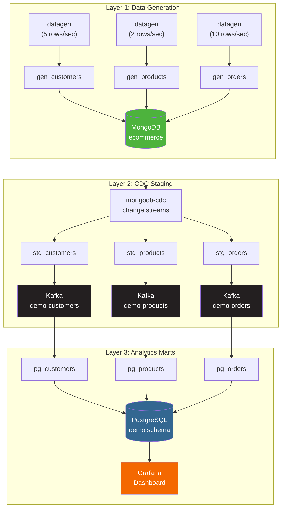
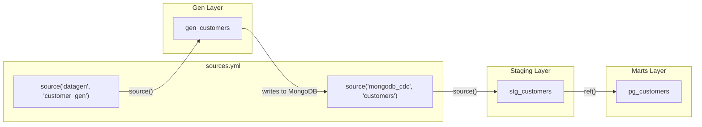
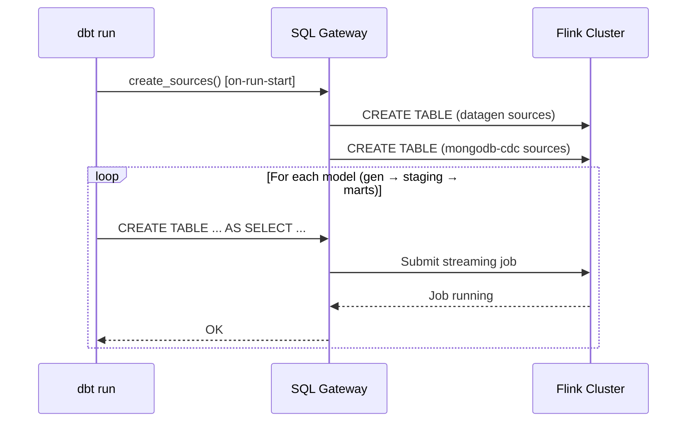
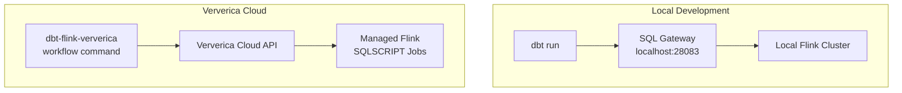

# MongoDB CDC Tutorial

[Home](../index.md) > [Guides](./) > MongoDB CDC Tutorial

---

Build an end-to-end CDC streaming pipeline that captures changes from MongoDB, stages them through Kafka, and materializes them into PostgreSQL for analytics -- all managed by dbt models running on Apache Flink.

## What You Will Build

A three-layer streaming data pipeline using 9 dbt models:

1. **Generation layer** -- Flink datagen connector produces synthetic e-commerce data into MongoDB
2. **Staging layer** -- MongoDB CDC captures document changes and publishes them to Kafka topics
3. **Marts layer** -- Kafka topics are consumed and materialized into PostgreSQL tables, visualized by Grafana



**Estimated time:** 30 minutes local setup, +15 minutes for Ververica Cloud deployment.

## Prerequisites

| Requirement | Version | Notes |
|---|---|---|
| Python | 3.9+ | For dbt and the adapter |
| dbt-flink-adapter | 1.8+ | `pip install dbt-flink-adapter` |
| Podman | Latest | Container runtime (`podman compose` support required) |
| RAM | ~4 GB free | For 7 containers including Flink cluster |
| dbt-flink-ververica CLI | Latest | Optional, for Ververica Cloud deployment only |

## Concepts: The Three-Layer Pattern

This demo uses a layered architecture where each dbt model serves a specific role in the pipeline. Models connect via `source()` (for external systems) and `ref()` (for model-to-model dependencies).



**Why three layers?**

| Layer | Purpose | Connector In | Connector Out | Key Concept |
|---|---|---|---|---|
| Gen | Produce synthetic data | `datagen` (Flink built-in) | `mongodb` (sink) | Deterministic transforms from sequential IDs |
| Staging | Capture CDC changes | `mongodb-cdc` (change streams) | `upsert-kafka` | Changelog semantics with business key |
| Marts | Materialize for analytics | `upsert-kafka` (via `ref()`) | `jdbc` (PostgreSQL) | Buffered writes with primary key upsert |

## Step 1: Start Infrastructure

From the repository root:

```bash
cd demos/mongo-flink-kafka-pg
bash setup.sh
```

This starts 7 containers and waits for health checks (60--120 seconds):

| Service | Container | Host Port | What It Does |
|---|---|---|---|
| MongoDB 7.0 | `demo-mongodb` | 27117 | Source database (single-node replica set) |
| Flink JobManager | `demo-jobmanager` | 28081 | Flink cluster coordinator + Web UI |
| Flink TaskManager (x2) | `taskmanager` | -- | Task execution (4 slots each, 8 total) |
| SQL Gateway | `demo-sql-gateway` | 28083 | REST API endpoint for dbt-flink-adapter |
| Kafka (KRaft) | `demo-kafka` | 29092 | Changelog topic store (no ZooKeeper) |
| PostgreSQL 15 | `demo-postgres` | 25432 | Target analytics database |
| Grafana 11.4 | `demo-grafana` | 23000 | Dashboard visualization |

## Step 2: Initialize Environment

```bash
bash initialize.sh
```

This performs five setup tasks:

1. **Downloads connector JARs** (cached in `/tmp/mongo-demo-connectors`):

   | JAR | Version | Purpose |
   |---|---|---|
   | `flink-sql-connector-mongodb-cdc` | 3.0.0 | MongoDB CDC source connector |
   | `flink-sql-connector-mongodb` | 1.2.0-1.20 | MongoDB sink connector |
   | `flink-sql-connector-kafka` | 3.3.0-1.20 | Kafka source/sink connector |
   | `flink-connector-jdbc` | 3.3.0-1.20 | JDBC sink connector |
   | `postgresql` | 42.7.4 | PostgreSQL JDBC driver |

2. **Copies JARs** into all Flink containers (JobManager, TaskManagers, SQL Gateway)
3. **Initializes MongoDB** as a replica set (`rs0`) -- required for CDC change streams
4. **Creates PostgreSQL schema** (`demo.customers`, `demo.products`, `demo.orders` with indexes)
5. **Creates Kafka topics** (`demo-customers`, `demo-products`, `demo-orders`, 3 partitions each)

After initialization, Flink is restarted to load the new connector JARs.

## Step 3: Understand the Sources

Sources are defined in `dbt_project/models/sources.yml`. The demo uses two source groups.

### Datagen Sources

Flink's built-in `datagen` connector produces synthetic data at configurable rates:

```yaml
sources:
  - name: datagen
    tables:
      - name: customer_gen
        config:
          type: streaming
          connector_properties:
            connector: datagen
            rows-per-second: '5'
            fields.seq_id.kind: sequence
            fields.seq_id.start: '1'
            fields.seq_id.end: '100000'
            fields.city_idx.kind: random
            fields.city_idx.min: '0'
            fields.city_idx.max: '7'
        columns:
          - name: seq_id
            data_type: BIGINT
          - name: city_idx
            data_type: INT
```

The datagen connector produces rows with sequential IDs and random index values. The gen models then transform these into meaningful business data using `CASE` expressions.

### MongoDB CDC Sources

The `mongodb-cdc` connector reads change streams from MongoDB collections:

```yaml
  - name: mongodb_cdc
    tables:
      - name: customers
        config:
          type: streaming
          primary_key: [_id]
          connector_properties:
            connector: mongodb-cdc
            hosts: mongodb:27017
            database: ecommerce
            collection: customers
        columns:
          - name: _id
            data_type: STRING
          - name: customer_id
            data_type: STRING
          # ... remaining columns
```

Key points:
- `primary_key: [_id]` is **required** for all CDC sources -- Flink uses it to apply updates and deletes
- The `hosts` property uses the internal Docker network hostname (`mongodb:27017`)
- MongoDB must be a replica set for change streams to work

When `dbt run` executes, the `on-run-start` hook calls `create_sources()`, which generates `CREATE TABLE` DDL for each source with `PRIMARY KEY (_id) NOT ENFORCED` and the appropriate `WITH (...)` connector properties.

## Step 4: Understand the Gen Models

The gen layer transforms raw datagen output into structured documents and writes them to MongoDB.

**Example: `gen_customers.sql`**

```sql
{{
    config(
        materialized='streaming_table',
        columns="`_id` STRING, `customer_id` STRING, `name` STRING, `email` STRING, `city` STRING, `created_at` TIMESTAMP(3)",
        connector_properties={
            'connector': 'mongodb',
            'uri': 'mongodb://mongodb:27017',
            'database': 'ecommerce',
            'collection': 'customers',
        },
        primary_key='_id',
    )
}}

SELECT
    CAST(seq_id AS STRING) AS _id,
    CAST(seq_id AS STRING) AS customer_id,
    CONCAT('Customer_', CAST(seq_id AS STRING)) AS name,
    CONCAT('user', CAST(seq_id AS STRING), '@demo.com') AS email,
    CASE MOD(city_idx, 8)
        WHEN 0 THEN 'New York'
        WHEN 1 THEN 'London'
        WHEN 2 THEN 'Tokyo'
        WHEN 3 THEN 'Berlin'
        WHEN 4 THEN 'Sydney'
        WHEN 5 THEN 'Toronto'
        WHEN 6 THEN 'Mumbai'
        ELSE 'Singapore'
    END AS city,
    CURRENT_TIMESTAMP AS created_at
FROM {{ source('datagen', 'customer_gen') }}
```

**How it works:**

1. `source('datagen', 'customer_gen')` reads from the datagen connector (5 rows/sec)
2. Sequential `seq_id` values are transformed into `_id`, `customer_id`, `name`, and `email`
3. Random `city_idx` values are mapped to city names via `CASE`
4. The `mongodb` sink connector writes documents to the `ecommerce.customers` collection
5. `primary_key='_id'` ensures upsert semantics in MongoDB

The other gen models follow the same pattern:
- **`gen_products`** maps `category_idx` to product categories and converts `price_cents` to `DECIMAL(10, 2)`
- **`gen_orders`** references customer and product IDs, calculates totals, and maps `status_idx` to order statuses

## Step 5: Understand the Staging Models

The staging layer captures MongoDB CDC events and publishes them to Kafka topics using `upsert-kafka`.

**Example: `stg_customers.sql`**

```sql
{{
    config(
        materialized='streaming_table',
        columns="`customer_id` STRING, `name` STRING, `email` STRING, `city` STRING, `created_at` TIMESTAMP(3)",
        connector_properties={
            'connector': 'upsert-kafka',
            'topic': 'demo-customers',
            'key.format': 'json',
            'value.format': 'json',
            'properties.bootstrap.servers': 'kafka:29093',
        },
        primary_key='customer_id',
    )
}}

SELECT
    customer_id,
    name,
    email,
    city,
    created_at
FROM {{ source('mongodb_cdc', 'customers') }}
```

**Key design decisions:**

- **`upsert-kafka`** (not regular `kafka`) -- because MongoDB CDC produces a changelog stream (inserts, updates, deletes). The upsert-kafka connector preserves these changelog semantics in Kafka, keyed by `customer_id`.
- **`primary_key='customer_id'`** (not `_id`) -- the staging layer uses the business key, not the MongoDB document ID. This is the key that downstream consumers will use for lookups and joins.
- **`columns=`** is required -- Flink's `CREATE TABLE AS SELECT` does not support `PRIMARY KEY` declarations, so `columns` must be specified explicitly.
- **`kafka:29093`** -- the internal Kafka listener within the Docker network.

> **Note:** Use `columns=` (not `schema=`) for inline column definitions. dbt-core reserves `schema=` for the model's custom schema name.

## Step 6: Understand the Marts Models

The marts layer reads from Kafka (via `ref()` to the staging models) and writes to PostgreSQL using the JDBC connector.

**Example: `pg_customers.sql`**

```sql
{{
    config(
        materialized='streaming_table',
        columns="`customer_id` STRING, `name` STRING, `email` STRING, `city` STRING, `created_at` TIMESTAMP(3)",
        connector_properties={
            'connector': 'jdbc',
            'url': 'jdbc:postgresql://postgres:5432/demodb',
            'table-name': 'demo.customers',
            'username': 'postgres',
            'password': 'postgres',
            'driver': 'org.postgresql.Driver',
            'sink.buffer-flush.max-rows': '100',
            'sink.buffer-flush.interval': '1s',
        },
        primary_key='customer_id',
    )
}}

SELECT
    customer_id,
    name,
    email,
    city,
    created_at
FROM {{ ref('stg_customers') }}
```

**How it works:**

1. `ref('stg_customers')` creates a dbt dependency on the staging model. At runtime, this resolves to the Flink table created by `stg_customers`, which reads from the `demo-customers` Kafka topic.
2. The `jdbc` connector writes rows to `demo.customers` in PostgreSQL.
3. `sink.buffer-flush.max-rows: '100'` and `sink.buffer-flush.interval: '1s'` control batching -- rows are flushed every 100 rows or every second, whichever comes first.
4. `primary_key='customer_id'` enables upsert semantics in PostgreSQL -- updates to existing customers are applied rather than creating duplicates.

## Step 7: Run the Pipeline

```bash
bash run_dbt.sh
```

Expected output:

```
Running dbt pipeline...

Running with dbt=1.8.x
Found 9 models, 6 sources

Concurrency: 1 threads (target='dev')

1 of 9 START streaming_table model default_database.gen_customers ........... [RUN]
1 of 9 OK streaming_table model default_database.gen_customers .............. [OK]
2 of 9 START streaming_table model default_database.gen_products ............ [RUN]
2 of 9 OK streaming_table model default_database.gen_products ............... [OK]
3 of 9 START streaming_table model default_database.gen_orders .............. [RUN]
3 of 9 OK streaming_table model default_database.gen_orders ................. [OK]
4 of 9 START streaming_table model default_database.stg_customers .......... [RUN]
...
9 of 9 OK streaming_table model default_database.pg_orders ................. [OK]

Finished running 9 streaming_table models in X seconds.

Completed successfully.
Done. PASS=9 WARN=0 ERROR=0 SKIP=0 TOTAL=9
```

After running, the Flink Web UI at [http://localhost:28081](http://localhost:28081) shows 9 running jobs -- one per model.



## Step 8: Verify Data Flow

### Check MongoDB

```bash
podman exec demo-mongodb mongosh ecommerce --eval "
  print('Customers:', db.customers.countDocuments());
  print('Products:', db.products.countDocuments());
  print('Orders:', db.orders.countDocuments());
"
```

Documents should be accumulating at the configured datagen rates (customers: 5/sec, products: 2/sec, orders: 10/sec).

### Check Kafka

```bash
podman exec demo-kafka kafka-console-consumer \
  --bootstrap-server localhost:9092 \
  --topic demo-customers \
  --from-beginning \
  --max-messages 3
```

### Check PostgreSQL

```bash
podman exec demo-postgres psql -U postgres -d demodb -c "
  SELECT 'customers' AS entity, COUNT(*) FROM demo.customers
  UNION ALL
  SELECT 'products', COUNT(*) FROM demo.products
  UNION ALL
  SELECT 'orders', COUNT(*) FROM demo.orders;
"
```

### Check Grafana

Open [http://localhost:23000](http://localhost:23000). The dashboard auto-refreshes every 5 seconds and shows:

- **Top row:** Total orders, revenue, customers, products (stat panels)
- **Middle row:** Orders by status (pie), revenue per minute (line), orders per minute (bar)
- **Bottom row:** Orders by category (bar), recent orders (table with joins)

## Step 9: Deploy to Ververica Cloud

The same dbt models can be deployed to Ververica Cloud for managed execution.



### Configure the TOML

The demo includes `dbt_project/dbt-flink-ververica.toml`:

```toml
[ververica]
gateway_url = "https://app.ververica.cloud"
# workspace_id = "your-workspace-id-here"
namespace = "default"
default_engine_version = "vera-4.0.0-flink-1.20"

[dbt]
project_dir = "."
target = "dev"

[deployment]
deployment_name = "mongo-cdc-demo"
parallelism = 1
restore_strategy = "LATEST_STATE"
upgrade_strategy = "STATEFUL"

additional_dependencies = [
    "s3://my-flink-jars/flink-sql-connector-mongodb-cdc-3.0.0.jar",
    "s3://my-flink-jars/flink-sql-connector-mongodb-1.2.0-1.20.jar",
    "s3://my-flink-jars/flink-sql-connector-kafka-3.3.0-1.20.jar",
    "s3://my-flink-jars/flink-connector-jdbc-3.3.0-1.20.jar",
    "s3://my-flink-jars/postgresql-42.7.4.jar",
]

[sql_processing]
strip_hints = true
generate_set_statements = true
include_drop_statements = true
```

Update the `workspace_id` and `additional_dependencies` S3 paths to match your environment.

### Deploy

```bash
# Authenticate
dbt-flink-ververica auth login --email your@email.com

# Dry run — preview compiled and transformed SQL
dbt-flink-ververica workflow \
  --name-prefix mongo-cdc \
  --config dbt_project/dbt-flink-ververica.toml \
  --dry-run

# Deploy and start
dbt-flink-ververica workflow \
  --name-prefix mongo-cdc \
  --config dbt_project/dbt-flink-ververica.toml \
  --start
```

### What Changes Between Local and VVC

| Setting | Local | Ververica Cloud |
|---|---|---|
| MongoDB host | `mongodb:27017` (Docker network) | Your MongoDB endpoint |
| Kafka bootstrap | `kafka:29093` (Docker network) | Your Kafka bootstrap servers |
| PostgreSQL URL | `jdbc:postgresql://postgres:5432/demodb` | Your PostgreSQL JDBC URL |
| Connector JARs | Copied into container `lib/` | S3/GCS URIs in `additional_dependencies` |
| Parallelism | 1 (single TaskManager) | Set in TOML or per-deployment |
| Checkpointing | Local filesystem | Cloud-managed |

For VVC deployment, update the connector hostnames in your `sources.yml` and model configs to point to your production infrastructure, or use `{{ env_var() }}` for environment-specific values.

## Step 10: Customize the Pipeline

### Add a new entity

To add a `reviews` entity, create three files following the existing pattern:

1. **`models/gen/gen_reviews.sql`** -- datagen → mongodb sink (add a `review_gen` source in `sources.yml`)
2. **`models/staging/stg_reviews.sql`** -- mongodb-cdc → upsert-kafka (add a `reviews` CDC source in `sources.yml`)
3. **`models/marts/pg_reviews.sql`** -- ref('stg_reviews') → jdbc PostgreSQL

Add corresponding source definitions to `sources.yml` for both `datagen` and `mongodb_cdc` groups.

### Change data generation rates

Edit `sources.yml` and adjust `rows-per-second` in the datagen connector properties:

```yaml
connector_properties:
  connector: datagen
  rows-per-second: '50'  # Increase from 5 to 50
```

### Use the external data generator

For more realistic CDC patterns (updates, deletes, status transitions), use the Python generator instead of the Flink datagen models:

```bash
# Stop gen models, keep staging and marts running
# Then start the Python generator
bash generate.sh --rate 10 --duration 300
```

## Teardown

```bash
bash teardown.sh
```

This stops all containers, removes volumes (MongoDB data, Kafka logs, PostgreSQL data), and deletes the Python virtual environment.

For Ververica Cloud, stop deployments via the CLI:

```bash
dbt-flink-ververica workflow \
  --name-prefix mongo-cdc \
  --config dbt_project/dbt-flink-ververica.toml \
  --stop
```

## Troubleshooting

### SQL Gateway not reachable

```
Error: SQL Gateway not reachable at localhost:28083
```

Ensure `bash setup.sh` completed successfully. Check SQL Gateway logs:

```bash
podman compose logs sql-gateway
```

Common cause: Flink JobManager not yet healthy. SQL Gateway depends on it.

### "Table not found" after dbt run

Missing connector JARs. Verify `bash initialize.sh` ran and JARs are present:

```bash
podman exec demo-jobmanager ls /opt/flink/lib/ | grep -E "(mongodb|kafka|jdbc|postgresql)"
```

All 5 JARs should be listed. If not, re-run `bash initialize.sh`.

### MongoDB not PRIMARY

CDC change streams require the MongoDB instance to be a replica set PRIMARY:

```bash
podman exec demo-mongodb mongosh --eval "rs.status().members[0].stateStr"
```

Expected output: `PRIMARY`. If not initialized, `initialize.sh` handles this. Otherwise:

```bash
podman exec demo-mongodb mongosh --eval \
  "rs.initiate({_id: 'rs0', members: [{_id: 0, host: 'mongodb:27017'}]})"
```

### No data in PostgreSQL

Data must flow through all three layers. Diagnose layer by layer:

1. **Gen → MongoDB:** `podman exec demo-mongodb mongosh ecommerce --eval "db.customers.countDocuments()"`
2. **Staging → Kafka:** `podman exec demo-kafka kafka-console-consumer --bootstrap-server localhost:9092 --topic demo-customers --from-beginning --max-messages 3`
3. **Marts → PostgreSQL:** `podman exec demo-postgres psql -U postgres -d demodb -c "SELECT COUNT(*) FROM demo.customers"`

Check the Flink Web UI ([http://localhost:28081](http://localhost:28081)) for failed or restarting jobs.

### Kafka topic errors

If topics have incompatible configurations from a previous run:

```bash
for topic in demo-customers demo-products demo-orders; do
  podman exec demo-kafka kafka-topics --bootstrap-server localhost:9092 --delete --topic "$topic"
  podman exec demo-kafka kafka-topics --bootstrap-server localhost:9092 --create \
    --topic "$topic" --partitions 3 --replication-factor 1
done
```

### Session expired

Long-running dbt sessions may time out. Rerun `bash run_dbt.sh` to create a new session. The SQL Gateway creates fresh sessions automatically.

---

## Next Steps

- [MongoDB Atlas + Ververica Cloud](./mongodb-atlas-ververica-tutorial.md) -- Deploy this pipeline to managed cloud infrastructure
- [CDC Sources](./cdc-sources.md) -- CDC connector reference for MySQL, PostgreSQL, MongoDB, and more
- [Streaming Pipelines](./streaming-pipelines.md) -- Watermarks, windows, and advanced streaming patterns
- [Workflow Tutorial](./workflow-tutorial.md) -- One-command compile, transform, deploy, and start
- [CI/CD](./ci-cd.md) -- GitHub Actions workflows for automated deployment
- [Sources and Connectors](./sources-and-connectors.md) -- Full connector configuration reference
