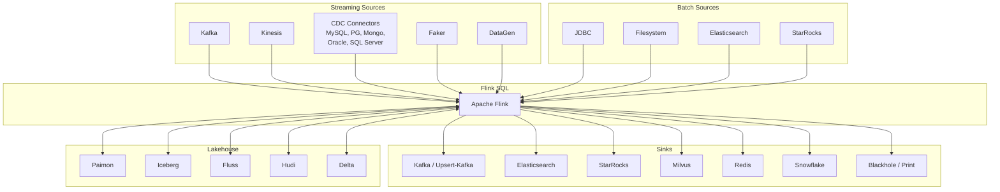
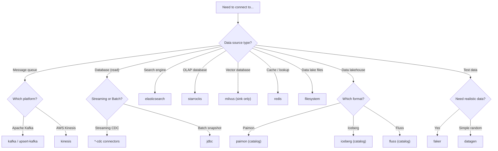
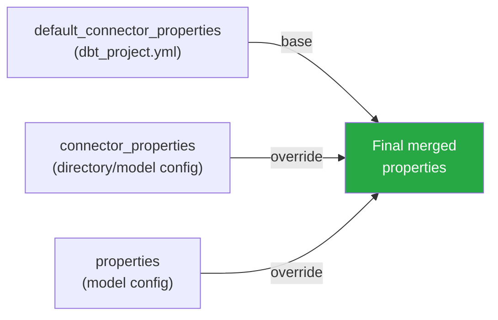

# Sources and Connectors

[Home](../index.md) > [Guides](./) > Sources and Connectors

---

dbt sources map external data systems -- Kafka topics, database tables, file directories -- into the dbt DAG. In dbt-flink-adapter, source definitions create Flink `CREATE TABLE` statements with connector configuration, column definitions, and optional watermarks. The `create_sources` macro materializes all sources into the Flink catalog before your models run.

## Connector Ecosystem



## Defining Sources

Sources are defined in `schema.yml` files with columns, data types, connector properties, and optional watermarks.

```yaml
# models/schema.yml
sources:
  - name: raw
    description: "Raw event data from Kafka"
    tables:
      - name: events
        description: "User interaction events"
        config:
          type: streaming
          connector_properties:
            connector: kafka
            topic: user-events
            properties.bootstrap.servers: "kafka:9092"
            scan.startup.mode: earliest-offset
            format: json
          watermark:
            column: event_time
            strategy: "event_time - INTERVAL '5' SECOND"
        columns:
          - name: event_id
            data_type: BIGINT
            description: "Unique event identifier"
          - name: user_id
            data_type: STRING
            description: "User who triggered the event"
          - name: event_type
            data_type: STRING
            description: "Type of event (click, purchase, etc.)"
          - name: event_time
            data_type: TIMESTAMP(3)
            description: "When the event occurred (event time)"
          - name: amount
            data_type: "DECIMAL(10, 2)"
            description: "Transaction amount"
```

### Generated SQL

Running `dbt run-operation create_sources` produces:

```sql
/** drop_statement('DROP TABLE IF EXISTS `events`') */
CREATE TABLE events (
    `event_id` BIGINT,
    `user_id` STRING,
    `event_type` STRING,
    `event_time` TIMESTAMP(3),
    `amount` DECIMAL(10, 2),
    WATERMARK FOR event_time AS event_time - INTERVAL '5' SECOND
)
WITH (
    'connector' = 'kafka',
    'topic' = 'user-events',
    'properties.bootstrap.servers' = 'kafka:9092',
    'scan.startup.mode' = 'earliest-offset',
    'format' = 'json'
);
```

## Column Types

Flink supports three types of columns in table definitions. Set the `column_type` field in your YAML to control which type is generated.

### Physical Columns (Default)

Physical columns map directly to data fields in the source. This is the default when no `column_type` is specified.

```yaml
columns:
  - name: event_id
    data_type: BIGINT
  - name: user_id
    data_type: STRING
```

Generated: `event_id` BIGINT, `user_id` STRING

### Computed Columns

Computed columns derive their value from an expression rather than reading from the source data. Set `column_type: computed` and provide an `expression`.

```yaml
columns:
  - name: event_time
    data_type: TIMESTAMP(3)
  - name: event_date
    column_type: computed
    expression: "CAST(event_time AS DATE)"
  - name: proc_time
    column_type: computed
    expression: "PROCTIME()"
```

Generated:

```sql
`event_time` TIMESTAMP(3),
`event_date` AS CAST(event_time AS DATE),
`proc_time` AS PROCTIME()
```

### Metadata Columns

Metadata columns expose connector-level metadata (such as Kafka partition, offset, or timestamp). Set `column_type: metadata` and optionally provide an `expression` for the metadata key.

```yaml
columns:
  - name: kafka_partition
    data_type: INT
    column_type: metadata
    expression: "partition"
  - name: kafka_offset
    data_type: BIGINT
    column_type: metadata
    expression: "offset"
  - name: kafka_timestamp
    data_type: "TIMESTAMP_LTZ(3)"
    column_type: metadata
    expression: "timestamp"
```

Generated:

```sql
`kafka_partition` INT METADATA FROM 'partition',
`kafka_offset` BIGINT METADATA FROM 'offset',
`kafka_timestamp` TIMESTAMP_LTZ(3) METADATA FROM 'timestamp'
```

## Watermark Configuration on Sources

Watermarks on source tables enable event-time processing in all downstream models that reference the source.

```yaml
config:
  watermark:
    column: event_time
    strategy: "event_time - INTERVAL '5' SECOND"
```

| Field | Required | Description |
|---|---|---|
| `column` | Yes | The TIMESTAMP column to use as event time |
| `strategy` | No | Watermark expression. Defaults to `column - INTERVAL '5' SECOND` |

Common strategies:

| Strategy Expression | Meaning |
|---|---|
| `event_time - INTERVAL '5' SECOND` | Allow up to 5 seconds of out-of-order data |
| `event_time - INTERVAL '1' MINUTE` | Allow up to 1 minute of late data |
| `event_time` | Strictly ordered (zero tolerance for lateness) |

## Common Connectors

### Kafka (Streaming and Batch)

The primary connector for streaming pipelines. Also supports bounded batch reads.

```yaml
config:
  connector_properties:
    connector: kafka
    topic: my-topic
    properties.bootstrap.servers: "broker1:9092,broker2:9092"
    scan.startup.mode: earliest-offset
    format: json
    # For batch mode, add:
    # scan.bounded.mode: latest-offset
```

| Property | Required | Description |
|---|---|---|
| `connector` | Yes | `kafka` |
| `topic` | Yes | Kafka topic name |
| `properties.bootstrap.servers` | Yes | Kafka broker addresses |
| `scan.startup.mode` | No | Where to start reading: `earliest-offset`, `latest-offset`, `group-offsets`, `timestamp`, `specific-offsets` |
| `format` | Yes | Data format: `json`, `avro`, `csv`, `raw` |
| `scan.bounded.mode` | Batch only | Makes Kafka bounded: `latest-offset`, `group-offsets`, `timestamp`, `specific-offsets` |

### datagen (Testing)

Generates synthetic data. Ideal for development, testing, and CI/CD pipelines.

```yaml
config:
  connector_properties:
    connector: datagen
    rows-per-second: '100'
    number-of-rows: '1000000'
    fields.event_id.kind: sequence
    fields.event_id.start: '1'
    fields.event_id.end: '1000000'
    fields.user_id.length: '8'
    fields.amount.min: '1.00'
    fields.amount.max: '999.99'
```

Without `number-of-rows`, the source is unbounded (streaming). With it, the source is bounded (batch-compatible).

### Filesystem (Batch)

Reads from files on local disk, HDFS, or S3.

```yaml
config:
  connector_properties:
    connector: filesystem
    path: "s3://data-lake/raw/events/"
    format: parquet
```

Naturally bounded. Supports `parquet`, `orc`, `avro`, `csv`, and `json` formats.

### JDBC (Batch)

Reads from a relational database table.

```yaml
config:
  connector_properties:
    connector: jdbc
    url: "jdbc:postgresql://db:5432/analytics"
    table-name: "public.events"
    username: "{{ env_var('DB_USER') }}"
    password: "{{ env_var('DB_PASSWORD') }}"
    scan.fetch-size: '1000'
```

Naturally bounded. For large tables, add parallel scan configuration:

```yaml
    scan.partition.column: id
    scan.partition.num: '4'
    scan.partition.lower-bound: '1'
    scan.partition.upper-bound: '10000000'
```

### CDC Connectors (Streaming)

Change Data Capture connectors stream database changes (INSERT, UPDATE, DELETE) as a changelog. CDC sources **require** the `primary_key` config, which generates `PRIMARY KEY (...) NOT ENFORCED` in the DDL.

**PostgreSQL CDC:**

```yaml
config:
  primary_key: [order_id]
  connector_properties:
    connector: postgres-cdc
    hostname: db.example.com
    port: '5432'
    username: "{{ env_var('PG_USER') }}"
    password: "{{ env_var('PG_PASSWORD') }}"
    database-name: production
    schema-name: public
    table-name: orders
    slot.name: flink_slot
    decoding.plugin.name: pgoutput
```

**MySQL CDC:**

```yaml
config:
  primary_key: [customer_id]
  connector_properties:
    connector: mysql-cdc
    hostname: mysql.example.com
    port: '3306'
    username: "{{ env_var('MYSQL_USER') }}"
    password: "{{ env_var('MYSQL_PASSWORD') }}"
    database-name: production
    table-name: orders
    server-id: '5401-5410'
```

The adapter validates CDC sources at compile time:
- `primary_key` is required for all `*-cdc` connectors
- Required connector properties (hostname, port, username, password, database-name, table-name) must be present
- Warnings for missing recommended properties (server-id for MySQL, slot.name for PostgreSQL)

CDC connector JARs are not bundled with Flink. For Ververica Cloud, use `--additional-deps` or the `additional_dependencies` TOML config to specify JAR URIs.

For the full CDC guide including database setup, deployment, and troubleshooting, see [CDC Sources](./cdc-sources.md).

### Amazon Kinesis (Streaming)

Reads from or writes to Amazon Kinesis Data Streams. Kinesis is an unbounded streaming source.

```yaml
config:
  connector_properties:
    connector: kinesis
    stream: user-events
    aws.region: us-east-1
    format: json
    scan.stream.initpos: TRIM_HORIZON
```

| Property | Required | Description |
|---|---|---|
| `connector` | Yes | `kinesis` |
| `stream` | Yes | Kinesis data stream name |
| `aws.region` | Yes* | AWS region (e.g., `us-east-1`) |
| `aws.endpoint` | Yes* | Custom endpoint (alternative to region) |
| `format` | Yes | Data format: `json`, `avro`, `csv`, `raw` |
| `scan.stream.initpos` | No | Initial position: `LATEST` (default), `TRIM_HORIZON`, `AT_TIMESTAMP` |

*One of `aws.region` or `aws.endpoint` required.

The adapter provides convenience macros:

```sql
{{ config(
    connector_properties=kinesis_source_properties(
        stream='user-events',
        aws_region='us-east-1',
        format='json',
        scan_initpos='TRIM_HORIZON'
    )
) }}
```

### Elasticsearch (Streaming/Batch)

Read from or write to Elasticsearch indices. Source reads are naturally bounded (batch). Sinks support streaming writes.

**Source (read):**

```yaml
config:
  connector_properties:
    connector: elasticsearch
    endPoint: "http://elasticsearch:9200"
    indexName: user-events
```

**Sink (write, ES7):**

```yaml
config:
  connector_properties:
    connector: elasticsearch-7
    hosts: "http://elasticsearch:9200"
    index: enriched-events
    username: "{{ env_var('ES_USER') }}"
    password: "{{ env_var('ES_PASSWORD') }}"
```

| Property (Source) | Required | Description |
|---|---|---|
| `connector` | Yes | `elasticsearch` |
| `endPoint` | Yes | Server address (e.g., `http://host:9200`) |
| `indexName` | Yes | Index name to read from |
| `batchSize` | No | Docs per scroll request (default: 2000) |

| Property (Sink) | Required | Description |
|---|---|---|
| `connector` | Yes | `elasticsearch-7` or `elasticsearch-6` |
| `hosts` | Yes | Server address(es) |
| `index` | Yes | Target index name |
| `document-type` | ES6 only | Document type (required for ES6) |
| `failure-handler` | No | `fail` (default), `ignore`, `retry-rejected` |

### StarRocks (Streaming/Batch)

Read from or write to StarRocks OLAP database. Source reads are naturally bounded. Sink writes use Stream Load API.

```yaml
config:
  connector_properties:
    connector: starrocks
    jdbc-url: "jdbc:mysql://starrocks-fe:9030"
    database-name: analytics
    table-name: fact_events
    username: "{{ env_var('STARROCKS_USER') }}"
    password: "{{ env_var('STARROCKS_PASSWORD') }}"
    load-url: "starrocks-fe:8030"  # Required for sink
```

| Property | Required | Description |
|---|---|---|
| `connector` | Yes | `starrocks` |
| `jdbc-url` | Yes | JDBC URL (`jdbc:mysql://<fe_ip>:<query_port>`) |
| `database-name` | Yes | StarRocks database |
| `table-name` | Yes | StarRocks table |
| `username` | Yes | Database credentials |
| `password` | Yes | Database credentials |
| `load-url` | Sink only | FE HTTP endpoint for Stream Load (`<fe_ip>:<http_port>`) |
| `sink.semantic` | No | `at-least-once` (default) or `exactly-once` |

### Milvus (Sink Only)

Write vector embeddings to Milvus vector database. Sink-only connector with upsert semantics.

```yaml
config:
  connector_properties:
    connector: milvus
    endpoint: milvus.example.com
    userName: "{{ env_var('MILVUS_USER') }}"
    password: "{{ env_var('MILVUS_PASSWORD') }}"
    databaseName: embeddings
    collectionName: product_vectors
```

| Property | Required | Description |
|---|---|---|
| `connector` | Yes | `milvus` |
| `endpoint` | Yes | Milvus hostname or IP |
| `port` | No | gRPC port (default: 19530) |
| `userName` | Yes | Authentication username |
| `password` | Yes | Authentication password |
| `databaseName` | Yes | Target database |
| `collectionName` | Yes | Target collection (must exist with AUTO_ID disabled) |

### Redis (Sink/Dimension)

Write to Redis or use Redis as a dimension table for lookup joins.

**Sink:**

```yaml
config:
  connector_properties:
    connector: redis
    host: redis.example.com
    mode: hashmap
    password: "{{ env_var('REDIS_PASSWORD') }}"
```

**Dimension (lookup join):**

```yaml
config:
  primary_key: [user_id]
  connector_properties:
    connector: redis
    host: redis.example.com
    cache: LRU
    cacheSize: '50000'
    cacheTTLMs: '60000'
```

| Property | Required | Description |
|---|---|---|
| `connector` | Yes | `redis` |
| `host` | Yes | Redis server address |
| `port` | No | Server port (default: 6379) |
| `mode` | Sink only | Redis data structure: `string`, `hashmap`, `list`, `set`, `sortedset` |
| `cache` | Dimension only | Caching strategy: `None` (default) or `LRU` |
| `cacheSize` | No | Max cached rows for LRU (default: 10000) |

### Faker (Testing)

Generates random test data using Java Faker expressions. More expressive than `datagen` for realistic test data.

```yaml
config:
  connector_properties:
    connector: faker
    rows-per-second: '1000'
    number-of-rows: '100000'
    fields.name.expression: "#{Name.fullName}"
    fields.email.expression: "#{Internet.emailAddress}"
    fields.age.expression: "#{number.numberBetween '18','99'}"
    fields.city.expression: "#{Address.city}"
```

Without `number-of-rows`, the source is unbounded (streaming). With it, the source is bounded (batch-compatible).

| Property | Required | Description |
|---|---|---|
| `connector` | Yes | `faker` |
| `fields.<col>.expression` | Yes (1+) | Java Faker expression (e.g., `#{Name.fullName}`) |
| `fields.<col>.null-rate` | No | Null probability 0.0-1.0 (default: 0) |
| `rows-per-second` | No | Generation rate (default: 10000) |
| `number-of-rows` | No | Total rows to generate (bounded mode) |

The adapter provides a convenience macro that builds field expressions from a dict:

```sql
{{ config(
    connector_properties=faker_source_properties(
        field_expressions={
            'name': "#{Name.fullName}",
            'email': "#{Internet.emailAddress}",
            'age': "#{number.numberBetween '18','99'}"
        },
        rows_per_second=1000,
        number_of_rows=100000
    )
) }}
```

### Connector Summary

| Connector | Streaming | Batch | Naturally Bounded | Primary Use |
|---|---|---|---|---|
| `kafka` | Yes | Yes (with bounded mode) | No | Event streaming |
| `upsert-kafka` | Yes | No | No | Keyed state / changelog |
| `datagen` | Yes | Yes (with number-of-rows) | No | Testing |
| `faker` | Yes | Yes (with number-of-rows) | No | Testing (Java Faker expressions) |
| `filesystem` | No | Yes | Yes | Data lake reads |
| `jdbc` | No | Yes | Yes | Database reads |
| `kinesis` | Yes | No | No | AWS stream ingestion |
| `elasticsearch` | Yes (sink) | Yes (source) | Source only | Search & analytics |
| `starrocks` | Yes (sink) | Yes (source) | Source only | OLAP analytics |
| `milvus` | Yes | N/A (sink only) | N/A | Vector embeddings |
| `redis` | Yes | N/A (sink/dimension) | N/A | Caching, lookup joins |
| `postgres-cdc` | Yes | No | No | PostgreSQL change capture |
| `mysql-cdc` | Yes | No | No | MySQL change capture |
| `mongodb-cdc` | Yes | No | No | MongoDB change capture |
| `oracle-cdc` | Yes | No | No | Oracle change capture |
| `sqlserver-cdc` | Yes | No | No | SQL Server change capture |
| `blackhole` | Yes | Yes | N/A (sink only) | Development / testing |
| `print` | Yes | Yes | N/A (sink only) | Debugging |

## Choosing a Connector



## Default Connector Properties (DRY Pattern)

To avoid repeating the same connector configuration across dozens of models and sources, use `default_connector_properties` in `dbt_project.yml`:

```yaml
# dbt_project.yml
models:
  my_project:
    +default_connector_properties:
      connector: kafka
      properties.bootstrap.servers: "broker1:9092,broker2:9092"
      format: json
      properties.group.id: "dbt-flink-consumer"

    staging:
      +connector_properties:
        scan.startup.mode: earliest-offset

    marts:
      +connector_properties:
        scan.startup.mode: latest-offset
```

The adapter merges properties in this order:

1. `default_connector_properties` -- Project-wide defaults
2. `connector_properties` -- Directory or model-level overrides
3. `properties` -- Model-level overrides (highest priority)



This means you can define `connector: kafka` and `bootstrap.servers` once at the project level, then only specify `topic` per model.

---

## Next Steps

- [Materializations](./materializations.md) -- How each materialization uses connector properties
- [Streaming Pipelines](./streaming-pipelines.md) -- Building streaming pipelines with watermarks and windows
- [Batch Processing](./batch-processing.md) -- Bounded source configuration for batch jobs
- [Incremental Models](./incremental-models.md) -- Connector requirements for each incremental strategy
