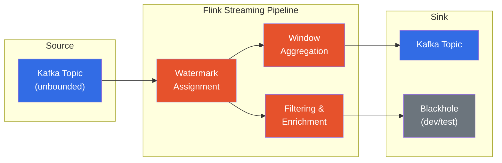
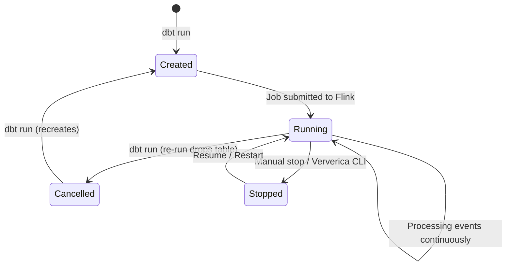

# Streaming Pipelines

[Home](../index.md) > [Guides](./) > Streaming Pipelines

---

Apache Flink's streaming engine processes unbounded data in real time. dbt-flink-adapter lets you author streaming pipelines as dbt models, using standard Flink SQL features -- watermarks, window functions, temporal joins -- while keeping the declarative, version-controlled workflow that dbt provides.

## Streaming Architecture

A typical streaming pipeline reads from an unbounded source (such as Kafka), assigns watermarks to track event-time progress, applies windowed aggregations, and writes results to a sink.



## Execution Mode

Set the execution mode to `streaming` to tell Flink to treat sources as unbounded and run jobs continuously.

```yaml
{{
  config(
    materialized='streaming_table',
    execution_mode='streaming'
  )
}}
```

The adapter translates this to the query hint `/** mode('streaming') */`, which the Flink SQL Gateway interprets as `SET 'execution.runtime-mode' = 'streaming';`.

---

## Watermarks

Watermarks are Flink's mechanism for tracking event-time progress in a data stream. They tell Flink "all events with a timestamp up to this point have arrived," which enables time-based operations like windows and temporal joins to produce correct results even when events arrive out of order.

### Event-Time Watermarks

Event-time watermarks use a column in the data (typically a `TIMESTAMP(3)`) as the time reference. The most common strategy is **bounded out-of-orderness**, which allows a fixed amount of late data.

**Using the config dictionary:**

```yaml
{{
  config(
    materialized='streaming_table',
    execution_mode='streaming',
    columns="
      event_id BIGINT,
      user_id STRING,
      event_type STRING,
      event_time TIMESTAMP(3),
      amount DECIMAL(10, 2)
    ",
    watermark={
      'column': 'event_time',
      'strategy': "event_time - INTERVAL '5' SECOND"
    },
    properties={
      'connector': 'kafka',
      'topic': 'events',
      'properties.bootstrap.servers': 'kafka:9092',
      'format': 'json'
    }
  )
}}
```

This generates:

```sql
CREATE TABLE target (
    event_id BIGINT,
    user_id STRING,
    event_type STRING,
    event_time TIMESTAMP(3),
    amount DECIMAL(10, 2),
    WATERMARK FOR event_time AS event_time - INTERVAL '5' SECOND
) WITH (
    'connector' = 'kafka',
    'topic' = 'events',
    'properties.bootstrap.servers' = 'kafka:9092',
    'format' = 'json'
)
```

**Using the watermark macro:**

If you prefer the macro syntax inside a `columns` string:

```yaml
{{
  config(
    materialized='streaming_table',
    columns="
      event_id BIGINT,
      user_id STRING,
      event_time TIMESTAMP(3),
      " ~ watermark_for_column('event_time', '5', 'SECOND'),
    properties={'connector': 'blackhole'}
  )
}}
```

The `watermark_for_column` macro expands to:

```sql
WATERMARK FOR event_time AS event_time - INTERVAL '5' SECOND
```

**Using the config-driven macro:**

The `generate_watermark_clause` macro reads from the `watermark` config dictionary:

```sql
{{ generate_watermark_clause(config.get('watermark')) }}
-- Produces: WATERMARK FOR event_time AS event_time - INTERVAL '5' SECOND
```

If no strategy is provided, it defaults to 5-second bounded out-of-orderness.

### Processing-Time Watermarks

Processing-time uses the wall-clock time of the Flink operator. It requires a computed column.

```yaml
{{
  config(
    materialized='streaming_table',
    columns="
      event_id BIGINT,
      user_id STRING,
      proc_time AS PROCTIME()
    ",
    properties={'connector': 'blackhole'}
  )
}}
```

The `processing_time_watermark` macro generates the computed column definition:

```sql
{{ processing_time_watermark('proc_time') }}
-- Produces: proc_time AS PROCTIME()
```

### Watermark Configuration Summary

| Approach | Syntax | When to Use |
|---|---|---|
| Config dictionary | `watermark: {column: '...', strategy: '...'}` | Most common; works with `streaming_table` schema config |
| `watermark_for_column` macro | `{{ watermark_for_column('col', '5', 'SECOND') }}` | Inline in schema strings |
| `generate_watermark_clause` macro | `{{ generate_watermark_clause(config.get('watermark')) }}` | When you need the full `WATERMARK FOR ...` clause from config |
| `processing_time_watermark` macro | `{{ processing_time_watermark('proc_time') }}` | Processing-time computed columns |
| Source YAML config | `watermark:` block in `schema.yml` | Source table definitions |

---

## Window Table-Valued Functions (TVFs)

Flink's window TVFs partition a stream into fixed or sliding time intervals for aggregation. dbt-flink-adapter provides both inline Flink SQL syntax and Jinja macros for each window type.

### Tumbling Windows

Non-overlapping, fixed-size windows. Every event belongs to exactly one window.

**Inline Flink SQL:**

```sql
-- models/streaming/tumbling_event_counts.sql
{{
  config(
    materialized='streaming_table',
    execution_mode='streaming',
    properties={'connector': 'blackhole'}
  )
}}

SELECT
    window_start,
    window_end,
    user_id,
    COUNT(*) AS event_count,
    SUM(amount) AS total_amount
FROM TABLE(
    TUMBLE(
        TABLE {{ source('raw', 'events') }},
        DESCRIPTOR(event_time),
        INTERVAL '1' MINUTE
    )
)
GROUP BY window_start, window_end, user_id
```

**Using the macro:**

```sql
SELECT
    window_start,
    window_end,
    user_id,
    COUNT(*) AS event_count
FROM TABLE(
    {{ tumbling_window('event_time', '1 MINUTE') }}
)
GROUP BY window_start, window_end, user_id
```

The `tumbling_window` macro expands to:

```sql
TUMBLE(TABLE source_table, DESCRIPTOR(event_time), INTERVAL '1 MINUTE')
```

### Hopping (Sliding) Windows

Overlapping windows with a fixed size and a fixed slide interval. An event can belong to multiple windows.

**Inline Flink SQL:**

```sql
-- models/streaming/moving_avg_amounts.sql
{{
  config(
    materialized='streaming_table',
    execution_mode='streaming',
    properties={'connector': 'blackhole'}
  )
}}

SELECT
    window_start,
    window_end,
    COUNT(*) AS event_count,
    AVG(amount) AS avg_amount
FROM TABLE(
    HOP(
        TABLE {{ source('raw', 'events') }},
        DESCRIPTOR(event_time),
        INTERVAL '1' MINUTE,
        INTERVAL '5' MINUTE
    )
)
GROUP BY window_start, window_end
```

**Using the macro:**

```sql
SELECT
    window_start,
    window_end,
    AVG(amount) AS avg_amount
FROM TABLE(
    {{ hopping_window('event_time', '5 MINUTE', '1 MINUTE') }}
)
GROUP BY window_start, window_end
```

The hopping window macro parameters are `(time_col, window_size, hop_size)`. Note that in the generated `HOP()` call, the slide interval comes before the window size.

### Session Windows

Variable-length windows that group events by activity gaps. A new window starts when the gap between consecutive events exceeds the specified threshold.

**Inline Flink SQL:**

```sql
-- models/streaming/user_sessions.sql
{{
  config(
    materialized='streaming_table',
    execution_mode='streaming',
    properties={'connector': 'blackhole'}
  )
}}

SELECT
    window_start,
    window_end,
    user_id,
    TIMESTAMPDIFF(SECOND, window_start, window_end) AS session_duration_sec,
    COUNT(*) AS event_count,
    SUM(amount) AS total_amount
FROM TABLE(
    SESSION(
        TABLE {{ source('raw', 'events') }},
        DESCRIPTOR(event_time),
        INTERVAL '30' SECOND
    )
)
GROUP BY window_start, window_end, user_id
```

**Using the macro:**

```sql
FROM TABLE(
    {{ session_window('event_time', '30 SECOND') }}
)
```

### Cumulative Windows

Windows that grow from a starting point in fixed steps up to a maximum size. Useful for running totals that reset at a boundary (for example, hourly cumulative counts within a day).

**Inline Flink SQL:**

```sql
-- models/streaming/hourly_cumulative.sql
{{
  config(
    materialized='streaming_table',
    execution_mode='streaming',
    properties={'connector': 'blackhole'}
  )
}}

SELECT
    window_start,
    window_end,
    user_id,
    COUNT(*) AS cumulative_count,
    SUM(amount) AS cumulative_amount
FROM TABLE(
    CUMULATE(
        TABLE {{ source('raw', 'events') }},
        DESCRIPTOR(event_time),
        INTERVAL '1' HOUR,
        INTERVAL '1' DAY
    )
)
GROUP BY window_start, window_end, user_id
```

**Using the macro:**

```sql
FROM TABLE(
    {{ cumulative_window('event_time', '1 DAY', '1 HOUR') }}
)
```

The `cumulative_window` macro parameters are `(time_col, max_window_size, step_size)`. Note the `CUMULATE()` function takes the step first, then the max size.

### Generic Window TVF Macro

The `window_tvf` macro provides a unified interface for all window types:

```sql
-- Tumbling
{{ window_tvf('tumble', 'event_time', {'size': '1 MINUTE'}) }}

-- Hopping
{{ window_tvf('hop', 'event_time', {'size': '5 MINUTE', 'hop': '1 MINUTE'}) }}

-- Session
{{ window_tvf('session', 'event_time', {'gap': '30 SECOND'}) }}

-- Cumulative
{{ window_tvf('cumulate', 'event_time', {'max_size': '1 DAY', 'step': '1 HOUR'}) }}
```

### Window Output Columns

All window TVFs produce three additional columns that you can reference in SELECT and GROUP BY:

| Column | Description |
|---|---|
| `window_start` | Window start timestamp (inclusive) |
| `window_end` | Window end timestamp (exclusive) |
| `window_time` | Window time attribute (for watermark propagation in chained windows) |

Use the helper macros `{{ window_start() }}`, `{{ window_end() }}`, and `{{ window_time() }}` for readability, though they simply return the column names.

### Macros vs. Inline Syntax

| Consideration | Macros | Inline Flink SQL |
|---|---|---|
| Readability | Higher abstraction | Explicit Flink syntax |
| Flexibility | Fixed to `source_table` reference | Full control over TABLE reference |
| Portability | Works with `window_tvf` dispatch | Directly copy-pasteable to Flink SQL console |
| Recommended for | Simple aggregations | Complex queries with subqueries or joins |

For most production pipelines, inline Flink SQL with explicit `TABLE(...)` references provides the most clarity and flexibility.

---

## Complete Pipeline Example

This example builds a streaming pipeline that reads from a datagen source (simulating Kafka), applies a tumbling window aggregation, and writes to a blackhole sink.

### Source Definition

```yaml
# models/schema.yml
sources:
  - name: raw
    tables:
      - name: click_events
        config:
          connector_properties:
            connector: datagen
            rows-per-second: '100'
            fields.user_id.length: '6'
            fields.click_id.kind: sequence
            fields.click_id.start: '1'
            fields.click_id.end: '10000000'
        columns:
          - name: click_id
            data_type: BIGINT
          - name: user_id
            data_type: STRING
          - name: page_url
            data_type: STRING
          - name: event_time
            data_type: TIMESTAMP(3)
        config:
          watermark:
            column: event_time
            strategy: "event_time - INTERVAL '3' SECOND"
```

### Streaming Model

```yaml
-- models/streaming/click_counts_per_minute.sql
{{
  config(
    materialized='streaming_table',
    execution_mode='streaming',
    columns="
      window_start TIMESTAMP(3),
      window_end TIMESTAMP(3),
      user_id STRING,
      click_count BIGINT
    ",
    properties={'connector': 'blackhole'}
  )
}}

SELECT
    window_start,
    window_end,
    user_id,
    COUNT(*) AS click_count
FROM TABLE(
    TUMBLE(
        TABLE {{ source('raw', 'click_events') }},
        DESCRIPTOR(event_time),
        INTERVAL '1' MINUTE
    )
)
GROUP BY window_start, window_end, user_id
```

### Running the Pipeline

```bash
# Create sources first
dbt run-operation create_sources

# Run the streaming model
dbt run --select click_counts_per_minute
```

The adapter submits the INSERT INTO job to Flink. The job runs continuously, producing one-minute tumbling window aggregations of click counts per user.

---

## Job Lifecycle and Continuous Queries

Streaming models create **long-running Flink jobs**. Unlike batch models that execute and complete, streaming jobs run indefinitely until explicitly stopped.



### Key Considerations

1. **Re-running a streaming model** drops the existing table (and its running job) and recreates it. This resets all state.

2. **Query hints** control lifecycle behavior when deploying through Ververica:
   - `job_state('running')` -- Job should be running after deployment
   - `job_state('suspended')` -- Job is created but not started
   - `upgrade_mode('stateless')` -- Job restarts without state recovery
   - `upgrade_mode('savepoint')` -- Job restarts from a savepoint

3. **Execution config** passes through to Flink configuration:

```yaml
{{
  config(
    execution_config={
      'execution.checkpointing.interval': '60s',
      'execution.checkpointing.mode': 'EXACTLY_ONCE',
      'state.backend': 'rocksdb'
    }
  )
}}
```

4. **Backpressure and scaling** are managed at the Flink cluster level. Adjust `parallelism` in your deployment config to scale streaming jobs.

---

## Next Steps

- [Batch Processing](./batch-processing.md) -- Bounded sources for batch execution
- [Incremental Models](./incremental-models.md) -- Strategies for incremental data loading
- [Materializations](./materializations.md) -- Full reference for all six materializations
- [Ververica Deployment](./ververica-deployment.md) -- Deploy streaming jobs to managed infrastructure
