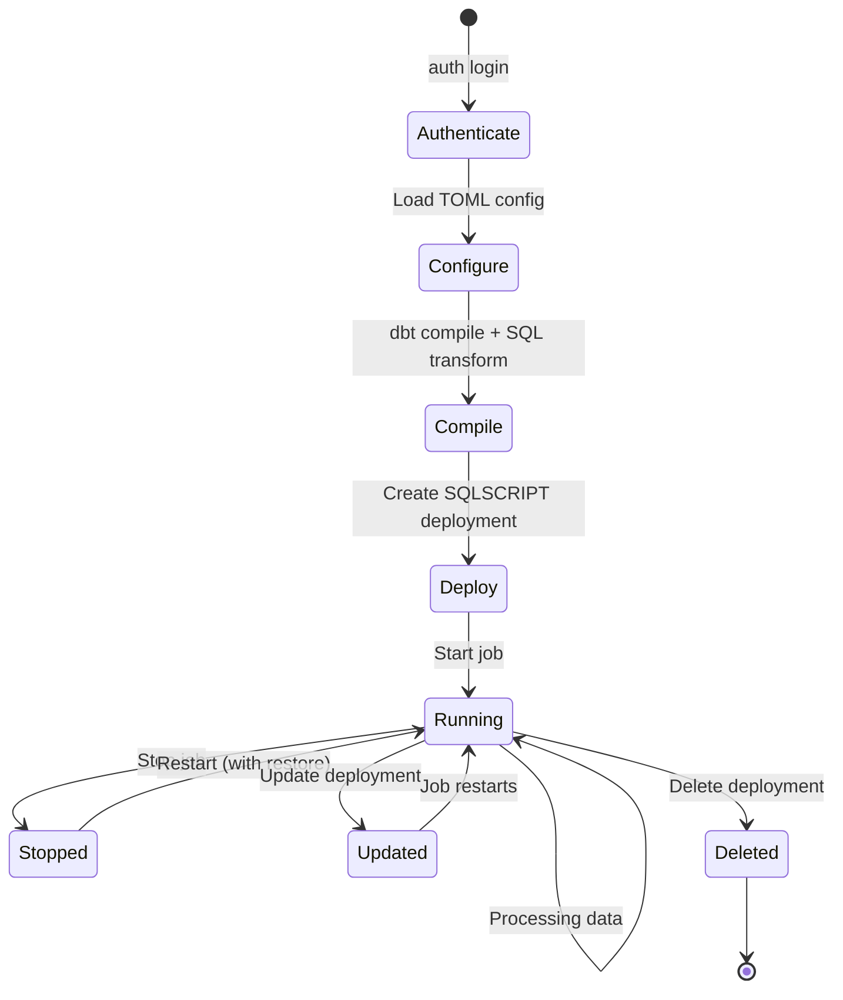
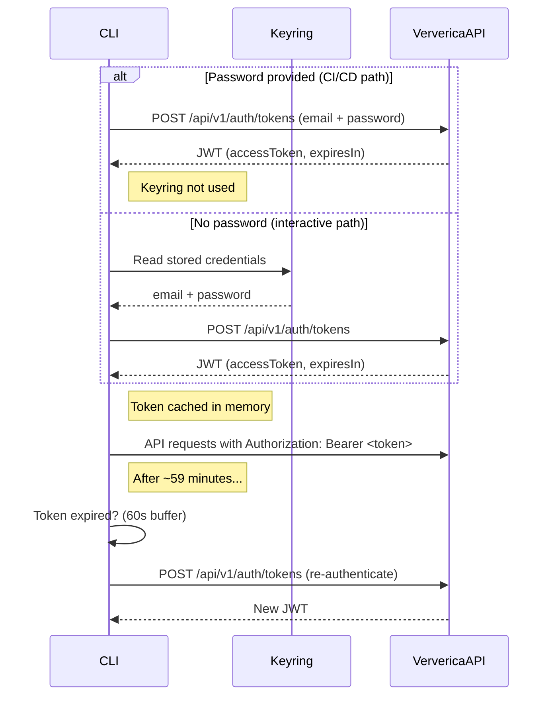
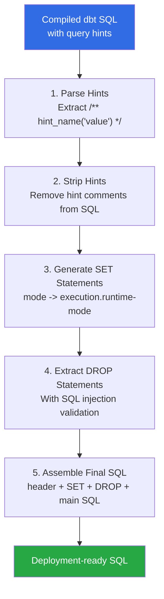
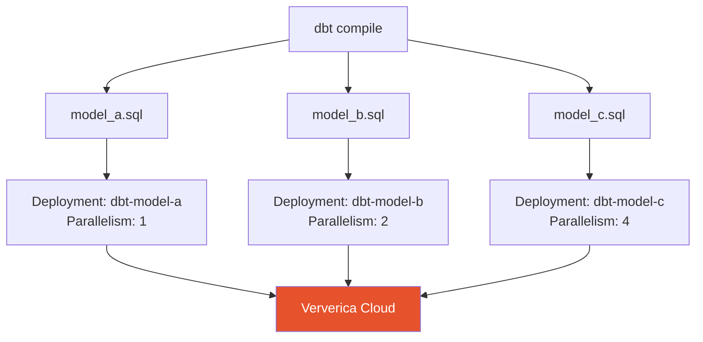
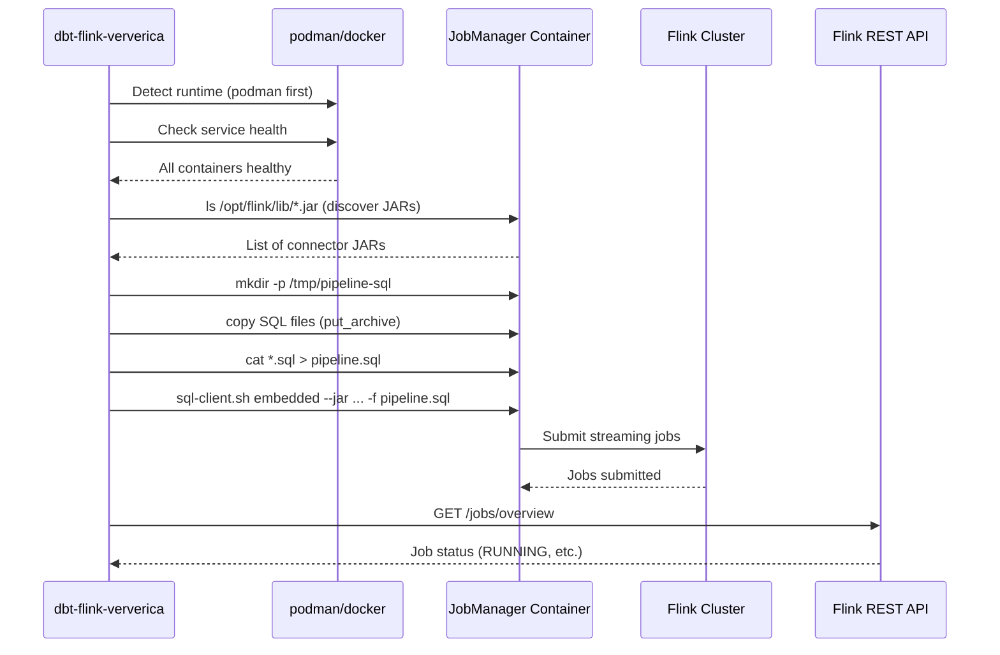

# Flink Deployment

[Home](../index.md) > [Guides](./) > Flink Deployment

---

The `dbt-flink-ververica` CLI supports two deployment targets:

1. **Ververica Cloud** -- Managed SQLSCRIPT deployments with authentication, scaling, and lifecycle management
2. **Local Flink** -- Deploy to local Flink clusters via `sql-client.sh` in containers (podman/docker)

This guide covers both deployment paths.

## Deployment Lifecycle



## Authentication

Ververica Cloud uses JWT-based authentication. The CLI supports two authentication paths:

1. **Keyring-based** (interactive) -- credentials saved in OS keyring, token auto-refreshes
2. **Password-based** (CI/CD) -- password provided via `--password` flag or `VERVERICA_PASSWORD` env var, keyring not used

### Interactive Login (Keyring)

```bash
# Interactive (prompts for email and password, saves to keyring)
dbt-flink-ververica auth login

# Non-interactive with keyring save
dbt-flink-ververica auth login \
  --email user@example.com \
  --password "$VERVERICA_PASSWORD"

# Custom gateway URL
dbt-flink-ververica auth login \
  --email user@example.com \
  --gateway-url https://custom.ververica.cloud
```

On success, the CLI:
1. Authenticates against `POST /api/v1/auth/tokens` with the `credentials` flow
2. Receives a JWT access token with a ~60 minute TTL
3. Stores the email and password in the OS keyring under the service name `dbt-flink-ververica`
4. Caches the token in memory for the current session

### Password Auth (CI/CD)

For CI/CD pipelines where keyring is unavailable, pass `--password` directly to `deploy` or `workflow`. The CLI authenticates without touching the keyring:

```bash
# Password via flag
dbt-flink-ververica workflow \
  --name-prefix prod \
  --email ci@company.com \
  --password "$VERVERICA_PASSWORD" \
  --workspace-id "$WORKSPACE_ID" \
  --start

# Password via env var (cleaner)
export VERVERICA_EMAIL=ci@company.com
export VERVERICA_PASSWORD=xxx
export VERVERICA_WORKSPACE_ID=a1b2c3d4-...

dbt-flink-ververica workflow --name-prefix prod --start
```

No separate `auth login` step is needed -- `deploy` and `workflow` authenticate inline.

### Token Lifecycle



The `AuthManager.get_valid_token()` method automatically re-authenticates when the current token expires or is within 60 seconds of expiring. When a password is provided, it uses direct auth; otherwise it falls back to keyring credentials.

### Logout and Status

```bash
# Check if credentials are saved
dbt-flink-ververica auth status --email user@example.com

# Logout and delete saved credentials
dbt-flink-ververica auth logout --email user@example.com

# Logout but keep credentials in keyring
dbt-flink-ververica auth logout --email user@example.com --keep-credentials
```

---

## TOML Configuration

The CLI reads configuration from a `dbt-flink-ververica.toml` file. Generate a default config with:

```bash
dbt-flink-ververica config init
```

Validate an existing config:

```bash
dbt-flink-ververica config validate dbt-flink-ververica.toml
```

### Full Configuration Reference

```toml
[ververica]
# Ververica Cloud API base URL
gateway_url = "https://app.ververica.cloud"

# Workspace UUID (find in Ververica Cloud UI under Settings)
workspace_id = "a1b2c3d4-e5f6-7890-abcd-ef1234567890"

# Namespace within the workspace
namespace = "default"

# Default Flink engine version for deployments
# Available versions depend on your Ververica Cloud plan
default_engine_version = "vera-4.0.0-flink-1.20"


[dbt]
# Path to dbt project root directory
project_dir = "."

# Path to dbt profiles directory (defaults to ~/.dbt if not set)
# profiles_dir = "/path/to/profiles"

# dbt target for compilation
target = "prod"

# Specific models to compile (empty array = all models)
models = []


[deployment]
# Deployment name (can be overridden with --name flag)
deployment_name = "my-streaming-pipeline"

# Job parallelism (1-1000)
parallelism = 2

# Flink engine version override (takes precedence over ververica.default_engine_version)
# engine_version = "vera-4.0.0-flink-1.20"

# Restore strategy for stateful job upgrades
# LATEST_STATE  - Restore from latest checkpoint/savepoint state
# LATEST_SAVEPOINT - Restore from latest explicit savepoint only
# NONE - Start fresh with no state
restore_strategy = "LATEST_STATE"

# Upgrade strategy for deployment updates
# STATEFUL  - Take savepoint before stopping, restore after restart
# STATELESS - Stop and restart without state preservation
upgrade_strategy = "STATEFUL"


[deployment.flink_config]
# Checkpointing configuration
"execution.checkpointing.interval" = "60s"
"execution.checkpointing.mode" = "EXACTLY_ONCE"
"execution.checkpointing.timeout" = "10min"
"execution.checkpointing.min-pause" = "30s"

# State backend
"state.backend" = "rocksdb"
"state.backend.incremental" = "true"

# Restart strategy
"restart-strategy" = "fixed-delay"
"restart-strategy.fixed-delay.attempts" = "3"
"restart-strategy.fixed-delay.delay" = "10s"

# Memory configuration
"taskmanager.memory.process.size" = "4gb"
"taskmanager.memory.managed.fraction" = "0.4"


[deployment.tags]
environment = "production"
team = "data-platform"
owner = "data-team@example.com"
cost-center = "engineering"


[sql_processing]
# Strip dbt-flink query hints from SQL before deployment
strip_hints = true

# Convert query hints to SET statements
generate_set_statements = true

# Wrap multiple statements in STATEMENT SET
# (usually false for Ververica Cloud single-deployment mode)
wrap_in_statement_set = false

# Include DROP statements extracted from drop_statement hints
include_drop_statements = true
```

---

## SQL Transformation Pipeline

When deploying dbt models to Ververica Cloud, the compiled SQL must be transformed. The `SqlProcessor` class orchestrates a five-stage pipeline:



### Stage 1: Parse Hints

The `SqlHintParser` extracts all query hints matching the pattern `/** hint_name('value') */`:

```
Input:  /** mode('streaming') */ /** upgrade_mode('stateless') */ CREATE TABLE ...
Output: [QueryHint(name='mode', value='streaming'), QueryHint(name='upgrade_mode', value='stateless')]
```

Supported hints:

| Hint | Purpose | Example |
|---|---|---|
| `mode` | Execution runtime mode | `/** mode('streaming') */` |
| `drop_statement` | DROP DDL to execute before CREATE | `/** drop_statement('DROP TABLE IF EXISTS `t`') */` |
| `job_state` | Desired job state (Ververica metadata) | `/** job_state('running') */` |
| `upgrade_mode` | How to upgrade the deployment | `/** upgrade_mode('stateless') */` |
| `execution_config` | Key=value pairs for SET statements | `/** execution_config('key1=val1;key2=val2') */` |

### Stage 2: Strip Hints

All `/** ... */` hint comments are removed from the SQL, and excess whitespace is cleaned up.

### Stage 3: Generate SET Statements

Hints that map to Flink configuration are converted to `SET` statements:

| Hint | Generated SET Statement |
|---|---|
| `mode('streaming')` | `SET 'execution.runtime-mode' = 'streaming';` |
| `mode('batch')` | `SET 'execution.runtime-mode' = 'batch';` |
| `execution_config('key=value')` | `SET 'key' = 'value';` |
| `job_state('...')` | *(skipped -- metadata only)* |
| `drop_statement('...')` | *(handled in stage 4)* |

### Stage 4: Extract DROP Statements

DROP statements embedded in `drop_statement` hints are extracted and validated against a strict regex pattern to prevent SQL injection:

```
Valid:   DROP TABLE IF EXISTS `my_table`
Valid:   DROP VIEW IF EXISTS my_schema.my_view CASCADE
Invalid: DROP TABLE foo; INSERT INTO bar VALUES (1) -- injection attempt
```

The validation pattern requires:
- Statement starts with `DROP`
- Object type is `TABLE`, `VIEW`, `DATABASE`, or `CATALOG`
- Optional `IF EXISTS`
- Identifier uses only alphanumerics, underscores, dots, and backticks
- Optional `CASCADE` or `RESTRICT`

### Stage 5: Assemble Final SQL

The components are assembled in order:

```sql
-- SQL generated by dbt-flink-ververica

-- Configuration
SET 'execution.runtime-mode' = 'streaming';

-- Drop existing objects
DROP TABLE IF EXISTS `my_table`;

-- Main SQL
CREATE TABLE my_table
WITH (
    'connector' = 'kafka',
    ...
)
AS
    SELECT ...
```

---

## Deployment Options

### Parallelism

Controls the number of parallel Flink task slots used by the job:

```toml
[deployment]
parallelism = 4
```

Valid range: 1 to 1000. Start with 1 for development, scale up based on throughput requirements.

### Engine Version

The Flink engine version determines which Flink features are available:

```toml
[ververica]
default_engine_version = "vera-4.0.0-flink-1.20"

[deployment]
# Override per-deployment
engine_version = "vera-4.0.0-flink-1.20"
```

### Restore Strategy

Controls how state is recovered when restarting a stopped job:

| Strategy | Behavior | When to Use |
|---|---|---|
| `LATEST_STATE` | Restore from the latest checkpoint or savepoint | Production streaming jobs (default) |
| `LATEST_SAVEPOINT` | Restore only from an explicit savepoint | When you need precise recovery points |
| `NONE` | Start fresh with no state | Development, after schema changes |

### Upgrade Strategy

Controls how the job is upgraded when the deployment is updated:

| Strategy | Behavior | When to Use |
|---|---|---|
| `STATEFUL` | Take savepoint before stopping, restore after restart | Production (preserves exactly-once semantics) |
| `STATELESS` | Stop and restart without state preservation | Development, stateless transformations |

### Flink Configuration

The `[deployment.flink_config]` section passes configuration directly to the Flink job:

```toml
[deployment.flink_config]
# Checkpointing (critical for streaming)
"execution.checkpointing.interval" = "60s"
"execution.checkpointing.mode" = "EXACTLY_ONCE"
"execution.checkpointing.timeout" = "10min"

# State backend
"state.backend" = "rocksdb"
"state.backend.incremental" = "true"

# Restart strategy
"restart-strategy" = "fixed-delay"
"restart-strategy.fixed-delay.attempts" = "3"
"restart-strategy.fixed-delay.delay" = "10s"

# Memory
"taskmanager.memory.process.size" = "4gb"
"taskmanager.memory.managed.fraction" = "0.4"
```

---

## CLI Commands

### Compile

Runs `dbt compile` and transforms the output SQL:

```bash
dbt-flink-ververica compile \
  --project-dir /path/to/dbt/project \
  --target prod \
  --models "model_a,model_b" \
  --output-dir ./target/ververica
```

### Deploy (Single Model)

Deploys a single SQL file as a SQLSCRIPT deployment. Auto-discovers SQL from `target/ververica/{name}.sql` if `--sql-file` is omitted:

```bash
# Auto-discovery (after compile)
dbt-flink-ververica deploy \
  --name my-streaming-job \
  --workspace-id a1b2c3d4-... \
  --email user@example.com \
  --parallelism 2 \
  --start

# Explicit SQL file with password auth (CI/CD)
dbt-flink-ververica deploy \
  --name my-streaming-job \
  --sql-file ./target/ververica/my_model.sql \
  --workspace-id "$WORKSPACE_ID" \
  --email "$EMAIL" \
  --password "$PASSWORD" \
  --engine-version vera-4.0.0-flink-1.20 \
  --start
```

### Workflow (Compile + Deploy All Models)

Runs the complete pipeline: compile, transform, authenticate, and deploy **each model as its own deployment**. Each model becomes `{prefix}-{model_name}`:

```bash
# Dry run -- compile and preview SQL without deploying
dbt-flink-ververica workflow \
  --name-prefix prod \
  --project-dir . \
  --dry-run

# Full deployment with auto-start
dbt-flink-ververica workflow \
  --name-prefix prod \
  --workspace-id a1b2c3d4-... \
  --email user@example.com \
  --password "$PASSWORD" \
  --target prod \
  --parallelism 4 \
  --start

# Deploy specific models only
dbt-flink-ververica workflow \
  --name-prefix prod \
  --models "user_dim,events_log" \
  --workspace-id "$WORKSPACE_ID" \
  --email "$EMAIL" \
  --start
```

Config priority: CLI flags > env vars > TOML config > defaults. See [CLI Reference](../reference/cli-reference.md#workflow) for all options.

### Config

```bash
# Generate default config file
dbt-flink-ververica config init --output dbt-flink-ververica.toml

# Validate config
dbt-flink-ververica config validate dbt-flink-ververica.toml
```

---

## Programmatic Deployment

For most CI/CD pipelines, the `workflow` command handles everything in a single invocation:

```bash
export VERVERICA_EMAIL=ci@company.com
export VERVERICA_PASSWORD=xxx
export VERVERICA_WORKSPACE_ID=a1b2c3d4-...

dbt-flink-ververica workflow \
  --name-prefix prod \
  --target prod \
  --parallelism 4 \
  --start
```

For custom automation beyond what the CLI provides, you can use the Python API directly:

### Deploy Script Pattern

```python
#!/usr/bin/env python3
"""Deploy dbt-flink models to Ververica Cloud programmatically."""

import os
from pathlib import Path

from dbt_flink_ververica.auth import AuthManager
from dbt_flink_ververica.client import DeploymentSpec, VervericaClient
from dbt_flink_ververica.sql_processor import DbtArtifactReader, SqlProcessor


def main():
    # Load configuration from environment
    gateway_url = os.environ.get("VERVERICA_GATEWAY_URL", "https://app.ververica.cloud")
    workspace_id = os.environ["VERVERICA_WORKSPACE_ID"]
    namespace = os.environ.get("VERVERICA_NAMESPACE", "default")
    email = os.environ["VERVERICA_EMAIL"]
    password = os.environ["VERVERICA_PASSWORD"]

    # Authenticate (password path skips keyring)
    auth_manager = AuthManager(gateway_url)
    token = auth_manager.get_valid_token(email, password=password)

    # Read and process compiled dbt models
    project_dir = Path(".")
    reader = DbtArtifactReader(project_dir, target="prod")
    models = reader.find_compiled_models()

    processor = SqlProcessor(
        strip_hints=True,
        generate_set_statements=True,
        include_drop_statements=True,
    )
    processed_models = reader.process_models(models, processor)

    # Deploy each model as its own deployment
    with VervericaClient(gateway_url, workspace_id, token) as client:
        for model in processed_models:
            if model.processed is None:
                continue

            spec = DeploymentSpec(
                name=f"prod-{model.name}",
                namespace=namespace,
                sql_script=model.processed.final_sql,
                engine_version="vera-4.0.0-flink-1.20",
                parallelism=2,
                execution_mode="STREAMING",
                labels={
                    "managed-by": "dbt-flink-ververica",
                    "dbt-model": model.name,
                },
            )

            status = client.create_sqlscript_deployment(spec)
            print(f"Deployed {model.name}: {status.deployment_id}")

            # Optionally start the deployment
            client.start_deployment(
                namespace=namespace,
                deployment_id=status.deployment_id,
            )


if __name__ == "__main__":
    main()
```

### Multi-Model Deployment

When deploying multiple models, each model becomes a separate Ververica deployment with its own Flink job. This provides independent scaling, lifecycle management, and failure isolation.



For models that should run as a single job (multi-statement pipeline), use the `wrap_in_statement_set` option in `[sql_processing]`:

```toml
[sql_processing]
wrap_in_statement_set = true
```

This wraps the combined SQL in a `BEGIN STATEMENT SET; ... END;` block.

---

## Local Flink Deployment

For deploying to local Flink clusters running in containers. The CLI copies SQL files into the JobManager container and executes them via `sql-client.sh`. This approach is necessary because the Flink SQL Gateway REST API cannot dynamically load connector JARs -- the SQL CLI is the correct path for local Flink deployments that require custom connectors (CDC, Kafka, JDBC).

### Prerequisites

- A running Flink cluster in containers (podman or docker)
- `pip install dbt-flink-ververica[local]` (for podman) or `pip install dbt-flink-ververica[docker]`
- SQL files for your pipeline

### Quick Start

```bash
# 1. Check services are healthy
dbt-flink-ververica localservices

# 2. Preview what will be deployed
dbt-flink-ververica localdeploy \
  --sql-dir ./scripts/test-kit/sql/flink/ \
  --dry-run

# 3. Deploy the pipeline
dbt-flink-ververica localdeploy \
  --sql-dir ./scripts/test-kit/sql/flink/

# 4. Check job status
dbt-flink-ververica localstatus

# 5. Cancel a specific job
dbt-flink-ververica localcancel <job-id>
```

### How It Works



### SQL File Ordering

SQL files in the `--sql-dir` directory are sorted by filename and concatenated in order. Use numeric prefixes to control execution order:

```
sql/flink/
├── 01_sources.sql      # CDC source tables (Postgres -> Kafka)
├── 02_staging.sql       # Kafka source + staging transforms
└── 03_marts.sql         # Analytics mart tables (Kafka -> PG)
```

Each `INSERT INTO` statement becomes a separate long-running streaming Flink job.

### JAR Discovery

By default, the deployer scans the JobManager container for connector JARs matching configured patterns:

```toml
[local_flink]
jar_patterns = [
    "/opt/flink/lib/flink-sql-connector-*.jar",
    "/opt/flink/lib/flink-connector-*.jar",
    "/opt/flink/lib/postgresql-*.jar",
]
```

Discovered JARs are passed as `--jar` flags to `sql-client.sh`. You can also specify additional JARs with `--jar` CLI flags or disable auto-detection with `--no-auto-jars`.

### TOML Configuration

All local Flink options can be set in `dbt-flink-ververica.toml`:

```toml
[local_flink]
jobmanager_container = "flink-jobmanager"
flink_rest_url = "http://localhost:18081"
sql_dir = "./sql/flink"
job_verification_delay_seconds = 3.0
rest_api_timeout_seconds = 10.0

[local_flink.services]
jobmanager = "flink-jobmanager"
kafka = "tk-kafka"
postgres = "tk-postgres"
```

CLI flags override TOML values. See [TOML Configuration Reference](../reference/toml-config.md#local_flink) for the full schema.

### Cancelling Jobs

Use `local cancel` to stop a running Flink job by its ID:

```bash
# Get the job ID from local status output
dbt-flink-ververica localstatus

# Cancel the job
dbt-flink-ververica localcancel a1b2c3d4e5f6a1b2c3d4e5f6a1b2c3d4
```

The command sends a `PATCH /jobs/{job_id}?mode=cancel` request to the Flink REST API. The request timeout is controlled by `rest_api_timeout_seconds` (default: 10s).

Common failure modes:
- **HTTP 404**: Job ID not found -- verify the ID with `local status`
- **HTTP 409**: Job is not in a cancellable state (already finished or cancelled)
- **Connection error**: Flink REST API is unreachable -- check `flink_rest_url` in your config

See [CLI Reference](../reference/cli-reference.md#local-cancel) for the full command signature.

### Container Runtime

The deployer prefers podman and falls back to docker. Both `podman-py` and `docker-py` expose a compatible API, so the behavior is identical regardless of which runtime is used.

Install the appropriate dependency:

```bash
pip install dbt-flink-ververica[local]     # podman
pip install dbt-flink-ververica[docker]  # docker
```

---

## Next Steps

- [CI/CD](./ci-cd.md) -- GitHub Actions workflow and multi-environment deployment
- [Materializations](./materializations.md) -- How each materialization generates query hints
- [Streaming Pipelines](./streaming-pipelines.md) -- Building streaming models for deployment
- [Batch Processing](./batch-processing.md) -- Batch job deployment patterns
