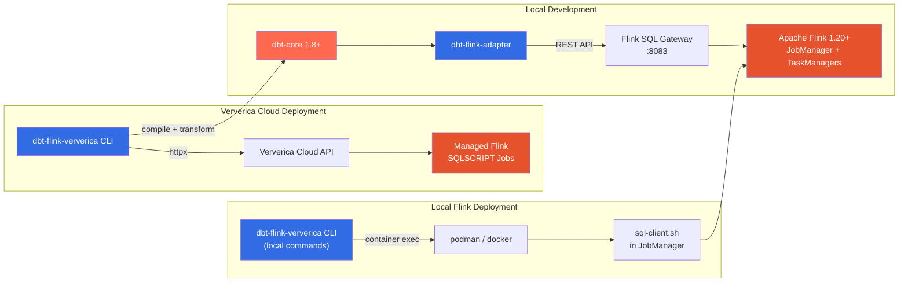

# dbt-flink-adapter Documentation

**Build streaming and batch data pipelines with dbt on Apache Flink.**

dbt-flink-adapter brings the software engineering discipline of dbt -- version-controlled SQL models, testing, documentation, and lineage -- to Apache Flink's stream and batch processing engine. Write dbt models that compile to Flink SQL, run them against a local Flink cluster through the SQL Gateway, or deploy them to Ververica Cloud as managed streaming jobs with a single CLI command.

## Architecture

## Feature Matrix

| Materialization | Streaming Mode | Batch Mode | Connector Required | Use Case |
|---|---|---|---|---|
| `table` | Yes | Yes | Yes | Persistent table backed by a connector (Kafka, filesystem, JDBC) |
| `view` | Yes | Yes | No | Lightweight SQL view; no data stored |
| `streaming_table` | Yes | No | Yes | Continuous streaming pipeline with watermarks and windows |
| `incremental` | Yes | Yes | Yes | Append-only or merge updates to existing table |
| `materialized_table` | Yes | Yes | Yes | Flink Managed Table with continuous or full refresh |
| `ephemeral` | Yes | Yes | No | CTE inlined into downstream models; no object created |

## Getting Started

Choose the path that matches your goal:

| Goal | Guide | Time |
|---|---|---|
| Run Flink SQL models on your laptop | [Local Quickstart](getting-started/quickstart-local.md) | 15 min |
| Deploy to a local Flink cluster | [Flink Deployment Guide](guides/ververica-deployment.md#local-flink-deployment) | 10 min |
| Deploy streaming jobs to Ververica Cloud | [Ververica Quickstart](getting-started/quickstart-ververica.md) | 30 min |
| Install the adapter and CLI | [Installation](getting-started/installation.md) | 5 min |

## Prerequisites at a Glance

| Component | Version | Required For |
|---|---|---|
| Python | 3.9 -- 3.13 | Everything |
| dbt-core | 1.8, 1.9, or 1.10 | Everything |
| Apache Flink | 1.20+ | Local development |
| Docker + Docker Compose | Latest | Running local Flink cluster |
| Ververica Cloud account | -- | Cloud deployment only |

## Documentation Map

### Getting Started
- [Installation](getting-started/installation.md) -- Install the adapter and CLI tool
- [Local Quickstart](getting-started/quickstart-local.md) -- Build a streaming pipeline on your laptop
- [Ververica Quickstart](getting-started/quickstart-ververica.md) -- Deploy to Ververica Cloud end-to-end

### Guides
- [Materializations](guides/materializations.md) -- Table, view, streaming_table, incremental, materialized_table, ephemeral
- [Streaming Pipelines](guides/streaming-pipelines.md) -- Watermarks, windows, Kafka integration
- [Batch Processing](guides/batch-processing.md) -- Bounded sources, filesystem connectors, JDBC
- [Incremental Models](guides/incremental-models.md) -- Append, insert_overwrite, and merge strategies
- [Sources and Connectors](guides/sources-and-connectors.md) -- Source definitions, column types, connector configuration
- [CDC Sources](guides/cdc-sources.md) -- Change Data Capture with MySQL, PostgreSQL, MongoDB, and more
- [Flink Deployment](guides/ververica-deployment.md) -- Deploy to Ververica Cloud or local Flink clusters
- [Workflow Tutorial](guides/workflow-tutorial.md) -- One-command deployment: compile, transform, deploy, and start
- [CI/CD](guides/ci-cd.md) -- GitHub Actions workflows and multi-environment deployment

### Reference
- [Adapter Configuration](reference/adapter-config.md) -- profiles.yml, dbt_project.yml, model config options
- [CLI Reference](reference/cli-reference.md) -- All dbt-flink-ververica commands and flags
- [Macros](reference/macros.md) -- Window, watermark, and batch macro signatures
- [TOML Configuration](reference/toml-config.md) -- dbt-flink-ververica.toml reference
- [SQL Transformation](reference/sql-transformation.md) -- How query hints become SET and DROP statements
- [Flink Compatibility](reference/flink-compatibility.md) -- Version matrix and known limitations

### Troubleshooting
- [Troubleshooting Guide](troubleshooting.md) -- Common errors, solutions, and diagnostics

## Current Version

**dbt-flink-adapter 1.8.0** -- November 2025

Key capabilities in this release:
- Full catalog introspection (`dbt docs generate` works)
- Model contracts with schema enforcement
- Python 3.9 -- 3.13 support
- dbt-core 1.8, 1.9, 1.10 compatibility
- Session heartbeat and query cancellation
- Ververica Cloud CLI for managed deployments

## License

Apache License 2.0. See [LICENSE](https://github.com/getindata/dbt-flink-adapter/blob/main/LICENSE).
