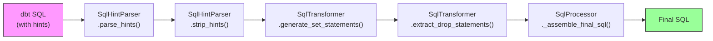

# SQL Transformation Reference

[Documentation](../index.md) > [Reference](../index.md#reference) > SQL Transformation

---

This document describes how the dbt-flink-ververica CLI transforms compiled dbt SQL into deployment-ready Flink SQL. The transformation pipeline parses query hints, generates configuration statements, extracts DDL operations, and assembles the final SQL output.

## Pipeline Overview



**Pipeline steps:**

1. **Parse hints** -- `SqlHintParser.parse_hints()` extracts all `/** hint_name('value') */` patterns from the SQL using a regex match, returning a list of `QueryHint` objects.
2. **Strip hints** -- `SqlHintParser.strip_hints()` removes all matched hint patterns from the SQL body, cleaning up extra blank lines and whitespace.
3. **Generate SET statements** -- `SqlTransformer.generate_set_statements()` converts recognized hints into Flink `SET` statements. Unknown hints are skipped with a warning.
4. **Extract DROP statements** -- `SqlTransformer.extract_drop_statements()` pulls `drop_statement` hints out as validated DDL statements, placed before the main SQL.
5. **Assemble final SQL** -- `SqlProcessor._assemble_final_sql()` combines the header comment, SET statements, DROP statements, and clean SQL into the final output.

Each step is controlled by settings in the `[sql_processing]` section of the TOML configuration file. See [TOML Configuration](toml-config.md#sql_processing).

---

## Hint Format

Query hints are embedded in dbt-compiled SQL as specially-formatted block comments.

### Syntax

```
/** hint_name('value') */
```

Both single quotes and double quotes are accepted around the value:

```
/** mode('streaming') */
/** mode("streaming") */
```

### Regex Pattern

The parser uses this regex to match hints:

```
/\*\*\s*(\w+)\s*\(\s*['"]([^'"]*)['"]\s*\)\s*\*/
```

Breaking it down:

| Component | Matches |
|---|---|
| `/\*\*` | Opening `/**` |
| `\s*` | Optional whitespace |
| `(\w+)` | Hint name (capture group 1): one or more word characters |
| `\s*\(\s*` | Opening parenthesis with optional whitespace |
| `['"]` | Opening quote (single or double) |
| `([^'"]*)` | Hint value (capture group 2): any characters except quotes |
| `['"]\s*\)` | Closing quote and parenthesis |
| `\s*\*/` | Closing `*/` |

The pattern uses the `IGNORECASE` flag, so hint names are case-insensitive.

---

## Supported Hints

### Hint-to-Configuration Mapping

| Hint | Maps To | Output | Description |
|---|---|---|---|
| `mode('streaming')` | `execution.runtime-mode` | `SET 'execution.runtime-mode' = 'streaming';` | Flink execution mode. Values: `streaming`, `batch`. |
| `execution_mode('batch')` | `execution.runtime-mode` | `SET 'execution.runtime-mode' = 'batch';` | Alias for `mode`. Same Flink config key. |
| `job_state('running')` | (metadata only) | No SET statement generated | Deployment metadata hint. Used by dbt-flink internally, not a Flink configuration key. Skipped during SET generation. |
| `upgrade_mode('stateless')` | (metadata only) | No SET statement generated | Deployment upgrade behavior. Used by dbt-flink internally. |
| `drop_statement('DROP TABLE IF EXISTS x')` | (separate section) | Placed in DROP section | DDL statement extracted and placed before the main SQL. Not converted to a SET statement. |
| `execution_config('key=val;key2=val2')` | (multiple SET statements) | Parsed into individual SET statements | Semicolon-separated key=value pairs for Flink config. |

Unrecognized hint names are logged as warnings and silently skipped. They do not cause errors.

---

## DROP Statement Validation

DROP statements extracted from `drop_statement` hints are validated against a security pattern to prevent SQL injection.

### Validation Pattern

```
DROP (TABLE|VIEW|DATABASE|CATALOG) [IF EXISTS] <identifier> [CASCADE|RESTRICT]
```

The regex:

```
^\s*DROP\s+(TABLE|VIEW|DATABASE|CATALOG)\s+(?:IF\s+EXISTS\s+)?[\w.`]+\s*(?:CASCADE|RESTRICT)?\s*;?\s*$
```

### Accepted Formats

```sql
DROP TABLE IF EXISTS my_table;
DROP VIEW my_view;
DROP TABLE `my_catalog`.`my_db`.`my_table`;
DROP DATABASE my_db CASCADE;
```

### Rejected Formats

Statements that do not match the pattern raise a `ValueError`:

```sql
-- Rejected: contains subquery
DROP TABLE (SELECT name FROM tables);

-- Rejected: contains semicolon-separated commands
DROP TABLE a; DROP TABLE b;

-- Rejected: not a DROP statement
TRUNCATE TABLE my_table;
```

A semicolon is appended automatically if the validated statement does not already end with one.

---

## Transformation Examples

### Example 1: Streaming Model with DROP

**Input (dbt-compiled SQL):**

```sql
/** mode('streaming') */
/** drop_statement('DROP TABLE IF EXISTS user_events') */
CREATE TABLE user_events (
  event_id BIGINT,
  user_id BIGINT,
  event_time TIMESTAMP(3),
  WATERMARK FOR event_time AS event_time - INTERVAL '5' SECOND
) WITH (
  'connector' = 'kafka',
  'topic' = 'user-events',
  'properties.bootstrap.servers' = 'kafka:9092',
  'format' = 'json'
)
```

**Output (transformed SQL):**

```sql
-- SQL generated by dbt-flink-ververica

-- Configuration
SET 'execution.runtime-mode' = 'streaming';

-- Drop existing objects
DROP TABLE IF EXISTS user_events;

-- Main SQL
CREATE TABLE user_events (
  event_id BIGINT,
  user_id BIGINT,
  event_time TIMESTAMP(3),
  WATERMARK FOR event_time AS event_time - INTERVAL '5' SECOND
) WITH (
  'connector' = 'kafka',
  'topic' = 'user-events',
  'properties.bootstrap.servers' = 'kafka:9092',
  'format' = 'json'
)
```

### Example 2: Batch Model without Hints

**Input:**

```sql
CREATE TABLE daily_aggregates
WITH (
  'connector' = 'filesystem',
  'path' = 's3://warehouse/daily_aggregates',
  'format' = 'parquet'
)
AS
SELECT
  DATE_FORMAT(event_time, 'yyyy-MM-dd') AS event_date,
  COUNT(*) AS event_count
FROM source_events
GROUP BY DATE_FORMAT(event_time, 'yyyy-MM-dd')
```

**Output:**

```sql
-- SQL generated by dbt-flink-ververica

-- Main SQL
CREATE TABLE daily_aggregates
WITH (
  'connector' = 'filesystem',
  'path' = 's3://warehouse/daily_aggregates',
  'format' = 'parquet'
)
AS
SELECT
  DATE_FORMAT(event_time, 'yyyy-MM-dd') AS event_date,
  COUNT(*) AS event_count
FROM source_events
GROUP BY DATE_FORMAT(event_time, 'yyyy-MM-dd')
```

When there are no hints, the output is the original SQL with only the header comment added.

### Example 3: Model with Multiple Hints

**Input:**

```sql
/** mode('streaming') */
/** job_state('running') */
/** drop_statement('DROP TABLE IF EXISTS enriched_events') */
/** drop_statement('DROP VIEW IF EXISTS enriched_events_view') */
INSERT INTO enriched_events
SELECT
  e.event_id,
  e.user_id,
  u.name AS user_name,
  e.event_time
FROM events e
JOIN users FOR SYSTEM_TIME AS OF e.event_time AS u
ON e.user_id = u.user_id
```

**Output:**

```sql
-- SQL generated by dbt-flink-ververica

-- Configuration
SET 'execution.runtime-mode' = 'streaming';

-- Drop existing objects
DROP TABLE IF EXISTS enriched_events;
DROP VIEW IF EXISTS enriched_events_view;

-- Main SQL
INSERT INTO enriched_events
SELECT
  e.event_id,
  e.user_id,
  u.name AS user_name,
  e.event_time
FROM events e
JOIN users FOR SYSTEM_TIME AS OF e.event_time AS u
ON e.user_id = u.user_id
```

Note that `job_state` does not produce a SET statement (it is metadata-only), and both `drop_statement` hints are extracted into the DROP section.

---

## Assembly Format

The final SQL follows this structure:

```sql
-- SQL generated by dbt-flink-ververica

-- Configuration                        (only if SET statements exist)
SET 'key1' = 'value1';
SET 'key2' = 'value2';

-- Drop existing objects                (only if DROP statements exist)
DROP TABLE IF EXISTS my_table;

-- Main SQL                             (always present)
<clean SQL body>
```

When `wrap_in_statement_set` is enabled in the `[sql_processing]` config, the main SQL is wrapped:

```sql
-- Main SQL
BEGIN STATEMENT SET;

<clean SQL body>

END;
```

### Section Ordering

Sections always appear in this order:

1. **Header comment** -- `-- SQL generated by dbt-flink-ververica`
2. **Configuration** -- SET statements (if any)
3. **Drop existing objects** -- DROP statements (if any)
4. **Main SQL** -- Clean SQL with hints removed

This ordering ensures that configuration is applied before any DDL or DML, and that existing objects are dropped before recreation.

---

## Configuration Flags

The transformation pipeline is controlled by these `SqlProcessor` constructor parameters, which map to `[sql_processing]` TOML keys:

| Parameter | TOML Key | Default | Effect When `false` |
|---|---|---|---|
| `strip_hints` | `strip_hints` | `True` | Hints are left in the SQL as comments |
| `generate_set_statements` | `generate_set_statements` | `True` | No SET statements are generated from hints |
| `include_drop_statements` | `include_drop_statements` | `True` | DROP statements from hints are discarded |
| `wrap_in_statement_set` | `wrap_in_statement_set` | `False` | Main SQL is not wrapped in STATEMENT SET |

---

## Data Model

The transformation pipeline uses these Pydantic models:

### QueryHint

Represents a single parsed hint.

| Field | Type | Description |
|---|---|---|
| `name` | string | Hint name (e.g., `mode`, `drop_statement`) |
| `value` | string | Hint value (e.g., `streaming`, `DROP TABLE IF EXISTS x`) |
| `raw` | string | Original raw hint string as it appeared in the SQL |

### ProcessedSql

Result of the full transformation pipeline.

| Field | Type | Description |
|---|---|---|
| `original_sql` | string | Original SQL with hints intact |
| `clean_sql` | string | SQL with all hints removed |
| `set_statements` | list of strings | Generated SET statements |
| `drop_statements` | list of strings | Validated DROP statements |
| `hints` | list of QueryHint | All parsed hints |
| `final_sql` | string | Complete assembled SQL ready for deployment |

---

## See Also

- [TOML Configuration](toml-config.md#sql_processing) -- `[sql_processing]` settings
- [CLI Reference](cli-reference.md#compile) -- Compile command that invokes the pipeline
- [Adapter Configuration](adapter-config.md) -- Model config options that generate hints
